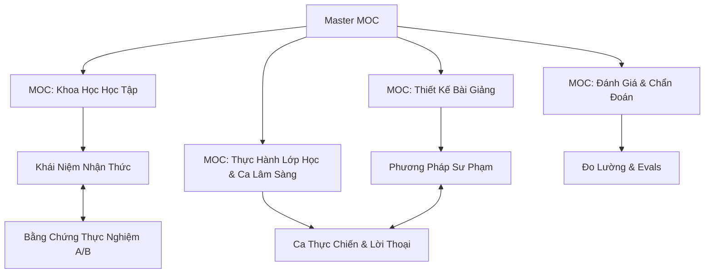

# Bản Đồ Điều Hướng Sư Phạm Toàn Hệ Thống (Master MOC)

Chào mừng bạn đến với mạng lưới tri thức sư phạm `design-os-pedagogy`. Hệ thống này được thiết kế theo cấu trúc **Triple Graph** (Khái niệm - Bằng chứng - Thực hành) tối ưu cho cả **Người đọc (qua Obsidian Wikilinks)** và **AI Agents (qua YAML Stable IDs)**.

---

## 1. Các Bản Đồ Chuyên Đề (Sub-MOCs)

1. [[MOC-Learning-Science]]: Não bộ, Bộ nhớ làm việc, Tải nhận thức, Chức năng điều hành.
2. [[MOC-Instructional-Design]]: Giảng dạy tường minh, Worked Examples, Productive Failure, UDL 3.0.
3. [[MOC-Assessment]]: Đánh giá quá trình, Câu hỏi bản lề, Rubrics, Chuẩn psychometrics.
4. [[MOC-Classroom-Practice]]: Thư viện các ca lâm sàng, lời thoại giáo viên - học sinh, phác đồ can thiệp.

---

## 2. Ma Trận Chẩn Đoán Tình Huống Sư Phạm Nhanh (Decision Router)

Khi đối mặt với triệu chứng học tập trên lớp, hãy đi theo bảng dẫn đường dưới đây:

| Triệu chứng quan sát ở người học | Căn nguyên nhận thức | Khái niệm & Can thiệp cần tra cứu | Ca thực tế đối chiếu |
| :--- | :--- | :--- | :--- |
| **Không biết bắt đầu giải từ đâu, ngồi nhìn đề bài bất lực** | Quá tải bộ nhớ làm việc (High intrinsic/search load) | [[Cognitive Load Theory]] & [[Worked Examples]] | [[Case — Grade 7 Algebra Worked Examples]] |
| **Hôm nay hiểu và làm bài tốt, tuần sau quên sạch** | Thiếu củng cố vết nơ-ron dài hạn (Weak consolidation) | [[Spaced Practice]] & [[Retrieval Practice]] | [[Case — High School Biology Spaced Retrieval]] |
| **Giải trôi chảy bài tập mẫu nhưng sai toàn bộ bài toán thực tế** | Chỉ có tri thức thủ tục, rỗng tri thức khái niệm (Whole Number Bias) | [[Concrete-to-Abstract CPA]] & [[Learner Diagnostics Protocol]] | [[Case — Fraction Misconception Clinical Case]] |
| **Ngồi nghe giảng thụ động gật gù nhưng khi thi điểm kém** | Ảo tưởng về năng lực (Illusion of Explanatory Depth) | [[Productive Failure]] & [[Peer Instruction]] | [[Case — University Physics Productive Failure]] |
| **NCS Tiến sĩ bế tắc, sợ bảo vệ, mất phương hướng đề tài** | Hội chứng Imposter & Thiếu khung nhận thức luận | [[Doctoral Supervision Socratic]] & [[Dissertation Defense Guide]] | [[Dissertation Defense Guide]] |

---

## 3. Quy Ước Liên Kết Kép (Dual-Linking Contract)

* **Dành cho AI Agent**: Đọc YAML Frontmatter để duyệt đồ thị quan hệ:
  * `prerequisites`: Điều kiện tiên quyết cần nạp trước.
  * `leads_to`: Khái niệm/phương pháp tiếp theo.
  * `evidence_claims`: Trỏ tới ID bài nghiên cứu thực nghiệm độc lập.
  * `clinical_cases`: Trỏ tới ID ca lớp học cụ thể.
* **Dành cho Con người**: Sử dụng cú pháp `[[Tên Khái Niệm]]` trong Obsidian để hiển thị Graph View và Backlinks tự động.
