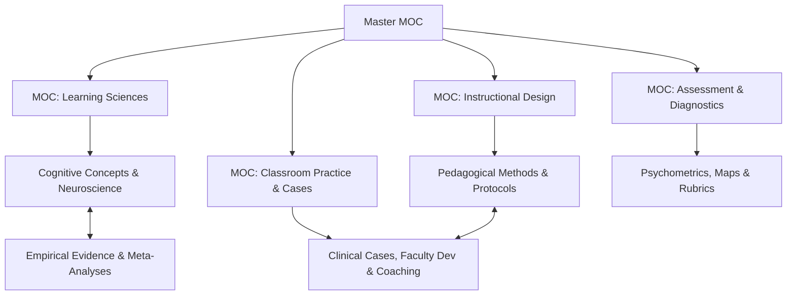

# Master Map of Content (Master MOC)

Welcome to the `design-os-pedagogy` knowledge network. This system is architected as an orthogonal **Triple Graph** (Concepts - Evidence - Clinical Practice) optimized simultaneously for **Human Educators (via Obsidian Wikilinks)** and **AI Pedagogical Agents (via YAML Stable IDs)**.

For a course request, start with the [course-design assistant](../90-agent-runtime/prompts/course-design-assistant.md), [CAP-02 design protocol](../70-capabilities/design/instructional-system-design-protocol.md) and [blueprint template](../docs/templates/course-blueprint.yaml). The [knowledge roadmap](../docs/knowledge-roadmap.md) records coverage gaps and acceptance criteria. A complete file or resolved link is not evidence of educational effectiveness.

---

## 1. Domain Maps of Content (Sub-MOCs)

1. [[MOC-Learning-Science]]: Learning mechanisms, cognitive load, practice, motivation and evidence limitations.
2. [[MOC-Instructional-Design]]: Methods, disciplinary guidance, course design and the AI Assistance Ladder (AL0-AL7).
3. [[MOC-Assessment]]: Diagnostic questions, formative adaptation, evidence maps and proposed interaction rubrics.
4. [[MOC-Classroom-Practice]]: Historical reports, authored cases and teacher development. Inspect each record's provenance and review status before treating it as empirical evidence.

---

## 2. Fast Diagnostic Decision Router

Use these authored prompts to gather more evidence. A visible behavior has several possible explanations; the table does not diagnose cognition or mental health.

| Observation | Follow-up before choosing an intervention | Reading route |
| --- | --- | --- |
| Difficulty starting | Ask the learner to explain the task, identify a first step and describe unfamiliar terms; check access and prerequisite knowledge | [[cognitive-load-theory]] and [[worked-example-fading-protocol]] |
| Immediate fluency but poor delayed recall | Compare task conditions, cues, practice opportunities and an independent delayed attempt | [[spaced-practice-retrieval]] and [[interleaving-practice]] |
| Procedure succeeds but a word problem fails | Check reading demands, the learner's representation and their explanation of the quantities | [[singapore-math-bar-modeling]] and [[fraction-misconception-clinical-case]] |
| Nodding without evidence of understanding | Request an explanation or small independent application before drawing conclusions | [[peer-instruction]] and [[realtime-formative-adaptation-protocol]] |
| Few learners contribute | Offer thinking time and alternative response routes; ask about language, access and participation conditions | [[wait-time-questioning-protocol]] |
| An error recurs | Elicit reasoning and test competing explanations with a discriminating follow-up | [[catalog-stem-and-humanities-misconceptions]] |
| A research student is stalled | Clarify the research problem, feedback, resources and support needs without assigning a psychological diagnosis | [[doctoral-supervision-socratic]] and [[dissertation-defense-guide]] |
| A polished AI-supported artifact exceeds independent explanation | Compare an appropriately accessible independent task and the learner's process; do not infer neural harm | [[cognitive-offloading-and-atrophy]] and [[process-based-assessment-viva]] |
| A teacher struggles to respond | Review the actual interaction, rehearse an alternative and distinguish rehearsal performance from classroom outcomes | [[synthetic-learners]] and [[video-assisted-instructional-coaching]] |

---

## 3. Evidence Syntheses & Agent Runtime Standards
* [[meta-analytic-effect-size-synthesis|Evidence synthesis (EVI-01)]]: Inspect metrics, provenance and limits; do not rank incomparable results.
* [[pedagogical-evidence-map|Evidence map (EVI-02)]]: Stage-by-method guidance with applicability limits.
* [[pedagogical-interaction-rubric|Interaction rubric (RUB-01)]]: A proposed rubric, not an executed general tutor evaluation.
* [Course-design acceptance](../90-agent-runtime/evals/course-design-acceptance.md): Authored scenarios and a manual review rubric.

---

## 4. Dual-Linking Protocol

* **For Autonomous AI Agents**: Query YAML Frontmatter for deterministic graph traversal:
  * `prerequisites`: Required concept nodes to load first.
  * `leads_to`: Downstream conceptual or instructional targets.
  * `source_ids`, `claim_ids`, `estimate_ids`: Typed evidence links; read the source scope and claim verdict separately.
  * `stage`, `axes`, `capabilities`, `context`: Independent canonical dimensions. `assistance_level` uses AL0-AL7.
  * `review_status`, `evidence_grade`, `provenance`: Review, appraisal and origin, not interchangeable trust labels.
* **For Human Learners**: Navigate seamlessly using Obsidian bidirectional links (`[[...]]`) and the visual graph view.

From the project root, run `.venv/bin/python -B tools/knowledge_coverage.py` for a read-only inventory. Add `--json` for record paths, missing tags and source trails. Counts indicate recorded coverage; inspect the actual content before using it to design a course.
