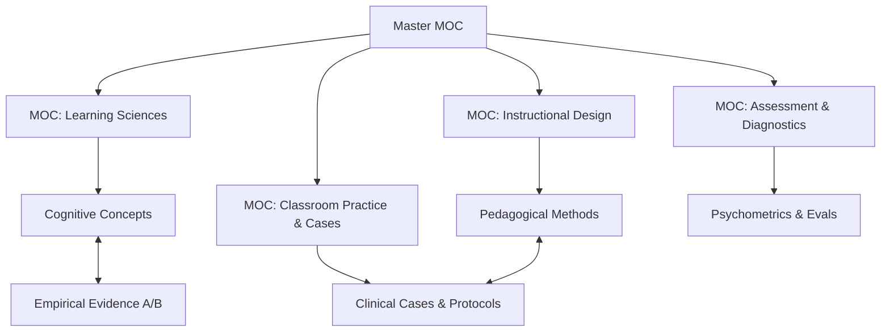

# Master Map of Content (Master MOC)

Welcome to the `design-os-pedagogy` knowledge network. This system is architected as an orthogonal **Triple Graph** (Concepts - Evidence - Clinical Practice) optimized simultaneously for **Human Educators (via Obsidian Wikilinks)** and **AI Pedagogical Agents (via YAML Stable IDs)**.

---

## 1. Domain Maps of Content (Sub-MOCs)

1. [[MOC-Learning-Science]]: Cognitive Architecture, Working Memory, Cognitive Load Theory, Executive Functions.
2. [[MOC-Instructional-Design]]: Explicit Instruction, Worked Examples, Productive Failure, UDL 3.0, Backward Design.
3. [[MOC-Assessment]]: Embedded Formative Assessment, Hinge-Point Questions, Diagnostic Rubrics, Psychometrics.
4. [[MOC-Classroom-Practice]]: Clinical Case Library, Socratic Dialogue Scripts, Targeted Intervention Protocols.

---

## 2. Fast Diagnostic Decision Router

When observing learner difficulties in the classroom or tutoring environment, use the routing matrix below:

| Observed Learner Symptom | Cognitive Root Cause | Target Construct & Intervention | Empirical Benchmark Case |
| :--- | :--- | :--- | :--- |
| **Paralysis at task onset / Staring blankly at problems** | Working Memory Overload (High intrinsic/search load) | [[Cognitive Load Theory]] & [[Worked Examples]] | [[Case — Grade 7 Algebra Worked Examples]] |
| **High fluency today, total failure to recall next week** | Weak Synaptic Consolidation / Illusion of Competence | [[Spaced Practice]] & [[Retrieval Practice]] | [[Case — High School Biology Spaced Retrieval]] |
| **Flawless procedural execution, complete word-problem failure** | Procedural mimicry without conceptual schema | [[Concrete-to-Abstract CPA]] & [[Learner Diagnostics Protocol]] | [[Case — Fraction Misconception Clinical Case]] |
| **Passive nodding during lecture, failing exam questions** | Illusion of Explanatory Depth | [[Productive Failure]] & [[Peer Instruction]] | [[Case — Eric Mazur Harvard Peer Instruction]] |
| **PhD candidate stalling, anxious about thesis defense** | Imposter Syndrome & Epistemic Boundary Deficit | [[Doctoral Supervision Socratic]] & [[Dissertation Defense Guide]] | [[Dissertation Defense Guide]] |

---

## 3. Dual-Linking Protocol

* **For Autonomous AI Agents**: Query YAML Frontmatter for deterministic graph traversal:
  * `prerequisites`: Required concept nodes to load first.
  * `leads_to`: Downstream conceptual or instructional targets.
  * `evidence_basis`: Direct pointer to empirical study and effect size.
  * `clinical_cases`: Benchmarked classroom transcripts and problem sets.
* **For Human Learners**: Navigate seamlessly using Obsidian bidirectional links (`[[...]]`) and the 2D visual graph view.
