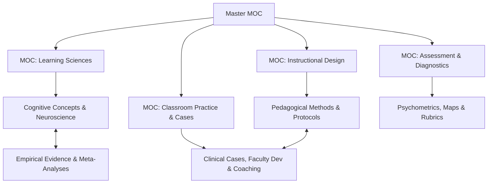

# Master Map of Content (Master MOC)

Welcome to the `design-os-pedagogy` knowledge network. This system is architected as an orthogonal **Triple Graph** (Concepts - Evidence - Clinical Practice) optimized simultaneously for **Human Educators (via Obsidian Wikilinks)** and **AI Pedagogical Agents (via YAML Stable IDs)**.

---

## 1. Domain Maps of Content (Sub-MOCs)

1. [[MOC-Learning-Science]]: Cognitive Architecture, Neurobiology of Learning, Neuromyths Debunked, Cognitive Load Theory, Spaced & Interleaving Practice, Achievement Motivation, Epistemic Ethics, and Cognitive Offloading Atrophy.
2. [[MOC-Instructional-Design]]: Direct Instruction (Engelmann), Productive Failure (Kapur), Problem-Based Learning (7 Jumps), Science of Reading (Scarborough's Rope), Singapore Math Bar Modeling, Clinical Reasoning & Deliberate Practice, 5E Instructional Model, Explicit Instruction (I Do, We Do, You Do), and the AI Assistance Ladder (S0–S7).
3. [[MOC-Assessment]]: Diagnostic Hinge Questions, Wait-Time Protocols, STEM & Humanities Misconception Catalog, Real-Time Formative Adaptation (CAP-04), Pedagogical Evidence Map (EVI-02), and Automated Pedagogical Interaction Rubric (RUB-01).
4. [[MOC-Classroom-Practice]]: Clinical Case Library, Landmark RCTs (Project Follow Through, Eric Mazur, KMOFAP), Worked-Example Fading Protocols, Instructional Coaching (Knight), SoTL Scholarship (Boyer), and Peer Observation Firewalls.

---

## 2. Fast Diagnostic Decision Router

When observing learner difficulties in the classroom or tutoring environment, use the routing matrix below:

| Observed Learner Symptom | Cognitive Root Cause | Target Construct & Intervention | Empirical Benchmark Case / Protocol |
| :--- | :--- | :--- | :--- |
| **Paralysis at task onset / Staring blankly at problems** | Working Memory Overload (High intrinsic/search load) | [[cognitive-load-theory|Cognitive Load Theory]] & [[worked-example-fading-protocol|Worked Example Fading]] | [[case-grade-7-algebra-worked-examples|Case — Grade 7 Algebra Worked Examples]] |
| **High fluency today, total failure to recall next week** | Weak Synaptic Consolidation / Illusion of Competence | [[spaced-practice-retrieval|Spaced Retrieval]] & [[interleaving-practice|Interleaving Practice]] | [[case-highschool-biology-retrieval-spacing|Case — High School Biology Spaced Retrieval]] |
| **Flawless procedural execution, complete word-problem failure** | Procedural mimicry without conceptual schema | [[singapore-math-bar-modeling|Singapore Math Bar Modeling]] & [[explicit-instruction-fln|Concrete-to-Abstract CPA]] | [[fraction-misconception-clinical-case|Case — Fraction Misconception Clinical Case]] |
| **Passive nodding during lecture, failing exam questions** | Illusion of Explanatory Depth | [[productive-failure-kapur|Productive Failure]] & [[case-eric-mazur-harvard-peer-instruction|Peer Instruction]] | [[case-eric-mazur-harvard-peer-instruction|Case — Eric Mazur Harvard Peer Instruction]] |
| **Shallow answers; only 1-2 extroverted students participate** | Zero Processing Time / Rapid Interrogation Failure | [[wait-time-questioning-protocol|Wait-Time Questioning Protocol]] | [[case-kmofap-formative-assessment-wiliam|Case — KMOFAP Formative Assessment Wiliam]] |
| **Persistent intuitive errors (e.g. heavier falls faster)** | Entrenched Naive Mental Model | [[catalog-stem-and-humanities-misconceptions|Misconception Catalog]] & [[realtime-formative-adaptation-protocol|Real-Time Adaptation]] | [[pedagogical-diagnosis-eval-01|Pedagogical Diagnosis Eval 01]] |
| **PhD candidate stalling, anxious about thesis defense** | Imposter Syndrome & Epistemic Boundary Deficit | [[doctoral-supervision-socratic|Doctoral Supervision Socratic]] & [[dissertation-defense-guide|Dissertation Defense Guide]] | [[dissertation-defense-guide|Dissertation Defense Guide]] |
| **Flawless AI-generated text, zero ability to explain underlying mechanisms** | Epistemic Debt & Premature Cognitive Offloading ($d = -0.32$) | [[cognitive-offloading-and-atrophy|Cognitive Offloading & Atrophy]] & [[process-based-assessment-viva|Process-Based Assessment & Adaptive Viva]] | [[case-ai-oral-defense-viva-undergrad|Case — AI Oral Defense Viva Undergrad]] |
| **Novice teacher freezes / reacts defensively during student misconceptions** | Low Clinical Simulation Exposure / Schema Deficit | [[synthetic-learners|Synthetic Learners for Clinical Rehearsal]] & [[video-assisted-instructional-coaching|Video Coaching]] | [[case-ai-synthetic-student-rehearsal|Case — AI Synthetic Student Rehearsal]] |

---

## 3. Evidence Syntheses & Agent Runtime Standards
* [[meta-analytic-effect-size-synthesis|Meta-Analytic Effect Size Synthesis (EVI-01)]]: Comprehensive ranking of 20 interventions benchmarked against Hattie's $d = 0.40$ hinge point.
* [[pedagogical-evidence-map|Pedagogical Evidence Map (EVI-02)]]: 2D Stage-by-Intervention matrix (S0–S7) defining developmental zones of desired effects and contraindications.
* [[pedagogical-interaction-rubric|Pedagogical Interaction Rubric (RUB-01)]]: 5-dimension automated LLM-as-a-judge rubric evaluating Socratic restraint, cognitive offloading defense, and stage adaptation.

---

## 4. Dual-Linking Protocol

* **For Autonomous AI Agents**: Query YAML Frontmatter for deterministic graph traversal:
  * `prerequisites`: Required concept nodes to load first.
  * `leads_to`: Downstream conceptual or instructional targets.
  * `evidence_basis`: Direct pointer to empirical study and effect size.
  * `stage_applicability`: Developmental target stages (S0–S7).
* **For Human Learners**: Navigate seamlessly using Obsidian bidirectional links (`[[...]]`) and the visual graph view.
