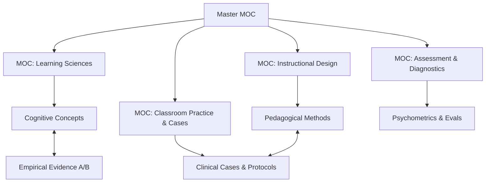

# Master Map of Content (Master MOC)

Welcome to the `design-os-pedagogy` knowledge network. This system is architected as an orthogonal **Triple Graph** (Concepts - Evidence - Clinical Practice) optimized simultaneously for **Human Educators (via Obsidian Wikilinks)** and **AI Pedagogical Agents (via YAML Stable IDs)**.

---

## 1. Domain Maps of Content (Sub-MOCs)

1. [[MOC-Learning-Science]]: Cognitive Architecture, Working Memory, Cognitive Load Theory, Executive Functions, Cognitive Offloading & Epistemic Debt.
2. [[MOC-Instructional-Design]]: Explicit Instruction, Worked Examples, Productive Failure, UDL 3.0, Backward Design, AI Assistance Ladder (S0–S7), Pedagogical State Machines.
3. [[MOC-Assessment]]: Formative Assessment, Hinge Questions, Process-Based Assessment & Proof-of-Learning, Adaptive Oral Defense (Viva Voce), Synthetic Learner Evals.
4. [[MOC-Classroom-Practice]]: Clinical Case Library, Landmark RCTs, Socratic Scripts, Teacher Clinical Simulations, Oral Defense Transcripts.

---

## 2. Fast Diagnostic Decision Router

When observing learner difficulties in the classroom or tutoring environment, use the routing matrix below:

| Observed Learner Symptom | Cognitive Root Cause | Target Construct & Intervention | Empirical Benchmark Case |
| :--- | :--- | :--- | :--- |
| **Paralysis at task onset / Staring blankly at problems** | Working Memory Overload (High intrinsic/search load) | [[cognitive-load-theory|Cognitive Load Theory]] & [[rosenshine-10-principles|Rosenshine 10 Principles]] | [[case-grade-7-algebra-worked-examples|Case — Grade 7 Algebra Worked Examples]] |
| **High fluency today, total failure to recall next week** | Weak Synaptic Consolidation / Illusion of Competence | [[evidence-mawson-2025-spacing|Spaced Practice]] & [[evidence-agarwal-2021-retrieval|Retrieval Practice]] | [[case-highschool-biology-retrieval-spacing|Case — High School Biology Spaced Retrieval]] |
| **Flawless procedural execution, complete word-problem failure** | Procedural mimicry without conceptual schema | [[explicit-instruction-fln|Concrete-to-Abstract CPA]] & [[learner-diagnostics-protocol|Learner Diagnostics Protocol]] | [[fraction-misconception-clinical-case|Case — Fraction Misconception Clinical Case]] |
| **Passive nodding during lecture, failing exam questions** | Illusion of Explanatory Depth | [[constructive-alignment-productive-failure|Productive Failure]] & [[case-eric-mazur-harvard-peer-instruction|Peer Instruction]] | [[case-eric-mazur-harvard-peer-instruction|Case — Eric Mazur Harvard Peer Instruction]] |
| **PhD candidate stalling, anxious about thesis defense** | Imposter Syndrome & Epistemic Boundary Deficit | [[doctoral-supervision-socratic|Doctoral Supervision Socratic]] & [[dissertation-defense-guide|Dissertation Defense Guide]] | [[dissertation-defense-guide|Dissertation Defense Guide]] |
| **Flawless AI-generated text, zero ability to explain underlying mechanisms** | Epistemic Debt & Premature Cognitive Offloading ($d = -0.32$) | [[cognitive-offloading-and-atrophy|Cognitive Offloading & Atrophy]] & [[process-based-assessment-viva|Process-Based Assessment & Adaptive Viva]] | [[case-ai-oral-defense-viva-undergrad|Case — AI Oral Defense Viva Undergrad]] |
| **Novice teacher freezes / reacts defensively during student misconceptions** | Low Clinical Simulation Exposure / Schema Deficit | [[synthetic-learners|Synthetic Learners for Clinical Rehearsal]] & [[pedagogical-state-machine|Pedagogical State Machine]] | [[case-ai-synthetic-student-rehearsal|Case — AI Synthetic Student Rehearsal]] |

---

## 3. Dual-Linking Protocol

* **For Autonomous AI Agents**: Query YAML Frontmatter for deterministic graph traversal:
  * `prerequisites`: Required concept nodes to load first.
  * `leads_to`: Downstream conceptual or instructional targets.
  * `evidence_basis`: Direct pointer to empirical study and effect size.
  * `clinical_cases`: Benchmarked classroom transcripts and problem sets.
* **For Human Learners**: Navigate seamlessly using Obsidian bidirectional links (`[[...]]`) and the 2D visual graph view.
