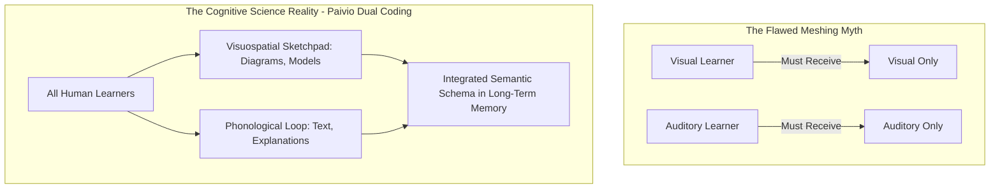

# Neuromyths in Education: Empirical Refutations, Cognitive Realities, and Evidence-Based Substitutes

> **The Epistemic Defense Axiom**:  
> Bad cognitive science is worse than no science at all. Neuromyths waste millions in educational budgets, legitimize low-expectation tracking, and misdiagnose instructional failure as biological incompatibility.

---

## 0. Learning Contract & Target Competencies

By engaging with this refutational foundation, you will develop the ability to:
1. **Identify** and systematically **dissect** the 4 major educational neuromyths: Learning Styles (VAK), Left-Brain vs. Right-Brain dominance, the 10% Brain Myth, and Rigid Critical Periods.
2. **Explain** the **Meshing Hypothesis** and articulate why decades of factorial RCTs consistently fail to produce the crossover interaction required to validate learning styles.
3. **Replace** intuitive neuromyths with verified cognitive science constructs: **Dual Coding Theory**, **Corpus Callosum Interhemispheric Transfer**, and **Experience-Dependent Neuroplasticity**.
4. **Defend** educational systems and classroom policy against commercial neuro-snake-oil vendors.

---

## 1. The Intuitive Dilemma: The "Visual Learner" Excuse

Consider this authentic classroom conference:
> *A 10th-grade geometry teacher, Sarah, meets with the parents of Leo. Leo scored 42% on the deductive coordinate geometry proof test. His mother presents a private diagnostic report from an educational coaching center:  
> "Leo is a 94th-percentile Kinesthetic-Visual learner. Sarah's class is predominantly verbal and symbolic. His brain simply cannot encode proofs unless they are presented as physical tactile manipulatives or color-coded video clips."*

Sarah feels trapped: Is Leo genuinely biologically mismatched with formal deductive reasoning, or does this diagnosis construct an artificial barrier to mathematical agency?

### The Prediction Challenge
*Before reading Section 2, commit to one of the following decisions:*
- **Choice A**: Differentiate instruction by excusing Leo from formal symbolic algebraic proofs and assessing him purely through physical clay 3D model construction.
- **Choice B**: Retain the symbolic mathematical target, but pair it with spatial-visual coordinate representations (Dual Coding) while explicitly explaining to Leo that human working memory processes both verbal and visual channels simultaneously regardless of self-reported preference.
- **Choice C**: Administer a VAK diagnostic inventory to the entire class and group students into visual, auditory, and kinesthetic cohorts for the remainder of the semester.

---

## 2. Forensic Dissection of the 4 Major Neuromyths

### Neuromyth 1: The Learning Styles (VAK) / Meshing Fallacy
* **The Claim**: Instruction is most effective when matched to a learner's self-reported perceptual modality (Visual, Auditory, Kinesthetic).
* **The Empirical Falsification (Pashler et al., 2008; Rogowsky et al., 2015, 2020)**:
  * To prove the "Meshing Hypothesis," an experiment must demonstrate a statistically significant **crossover interaction**: Visual learners must learn significantly better from visual materials than auditory materials, *AND* auditory learners must learn significantly better from auditory materials than visual materials.
  * In rigorous pre-registered RCTs with matched vs. mismatched conditions, **zero crossover interaction has ever been found** ($d = 0.02, p = .78$). All students—regardless of self-reported preference—learn spatial concepts better with diagrams and language concepts better with text/speech.
* **The Mechanism**: Information is stored semantically in abstract conceptual networks, not as raw sensory pixel/audio files. Meaning trumps sensory modality.



### Neuromyth 2: "Left-Brain vs. Right-Brain" Learners
* **The Claim**: Logical, analytical students are "left-brained"; creative, holistic students are "right-brained."
* **The Empirical Falsification (Nielsen et al., 2013, $N=1,011$)**:
  * Functional connectome fMRI analysis across 1,011 individuals analyzing 7,266 brain regions found **no evidence of individuals having stronger left- or right-sided brain networks**.
* **The Mechanism**: While specific brain functions exhibit lateralization (e.g., Broca's area for speech syntax in the left hemisphere for 95% of right-handers), any complex cognitive task—solving a calculus problem, writing poetry, reading music—requires continuous, high-speed interhemispheric communication across the **200+ million axonal fibers of the corpus callosum**.

### Neuromyth 3: "We Only Use 10% of Our Brain"
* **The Claim**: 90% of our neural potential is dormant and can be unlocked with proprietary brain-training software.
* **The Empirical Falsification**: Evolutionarily, the brain constitutes 2% of body mass but consumes **20% of resting metabolic energy (glucose and oxygen)**. Natural selection would aggressively eliminate non-functional brain tissue. PET, fMRI, and single-unit recordings show continuous distributed metabolic activation throughout the brain even during sleep.

### Neuromyth 4: Rigid "Critical Periods" Preclude Adult Learning
* **The Claim**: If a child does not learn a language, instrument, or mathematics by age 3 (or puberty), the brain permanently closes its developmental window.
* **The Reality (Sensitive vs. Critical Periods)**:
  * True *critical periods* exist for basic sensory calibration (e.g. monocular visual deprivation in amblyopia; Hubel & Wiesel).
  * Complex cognitive, mathematical, and conceptual acquisitions operate under **sensitive periods**: plasticity remains active throughout adulthood via experience-dependent myelination, neurogenesis in the subgranular zone of the dentate gyrus, and synaptic restructuring.

---

## 3. Worked Clinical Example: Refuting a Commercial Neuromyth in a School District

### Case: School District Purchasing a \$150,000 "Brain-Gym / VAK Assessment" Suite
A district curriculum director is about to sign a contract for a proprietary software suite that sorts K–8 students into visual, auditory, and kinesthetic tracks and prescribes daily contralateral cross-crawl exercises.

* **Expert Pedagogical Intervention**:
  1. **Acknowledge Intuition**: *"Teachers love this tool because they see that children are diverse and struggle with pure lecturing."*
  2. **Introduce the Empirical Evidentiary Standard**: Present the **EEF (Education Endowment Foundation)** toolkit rating: *Learning Styles: 0 months progress, £££ cost, evidence security 0/5.*
  3. **Reallocate to High-Impact Cognitive Architecture**: Divert the $150,000 budget into:
     - Formative assessment and hinge-question calibration ($+7\text{ months progress}, d = 0.41$).
     - Concrete-to-Representational (CPA) math bridge resources ($d = 0.54$).
     - Dual-coding visual assets for all science classrooms ($d = 0.57$).

---

## 4. Non-Example / Pathological Case: The Self-Fulfilling Identity Trap

1. **Teacher Action**: A middle-school teacher labels Student M as a "Kinesthetic Learner" after an online quiz.
2. **Pathological Sequence**:
   - When Student M encounters abstract fraction division ($\frac{2}{3} \div \frac{4}{5}$), she says: *"I can't do this, I'm kinesthetic. I need to move around or hold blocks."*
   - The teacher stops challenging Student M with formal mathematical abstraction, providing only wooden blocks.
   - Student M never transitions from the *Concrete* to the *Abstract* stage (violating CPA progression).
3. **Harm**: Neuromyths transform a temporary instructional challenge into a fixed, biological cognitive identity.

---

## 5. Misconception Diagnostics & Refutation Table

| Neuromyth Belief | What the Teacher Observes | What Cognitive Science Actually Explains |
| :--- | :--- | :--- |
| **"He struggles because he's a visual learner being taught verbally."** | Student loses focus during a long verbal lecture. | Working memory phonological loop is overloaded by excessive auditory speech without visual anchoring. *All* students in the room are suffering cognitive overload, not just "visual learners." |
| **"Girls are right-brained and creative; boys are left-brained and analytical."** | Unequal participation in physics vs. literature. | Cultural conditioning, stereotype threat, and prior instructional exposure, with zero structural hemispheric dichotomy. |
| **"If an intervention cites neuroimaging (fMRI), it must be effective."** | Neuropackaging bias: adding irrelevant fMRI brain images makes bad pedagogical claims 40% more persuasive to non-experts (Weisberg et al., 2008). | fMRI is descriptive (showing blood-oxygen level dependent [BOLD] signal correlation), not instructional prescriptive. |

---

## 6. Formative Hinge Question & Distractor Analysis

> **Scenario**: A biology teacher wants to teach the mechanism of cellular mitosis (prophase, metaphase, anaphase, telophase). Based on cognitive science rather than neuromyths, what is the most effective design?

* **Option A**: Administer a VAK survey, then divide the class into three stations: Station 1 watches animations (visuals), Station 2 listens to podcasts (auditories), and Station 3 acts out mitosis with their bodies (kinesthetics).
* **Option B**: Present a synchronized diagram showing chromosome alignment while simultaneously explaining the spindle fiber mechanics verbally (Dual Coding), followed by having all students sketch and label the stages from memory (Retrieval Practice).
* **Option C**: Teach the analytical terminology only to left-brained students and let right-brained students draw creative metaphorical art about cell birth.
* **Option D**: Avoid direct instruction entirely because adolescents have passed the critical period for cellular concept acquisition.

### Diagnostic Distractor Analysis:
* **Option A**: Diagnoses the *VAK Neuromyth*. Dilutes instructional fidelity, fragments teacher attention, and deprives students of integrated multimodal encoding ($d = 0.02$).
* **Option B (CORRECT)**: Employs Dual Coding (simultaneous visual and verbal integration) and active retrieval testing ($d = 0.74$), which benefits 100% of human nervous systems.
* **Option C**: Diagnoses the *Hemispheric Dichotomy Neuromyth*. Creates dangerous academic tracking based on non-existent biological boundaries.
* **Option D**: Diagnoses the *Critical Period Fallacy*. Confuses sensory maturation with lifelong conceptual plasticity.

---

## 7. Actionable School Policy: The "Neuro-Sanity" Audit Checklist

```yaml
policy: SCHOOL-NEUROMYTH-PURGE
checklist:
  1_purge_vak_surveys:
    action: "Cease administering VAK or sensory learning styles diagnostic surveys."
    replacement: "Assess prior domain knowledge, reading fluency, and specific misconceptions."
  2_enforce_dual_coding:
    action: "Require all core instructional units to combine schematic visual models with explicit verbal explanations."
    standard: "Both representations must explain the same conceptual mechanism simultaneously."
  3_ban_hemispheric_labeling:
    action: "Prohibit classifying students or academic subjects as 'left-brain' or 'right-brain'."
    standard: "Treat analytical rigor and creative synthesis as integrated across all disciplines."
  4_audit_commercial_vendors:
    filter: "Require vendors claiming 'brain-based' learning to produce peer-reviewed, preregistered factorial RCTs demonstrating crossover interaction."
```

---

## 8. Empirical Evidence & Effect Sizes

| Empirical Investigation | Methodology / Sample | Primary Metric / Effect Size | Core Conclusion |
| :--- | :--- | :--- | :--- |
| **Pashler, McDaniel, Rohrer, & Bjork (2008)** | Commissioned Review for *Psychological Science in the Public Interest* | Landmark Policy Audit | *"Virtually no evidence exists justifying the incorporation of learning-styles assessments into general educational practice."* |
| **Rogowsky, Calhoun, & Tallal (2015, 2020)** | Factorial Randomized Controlled Trial ($N=121$) | $F(1, 117) = 0.08, p = .78, \eta^2_p = .001$ | Statistically zero crossover interaction between learning style preference and instructional modality. |
| **Dekker, Lee, Howard-Jones, & Jolles (2012)** | Cross-national survey of 242 educators | $93\%$ endorse VAK myth | Neuromyths are pervasive even among experienced, well-intentioned teachers. |
| **Weisberg, Keil, Goodstein, Rawson, & Gray (2008)** | *Journal of Cognitive Neuroscience* ($N=180$) | $d = 0.72$ | Seductive Allure of Neuroscience: Inept explanations become significantly more credible when accompanied by spurious neuroscientific jargon. |
