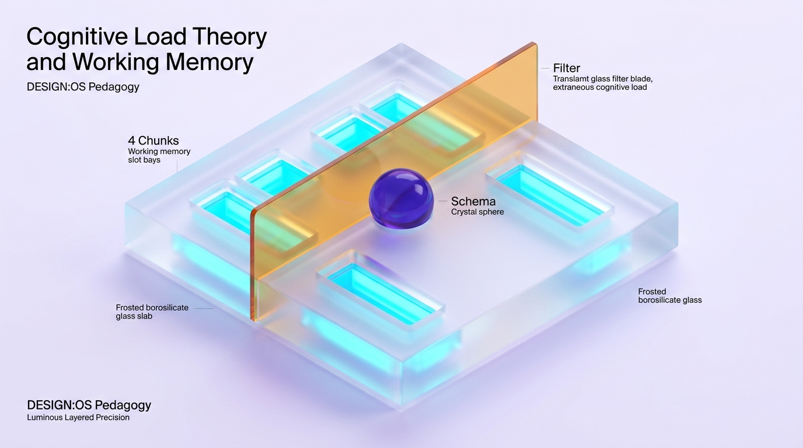

# Cognitive Load Theory: Human Cognitive Architecture & Instructional Calibration



---

## 0. Learning Contract

After engaging with this instructional module, you will be able to:
* **Diagnose** the three distinct dimensions of cognitive load (Intrinsic, Extraneous, Germane) in any live classroom transcript or lesson plan.
* **Identify and eliminate** split-attention, redundancy, and transient information effects from instructional materials.
* **Calibrate** instructional guidance dynamically based on the *Expertise Reversal Effect* (shifting from full worked examples for novices to unassisted problem solving for advanced learners).
* **Execute** an AI tutoring state machine that monitors cognitive bottlenecks in real time.

> **Pre-reading Diagnostic Challenge**:
> A science teacher designs an interactive digital module on cellular respiration. The screen features a detailed animated GIF of the Krebs cycle, accompanying background music, bulleted text on the left, and pop-up quiz bubbles every 30 seconds. In post-tests, students score significantly lower than a control group given a static black-and-white diagram with labeled text arrows.
> 
> *Before reading further, commit to an explanation: Why did the richer, more engaging media depress learning outcomes?*

---

## 1. The Intuitive Dilemma: The "Multimedia Engagement" Trap

Naive intuition in education assumes that:
> *"The more sensory stimulation, choices, and exploratory freedom we provide, the deeper and more authentic the learning experience."*

In controlled empirical trials, this intuition routinely fails. Novices exposed to unguided discovery in complex domains exhibit elevated anxiety, procedural confusion, and rapid forgetting. 

Why? Because the human brain is not a camera recording sensory inputs. It is an evolutionary information-processing system with a critical biological bottleneck: **Working Memory**.

---

## 2. Human Cognitive Architecture: The Causal Mechanism

Cognitive Load Theory (Sweller, 1988) rests on the structural relationship between two memory systems:

```
[ Environmental Stimuli: Visual & Auditory Input ]
                         │
                         ▼  (Attentional Filter)
┌─────────────────────────────────────────────────────────┐
│              WORKING MEMORY (Bottleneck)                │
│  - Bandwidth: 4 ± 1 novel chunks (Cowan, 2001)          │
│  - Duration: < 20 seconds without rehearsal             │
│  - Vulnerability: Catastrophic interference under load  │
└──────────────────────────┬──────────────────────────────┘
                           │ (Schema Consolidation)
                           ▼
┌─────────────────────────────────────────────────────────┐
│             LONG-TERM MEMORY (Infinite Store)           │
│  - Vast hierarchical networks of Cognitive Schemas      │
│  - Automated schemas function as 1 single chunk in WM   │
└─────────────────────────────────────────────────────────┘
```

### The Three Additive Dimensions of Cognitive Load
Total cognitive load experienced by a learner at any split second is additive:
$$\text{Total Load} = \text{Intrinsic Load} + \text{Extraneous Load} + \text{Germane Load}$$

$$\text{Condition for Schema Acquisition: } \text{Total Load} \le \text{Working Memory Capacity}$$

1. **Intrinsic Load (The Inherent Task Complexity)**:
   * Determined by **Element Interactivity**: the degree to which informational elements cannot be understood in isolation and must be processed simultaneously (e.g., learning vocabulary words has low element interactivity; balancing chemical equations has high element interactivity).
   * *Pedagogical Rule*: Intrinsic load cannot be deleted without changing the learning goal, but it can be **managed** via segmentation and sequencing.
2. **Extraneous Load (Instructional Friction)**:
   * Mental effort consumed by poor instructional design (searching for information across multiple pages, decoding decorative graphics, listening to redundant speech while reading identical slides).
   * *Pedagogical Rule*: Must be ruthlessly **minimized or eliminated**.
3. **Germane Load (Active Schema Construction)**:
   * Mental effort genuinely devoted to processing the intrinsic elements, deducing underlying rules, comparing structural features, and integrating concepts into long-term memory schemas.
   * *Pedagogical Rule*: Must be **optimized and protected**.

---

## 3. The Expertise Reversal Effect (Kalyuga, 2007)

The most consequential empirical law in instructional design:
> **Instructional techniques that are highly effective for novices become ineffective or counterproductive for experts.**

* **For Novices**: Heavy scaffolding, explicit modeling, and **Fully Worked Examples** ($d = 0.72 - 0.88$) minimize extraneous load and provide the missing mental schema.
* **For Intermediate Learners**: **Completion Problems** (faded worked examples where the student completes steps 3 and 4) maintain active engagement.
* **For Experts**: Detailed worked examples force them to cross-check familiar internal schemas with redundant external steps, creating extraneous cognitive load and inducing boredom. Experts learn best from unguided problem solving, inquiry, and ill-structured challenges.

```
Instructional Guidance Effectiveness
  High ▲
       │   Novices (High Guidance: Worked Examples)
       │    \
       │     \
       │      \
       │       \     Intermediates (Faded Guidance)
       │        \    /
       │         \  /
       │          \/
       │          /\
       │         /  \
       │        /    \    Experts (Low Guidance: Independent Problem Solving)
       │       /      \
   Low └──────┴────────┴────────────────────────► Learner Prior Knowledge
```

---

## 4. Worked Example: De-loading a High-School Science Lesson

### The Novice Task: Balancing Redox Reactions

#### Flawed Instructional Design (High Extraneous Load)
The teacher gives students a 10-step balancing algorithm on a handout, projects an animated simulation of electron transfer on the whiteboard, and asks students to work in groups of three to "figure out how to balance $\text{MnO}_4^- + \text{Fe}^{2+} \rightarrow \text{Mn}^{2+} + \text{Fe}^{3+}$."

*Expert Think-Aloud (Diagnosis)*:
> *"The novice students have to look back and forth between the paper handout and the board (Split-Attention Effect). The simulation moves continuously, so key states vanish before they can encode them (Transient Information Effect). The students are arguing about group roles while trying to juggle 6 oxidation states in working memory. Element interactivity has exceeded 8 chunks. Working memory failure is guaranteed."*

#### Calibrated Redesign (High Germane Load, Minimal Extraneous Load)
1. **Isolated Elements First**: The teacher verifies that oxidation state determination is fully automated through a 2-minute rapid retrieval warmup.
2. **Sub-Goal Labeled Worked Example**: The teacher presents a complete, annotated worked solution on a single unified canvas where explanatory labels point directly to each half-reaction with zero text separation.
3. **Paired Problem-Example Pair**:
   * *Step 1 (I Do)*: Teacher models Reaction A, thinking aloud through the electron balance step.
   * *Step 2 (We Do)*: Teacher presents isomorphic Reaction B with the first 3 steps filled in; students write only the final electron transfer step on individual dry-erase boards.
   * *Step 3 (You Do)*: Students solve isomorphic Reaction C independently.

---

## 5. Non-Example: The "Superficial Scaffolding" Fallacy

**Anti-Pattern**: A teacher attempts to apply Cognitive Load Theory by turning a complex essay prompt into a fill-in-the-blank worksheet where students merely write single adjectives into pre-written sentences.

*Why this fails*:
* The teacher has not reduced *extraneous* load; they have eliminated the *intrinsic* load of analytical composition altogether.
* No germane processing occurs because the learner does not have to construct a schema for thesis-argument-evidence synthesis.
* **Principle**: *Reducing cognitive load does not mean eliminating cognitive effort; it means directing all available effort exclusively to the target concept.*

---

## 6. Diagnostic Catalog: Common Pedagogical Misconceptions

| Misconception | Plausible Origin | Observable Indicator | Refutational Protocol |
| :--- | :--- | :--- | :--- |
| **M1: "Learning styles dictate cognitive load"** | Popular folklore that "visual learners" need pictures and "auditory learners" need audio. | Teacher prepares 3 versions of materials for different students. | Dual Coding applies to *all* human brains: visual and verbal channels are complementary, not isolated identity traits. |
| **M2: "Struggling novices learn deeper through open struggle"** | Conflating *desirable difficulty* with unguided confusion. | Giving beginners ill-structured projects with no scaffolding. | Desirable difficulties (Bjork) apply only *after* basic schemas exist in long-term memory. Novices who struggle without guidance simply reinforce erroneous heuristics. |
| **M3: "Eliminating cognitive load means making tasks easy"** | Equating cognitive ease with learning efficacy. | Simplifying tasks to rote recall with zero intellectual challenge. | Intrinsic load must match the proximal developmental zone. The goal is to maximize *Germane* load, not reduce total effort to zero. |

---

## 7. Formative Hinge Question & Diagnostic Map

### The Hinge Diagnostic Item
A high school physics teacher is introducing Newton’s Second Law ($F = ma$). Which instructional move represents the most empirically valid application of Cognitive Load Theory for a classroom of novices?

* **A)** Ask students to explore an interactive digital laboratory simulation to deduce the mathematical relationship between mass and acceleration on their own.
* **B)** Provide a fully worked mathematical solution on the board, speak through the reasoning while students read, and immediately follow with an identical problem where the mass is changed.
* **C)** Hand out a comprehensive 12-page study guide detailing every derivation, historical context, and potential edge case so students have complete information before solving problems.
* **D)** Pair students with diverse abilities so that novice students can watch advanced students solve the problem in real-time.

---

### Diagnostic Distractor Analysis & Routing

| Option | Diagnosis | Underlying Cognitive Fallacy | Immediate Remediation Route |
| :--- | :--- | :--- | :--- |
| **Option A** | **Misconception**: Discovery-First Fallacy | Assumes novices possess search heuristics to guide working memory without explicit schemas. | Reteach the *Expertise Reversal Effect* (Section 3). Show data from Kirschner, Sweller & Clark (2006). |
| **Option B** | **TARGET (Correct)** | Correctly recognizes the *Worked Example Effect* paired with an immediate isomorphic problem to maximize germane schema consolidation. | **Proceed to Transfer Challenge**. |
| **Option C** | **Misconception**: Completeness Illusion | Triggers severe *Information Overload* and *Split-Attention Effect*; novices cannot filter signal from noise. | Revisit Working Memory constraints ($4 \pm 1$ chunks). Direct to segmenting strategies. |
| **Option D** | **Misconception**: Passive Observation Illusion | Novices watching peers without explicit sub-goal modeling experience passive illusion of competence without cognitive encoding. | Introduce explicit *Think-Aloud Protocols* and active retrieval requirements. |

---

## 8. Operational Implementation Protocol: The 4-Step Load Calibration

### For Classroom Educators
1. **Pre-Flight Load Audit (Before Class)**:
   * Count the interactive elements in the focal problem. If $> 4$, **segment** the task into sub-skills.
   * Eliminate all decorative illustrations, background sounds, and redundant written-plus-spoken text.
2. **First-Contact Guidance**:
   * Present an annotated worked example with integrated visual labels.
   * Model thinking aloud: articulate *why* a particular decision was made, not just *what* formula was written.
3. **Scaffold Fading (Guidance Fading Effect)**:
   * Problem 1: 100% worked example.
   * Problem 2: 75% completed (student completes final step).
   * Problem 3: 25% completed (student completes core transformation).
   * Problem 4: Independent problem solving.
4. **Post-Hinge Differentiation**:
   * If the student achieves $\ge 80\%$ on the hinge diagnostic, immediately withdraw worked examples and introduce novel transfer tasks to avoid the Expertise Reversal Effect.

---

### For AI Tutor Architectures: Cognitive State Machine

```
[ Incoming Student Utterance / Action ]
                 │
                 ▼
[ Measure Latency, Error Rate & Response Complexity ]
                 │
     ┌───────────┴───────────┐
     ▼                       ▼
[ Latency > 45s OR      [ Error Rate = 0 AND
  Repetitive Slips ]     Latency < 10s ]
     │                       │
     ▼ (High Load Detected)  ▼ (Automation Detected)
[ Action: Downgrade ]   [ Action: Upgrade ]
  - Isolate sub-goal      - Fade all scaffolding
  - Supply worked step    - Present unguided transfer
  - Eliminate choices     - Challenge assumptions
```

---

## 9. Empirical Evidence & Meta-Analytic Parameters

| Principle | Authoritative Source | Effect Size | Target Cohort | Key Boundary Condition |
| :--- | :--- | :--- | :--- | :--- |
| **Worked Example Effect** | Barbieri et al. (2023); Sweller (2006) | $d = 0.72 - 0.88$ | Novices across STEM | Vanishes when learners gain prior domain knowledge (*Expertise Reversal*). |
| **Split-Attention Effect** | Ayres & Sweller (2014) | $d = 0.65$ | All stages | Ineffective if diagram and text are already fully self-explanatory. |
| **Redundancy Effect** | Kalyuga, Chandler & Sweller (1999) | $d = 0.54$ | Intermediate to Advanced | Does not apply when learners have low literacy and need dual spoken-written reinforcement. |
| **Modality Effect** | Low & Sweller (2014) | $d = 0.62$ | Multimodal systems | Fails if spoken narration is fast, accented, or cannot be replayed. |

---

## 10. Retrieval & Reflection Check

Answer these without referencing the notes:
1. *What is the biological difference between working memory and long-term memory that necessitates worked examples for beginners?*
2. *Under what exact empirical condition does providing a step-by-step worked example harm a student's learning progress?*
3. *Why is asking a novice to "guess the rule" in a chemistry lesson a breach of Cognitive Load Theory?*
