# Interleaving Practice: Cognitive Contrast, Category Boundary Formation, and Inductive Learning


> **The Inductive Boundary Axiom**:  
> In the classroom, students rarely fail because they don't know *how* to execute a formula; they fail because they don't know *which* formula to use when looking at an unlabelled problem. Blocked practice teaches execution; interleaved practice teaches discrimination.

---

## 0. Learning Contract & Target Competencies

By engaging with this clinical foundation, you will develop the ability to:
1. **Contrast** the cognitive effects of **Blocked Practice** ($AAABBBCCC$) versus **Interleaved Practice** ($ABCABCABC$) on acquisition performance versus long-term delayed transfer.
2. **Explain** the **Discriminative Contrast Hypothesis**: How alternating between distinct problem types forces the brain to attend to structural differences rather than superficial surface similarities.
3. **Restructure** textbook problem sets from blocked, homogeneous batches into interleaved problem sequences that teach cognitive diagnosis.
4. **Diagnose** why students often resist interleaving due to perceived difficulty, and coach them through the temporary dip in acquisition fluency.

---

## 1. The Intuitive Dilemma: The "End-of-Chapter" Illusion

Consider this authentic case:
> *Ms. Jenkins teaches 8th-grade mathematics. On Monday, she teaches Chapter 5.1: "Calculating the Volume of a Cylinder." She assigns 20 homework problems, all calculating cylinder volumes. Her students score an average of 95% on the homework.  
> On Tuesday, she teaches Chapter 5.2: "Volume of a Cone." She assigns 20 cone problems. Again, students score 94%.  
> On Wednesday, she teaches Chapter 5.3: "Volume of a Sphere." Again, 92%.  
> Two weeks later, on the cumulative unit exam, she presents Problem 7: a word problem involving a grain silo (a cylinder topped with a hemisphere).  
> 62% of the class calculates only the cylinder, applies the cone formula to the sphere, or freezes completely.*

Ms. Jenkins sighs: *"They were so good during homework! Why can't they solve this on the test?"*

### The Prediction Challenge
*Before reading Section 2, commit to one of the following hypotheses:*
- **Hypothesis A**: The students forgot the geometric formulas due to lack of study effort over the weekend.
- **Hypothesis B**: Blocked homework practice removed the single most critical cognitive step: **diagnosing the problem type**. Because every problem on Monday was a cylinder, students never had to ask *"What shape is this?"*—they merely substituted numbers into the predetermined formula.
- **Hypothesis C**: Geometric formulas cannot be transferred without concrete physical manipulatives.

---

## 2. The Underlying Cognitive Architecture

```mermaid
graph TD
    subgraph Blocked Practice - AAA BBB CCC
        P1[Cylinder 1] -->|Same Strategy| P2[Cylinder 2]
        P2 -->|Same Strategy| P3[Cylinder 3]
        P3 -->|Mechanical Auto-Pilot| HighAcquisition[High Fluency During Practice / Zero Discrimination]
        HighAcquisition -->|Delayed Test with Mixed Problems| TestFailure[Failure: Cannot select correct strategy]
    end
    
    subgraph Interleaved Practice - ABC ABC ABC
        Q1[Cylinder] -->|Contrast| Q2[Cone]
        Q2 -->|Contrast| Q3[Sphere]
        Q3 -->|Contrast| Q4[Cylinder]
        Q4 -->|Cognitive Friction| Discrimination[Active Category Boundary Formation]
        Discrimination -->|Delayed Test with Mixed Problems| RobustTransfer[High Delayed Retention & Fluid Problem Selection]
    end
```



### 2.1. The Discriminative Contrast Hypothesis
* **The Problem with Blocked Practice**: When a student encounters 20 consecutive factoring problems, the first problem requires thought. By problem 4, the executive system offloads the strategy selection to auto-pilot. The student merely executes the algorithm, ignoring the structural features of the algebraic expression.
* **The Power of Juxtaposition**: When Problem A (quadratic equation) is immediately followed by Problem B (linear system) and Problem C (exponential decay):
  1. The learner is deprived of the heuristic shortcut *"use whatever formula the teacher just taught."*
  2. The learner must analyze the **deep structural properties** of the problem to select the appropriate schema.
  3. Alternation forces **comparative contrast**: The learner notices subtle differences between problem classes that would otherwise remain invisible in blocked sets.

### 2.2. The Fluency Trap (Metacognitive Misalignment)
* During practice, blocked learning *feels* smooth, fast, and satisfying. Interleaved practice feels slow, disjointed, and frustrating.
* Consequently, learners (and instructors) overwhelmingly predict that blocked practice is superior.
* Empirical research (Kornell & Bjork, 2008) demonstrates that while blocked practice leads to higher scores *during acquisition*, interleaved practice leads to **dramatically higher performance on delayed retention tests (often $40\%\text{ to }75\%$ higher)**.

---

## 3. Worked Clinical Example with Expert Think-Aloud

### Clinical Scenario: Re-sequencing an Undergraduate Organic Chemistry Problem Set
* **Target Competency**: Differentiating between $S_N1$, $S_N2$, $E1$, and $E2$ chemical reaction mechanisms.

* **Novice Blocked Design**:
  - Worksheet 1: 15 $S_N2$ problems.
  - Worksheet 2: 15 $S_N1$ problems.
  - Worksheet 3: 15 $E2$ problems.

* **Expert Interleaved Redesign**:
  - A 12-problem sequence alternating between all 4 mechanisms in pseudo-random order:
    1. $S_N2$ (strong nucleophile, primary carbon)
    2. $E2$ (strong bulky base, secondary carbon)
    3. $S_N1$ (weak nucleophile, tertiary carbon, polar protic solvent)
    4. $E1$ (weak base, high temperature)
    5. $S_N2$ (inversion of stereochemistry challenge)
    6. $E2$ (Zaitsev vs. Hofmann regioselectivity)

### Expert Think-Aloud:
> *"If I give them 15 $S_N2$ problems in a row, by problem 3 they stop inspecting the nucleophile strength and solvent polarity—they just do backside attack every time. By interleaving an $E2$ immediately after an $S_N2$, they are forced to look directly at the competing reaction pathways: 'Wait, this base is bulky, so substitution is sterically hindered—this must eliminate!' That friction builds the exact diagnostic schema needed on the MCAT or clinical chemistry exam."*

---

## 4. Non-Example / Pathological Case: Pseudo-Interleaving

1. **Teacher Practice**: The teacher attempts interleaving by giving completely unrelated subjects within a single math problem: Problem 1 is ancient Greek history, Problem 2 is quadratic factoring, Problem 3 is French verb conjugation.
2. **Cognitive Analysis**:
   * This is not interleaving; this is arbitrary task-switching.
   * Interleaving requires **category discrimination within a related domain**. The problems must share surface similarities while differing in underlying structural rules.
   * Meaningless cross-domain switching merely induces destructive split-attention and task-resumption costs without generating discriminative contrast.

---

## 5. Misconception Diagnostics & Refutation Table

| Misconception | Classroom Phenomenon | Cognitive Science Refutation |
| :--- | :--- | :--- |
| **"Interleaving confuses beginners; they should master one skill completely before seeing another."** | Teachers avoid interleaving early in a unit. | While initial worked examples must be explicitly modeled, interleaving should begin as soon as 2 contrasting categories are introduced. Delaying interleaving creates rigid schemas that struggle with transfer (Carvalho & Goldstone, 2014). |
| **"If students are making more mistakes during class, the method is failing."** | Teacher reverts to blocked drills when students stumble on interleaved sheets. | Mistakes during interleaving are **productive prediction errors**. They activate dopamine-mediated learning and prompt structural comparisons that prevent future failure on comprehensive exams. |
| **"Interleaving means doing everything randomly."** | Chaotic homework assignments with unrelated topics. | Interleaving is intentional, structured alternation designed to highlight specific category boundaries and threshold concepts. |

---

## 6. Formative Hinge Question & Distractor Analysis

> **Scenario**: A middle-school math department is designing weekly problem sets for linear equations, quadratic equations, and systems of linear equations. Which assignment structure will maximize students' ability to correctly solve mixed word problems on the end-of-year state assessment?

* **Option A**: 3 weeks of linear equations only, followed by 3 weeks of quadratics only, followed by 3 weeks of systems only.
* **Option B**: Each weekly problem set contains 4 current-topic problems, 4 problems from previous topics requiring strategy discrimination, and 2 mixed synthesis problems.
* **Option C**: Students choose which problem type they feel like practicing based on their daily self-assessment.
* **Option D**: Giving 50 identical problems on one specific formula until 100% speed accuracy is reached before moving forward.

### Diagnostic Distractor Analysis:
* **Option A**: Diagnoses the *blocked practice bias*. Yields high weekly homework grades but creates catastrophic failure when problem types are presented without chapter headings.
* **Option B (CORRECT)**: Employs interleaved practice and distributed spacing ($d = 0.65$), forcing students to continuously diagnose the underlying algebraic structure.
* **Option C**: Allows students to fall into the *fluency trap*, naturally choosing easier or familiar problem types that avoid desirable difficulties.
* **Option D**: Induces mechanical overlearning without conceptual flexibility, causing rapid forgetting and inability to adapt to novel problem variations.

---

## 7. Actionable Classroom & AI Tutor Execution Protocol

```yaml
protocol: INTERLEAVED-PROBLEM-ENGINE
rules:
  minimum_categories: 2
  contrast_proximity: "Never place more than 2 identical problem types consecutively."
  explicit_diagnosis_step:
    action: "Require learners to state the underlying principle/rule BEFORE beginning calculations."
    prompt: "Before solving: What category does this problem belong to, and what visual or textual clue tells you that?"
  homework_distribution:
    current_unit: "40% of problems"
    interleaved_prior_units: "60% of problems (spanning previous 1-6 weeks)"
  error_intervention:
    condition: "Learner applies Formula A to Problem B"
    move: "Present Problem A and Problem B side-by-side. Ask: 'What structural difference makes Formula A work here, but fail there?'"
```

---

## 8. Empirical Evidence & Effect Sizes

| Source / Citation | Domain / Sample | Effect Size ($d$ / $g$) | Core Empirical Finding |
| :--- | :--- | :--- | :--- |
| **Rohrer & Taylor (2007)** | 9th-Grade Mathematics (Slope & Prisms) | $d = 0.76$ | Interleaved practice produced a $77\%$ correct score on delayed retention vs. $38\%$ for blocked practice, despite blocked scoring higher during practice. |
| **Kornell & Bjork (2008)** | Inductive Art Style Identification ($N=72$) | $d = 0.65$ | Interleaved presentation of artists' paintings produced significantly higher classification accuracy on novel paintings than blocked presentation. |
| **Carvalho & Goldstone (2014)** | Cognitive Psychology, *Cognition* | Grade A | Blocked practice highlights commonalities within a category; interleaved practice highlights differences between categories, which is the prerequisite for accurate classification. |
| **Dunlosky et al. (2013)** | Systematic Review of Learning Techniques | Moderate Utility | Interleaving is highly effective for mathematics, categorical diagnosis, and complex multi-rule domains. |
