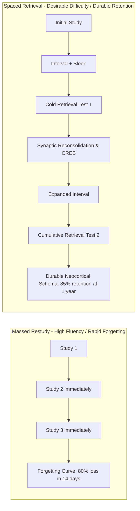

# Spaced Practice and the Retrieval Effect: Cognitive Dynamics, Synaptic Reconsolidation, and Instructional Protocols


> **The Cognitive Power Law**:  
> Memory is not a bucket that fills; it is a muscle that strengthens only when challenged to retrieve. The act of calling information to mind alters the accessibility, neural footprint, and longevity of that representation far more than repeated re-study.

---

## 0. Learning Contract & Target Competencies

By engaging with this learning science foundation, you will develop the ability to:
1. **Differentiate** between **Storage Strength** (how well consolidated a memory is) and **Retrieval Strength** (how accessible it is right now) using Bjork's New Theory of Disuse.
2. **Explain** the biological and cognitive mechanisms underlying the **Testing Effect** ($g = 0.51\text{ to }0.74$) and **Distributed Practice** ($d = 0.60$).
3. **Design** an expanding inter-study interval (ISI) schedule that optimizes retention for high-stakes cumulative retention.
4. **Transform** low-utility review activities (re-reading, highlighting, summary notes) into zero-stakes, high-impact retrieval routines.

---

## 1. The Intuitive Dilemma: The "Testing as Assessment" Trap

Consider this prevalent instructional dilemma:
> *Mr. Henderson, an AP Chemistry teacher, assigns weekly reading chapters. To "help" his students, he provides exhaustive 15-page study guides with all equations, definitions, and worked solutions filled in. Before the midterm, he dedicates 3 days to reviewing the slides while students highlight their notes.  
> His students report feeling confident and relaxed. Yet on the cumulative midterm, 58% fail to recall basic stoichiometry conversions introduced 5 weeks earlier.*

Mr. Henderson concludes: *"Tests are stressful. I shouldn't test them so often; I need to explain the concepts more clearly."*

### The Prediction Challenge
*Before reading Section 2, commit to one of the following diagnostic assessments:*
- **Assessment A**: Mr. Henderson is correct: testing induces cortisol spikes that paralyze the hippocampus; more clear lectures are required.
- **Assessment B**: Mr. Henderson has confused *retrieval as an evaluation instrument* with *retrieval as a potent memory modifier*. His students suffer from the **Illusion of Competence** induced by high perceptual fluency.
- **Assessment C**: High-school chemistry is too abstract for spaced practice; blocked massed practice is mathematically superior for chemical reactions.

---

## 2. The Underlying Cognitive Architecture



### 2.1. Bjork's Storage Strength vs. Retrieval Strength
Robert and Elizabeth Bjork (1992, 2011) established that any memory trace possesses two orthogonal dimensions:
1. **Retrieval Strength**: A measure of current ease of access. It is heavily influenced by immediate recency, environmental cues, and priming. Re-reading raises retrieval strength quickly but transiently.
2. **Storage Strength**: A measure of how deeply entrenched and interconnected a memory is within long-term semantic networks. Storage strength cannot be measured directly; it reveals itself when retrieval strength is low.
3. **The Inverse Principle**: When retrieval strength is high (e.g. right after reading a chapter), an additional study event yields **minimal storage strength growth**. Growth in storage strength is maximized when retrieval strength is low—when the learner must struggle to pull the memory trace from long-term memory (**Desirable Difficulty**).

### 2.2. The Molecular Mechanism of the Testing Effect
When a learner attempts active retrieval:
* **Spreading Activation**: The prefrontal cortex initiates a top-down search through associative memory networks, activating related semantic nodes and alternative retrieval routes.
* **Reconsolidation Window**: Once retrieved, the memory trace enters a transient, labile state. Protein synthesis is re-initiated, incorporating new contextual cues and strengthening synaptic connections between neocortical assemblies.
* **Error Correction**: If retrieval fails, immediate corrective feedback lands during a state of heightened dopaminergic sensitivity triggered by prediction error, drastically accelerating error correction.

---

## 3. Worked Clinical Example with Expert Think-Aloud

### Clinical Scenario: Redesigning a 10th-Grade Biology Retrieval Schedule
* **Context**: 10th-grade Cell Biology unit covering: Organelles (Week 1), Mitosis (Week 2), Cellular Respiration (Week 3), Photosynthesis (Week 4).

```text
[Week 1 - Friday]
Cold Retrieval Grid: 4 boxes on blank sheet: Nucleus, Mitochondria, Ribosome, Golgi. Students have 3 minutes to write function + sketch without looking at binders.

[Week 2 - Wednesday] (Spacing Interval: 5 days)
Two-Box Starter: 
  - Box 1 (Last week): Contrast Mitochondria vs. Chloroplast ATP production.
  - Box 2 (Today): What happens to the nuclear envelope during Prophase?

[Week 4 - Monday] (Spacing Interval: 21 days)
Cumulative Flash Challenge:
  - Connect: How does an error in Week 2's spindle checkpoint affect Week 1's organelle replication?
```

### Expert Think-Aloud:
> *"Notice that on Week 4, I am asking about Week 1 organelles. The students will complain: 'Why are you testing us on organelles? That test was 3 weeks ago!' This friction is exactly where storage strength is forged. If I don't force that retrieval now, the synaptic trace will dip below the threshold of accessibility, and by the final exam in June, it will require complete, time-consuming re-teaching."*

---

## 4. Non-Example / Pathological Case: The "Warm-Up Quiz" with Open Notes

1. **Teacher Practice**: Every morning, the teacher posts a 3-question "Bell Ringer" quiz, but tells students: *"You can use your textbooks and notes, or ask your neighbor."*
2. **Cognitive Analysis**:
   * Students look at the question, immediately glance down at their notebooks, locate the bold term, and copy the definition.
   * **Zero retrieval effort** occurs. The phonological loop simply buffers visual text from the notebook to the paper.
   * NMDA receptors remain blocked by $\text{Mg}^{2+}$; no intracellular $\text{Ca}^{2+}$ influx occurs.
3. **Correction**: Enforce the **"Brain First, Notes Second" Rule**. Pens down for 2 minutes of silent independent retrieval. Notes may only be consulted with a different colored pen during the post-retrieval feedback phase.

---

## 5. Misconception Diagnostics & Refutation Table

| Misconception | Classroom Symptom | Cognitive Science Refutation |
| :--- | :--- | :--- |
| **"Testing is only for grading and assigning marks."** | Quizzes are only given at the end of units for summative grades. | Testing is the most powerful learning event in the instructional sequence. Low-stakes or zero-stakes testing produces higher retention than identical time spent re-studying ($g = 0.61$). |
| **"If students make errors during retrieval, it reinforces bad habits."** | Teacher fears testing before students have "mastered" all content. | As long as corrective feedback is provided, retrieval errors followed by feedback produce *superior* final learning compared to error-free passive exposure (Kornell et al., 2009). |
| **"Massed cramming before exams is an effective study strategy."** | Students pull all-nighters and pass the next day. | Cramming exploits high immediate Retrieval Strength. Long-Term Storage Strength remains near zero; 80% of information is lost within 14 days. |

---

## 6. Formative Hinge Question & Distractor Analysis

> **Scenario**: A teacher has 60 minutes available for an exam preparation session on Thursday before Friday's exam. Which schedule produces the highest retention on a delayed retention test 30 days later?

* **Option A**: 60 minutes of uninterrupted teacher-led lecture reviewing all key formulas and highlighted concepts.
* **Option B**: 15 minutes of independent review of notes, followed by 45 minutes of closed-book cumulative retrieval practice with immediate feedback on errors.
* **Option C**: 60 minutes of students reading their textbooks in small cooperative study groups.
* **Option D**: Giving students the exact test questions with answers to memorize the night before.

### Diagnostic Distractor Analysis:
* **Option A**: Diagnoses the *transmissive lecture illusion*. Maximizes passive familiarity; produces near-zero delayed retention.
* **Option B (CORRECT)**: Balances initial priming with dominant active retrieval struggle ($d = 0.74$), which anchors representations for long-term retention.
* **Option C**: Fails to guarantee active retrieval; often degenerates into social distraction or passive re-reading.
* **Option D**: Fosters verbatim surface mimicry with zero conceptual schema development or transfer ability.

---

## 7. Actionable Classroom & AI Tutor Execution Protocol

```yaml
protocol: EXPANDING-SPACED-RETRIEVAL
schedule:
  day_0: "Initial explicit instruction with dual coding and worked examples."
  day_1: "Immediate 3-minute cold retrieval check (exit ticket)."
  day_3: "Hinge question warm-up integrating Day 0 concept into current lesson."
  day_7: "Cumulative retrieval grid pairing Day 0 concept with novel transfer scenario."
  day_21: "Interleaved challenge problem requiring discrimination between Day 0 and subsequent models."
rules:
  no_peeking: "Students must make an authentic retrieval attempt before consulting resources."
  immediate_feedback: "Feedback must confirm correct responses and explain underlying causal mechanisms for errors."
  zero_stakes: "Retrieval practice must never be scored punitively; psychological safety is essential for cognitive risk-taking."
```

---

## 8. Empirical Evidence & Effect Sizes

| Source / Citation | Methodology / Sample | Effect Size ($d$ / $g$) | Core Empirical Finding |
| :--- | :--- | :--- | :--- |
| **Dunlosky et al. (2013)** | Comprehensive Review of 10 Learning Techniques (*PSPI*) | Highest Utility Rating | Practice testing and distributed practice ranked as the **only two techniques** with high, robust generalizability across ages, domains, and tasks. |
| **Roediger & Karpicke (2006)** | *Psychological Science* ($N=120$) | $d = 0.88$ | Study-Test-Test-Test condition outperformed Study-Study-Study-Study condition by $30\%$ on 1-week delayed retention, despite lower immediate confidence. |
| **Agarwal et al. (2021)** | Meta-Analysis of 272 studies | $g = 0.51 - 0.74$ | Retrieval practice enhances learning in authentic classroom settings across elementary through post-secondary education. |
| **Mawson et al. (2025)** | Longitudinal Spacing Meta-Analysis | $d = 0.60$ | Distributed study intervals produce dramatic gains in mathematical problem-solving compared to equal-duration massed practice. |
