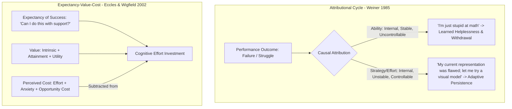

# Achievement Motivation, Self-Efficacy, and Epistemic Agency: Psychological Architecture and Classroom Drivers

> **The Motivational Mechanics Axiom**:  
> Motivation is not an innate personality trait; it is a dynamic psychological calculation. Learners do not invest cognitive effort because they are "motivated"; they become motivated when they experience competence through successful mastery under challenging conditions.

---

## 0. Learning Contract & Target Competencies

By engaging with this motivational foundation, you will develop the ability to:
1. **Dissect** learner withdrawal and learned helplessness using **Weiner's Attributional Taxonomy** (Locus, Stability, Controllability).
2. **Engineer** the 4 verified sources of **Bandura's Self-Efficacy**: Enactive Mastery Experiences, Vicarious Modeling, Social Persuasion, and Physiological State Calibration.
3. **Apply** the **Expectancy-Value-Cost Model** (Eccles & Wigfield) to diagnose whether student disengagement stems from expectancy deficits, utility skepticism, or perceived psychological cost.
4. **Refute** the "False Growth Mindset" trap (empty praise for "trying hard" without pedagogical scaffolding) and deploy evidence-based attribution retraining.

---

## 1. The Intuitive Dilemma: The "You're So Smart" Feedback Trap

Consider this widespread classroom interaction:
> *Maya, an 8th-grade student, scores 100% on a physics diagnostic test on velocity. Her teacher smiles and announces to the class:  
> "Look at Maya! She got every question right on the first try! You are so naturally gifted at science, Maya!"  
> Two weeks later, the class begins kinematics with accelerated motion. Maya encounters a challenging problem where her initial equation fails.  
> Instead of asking questions or trying a second approach, Maya quietly closes her notebook, hides her paper under her arm, and puts her head on her desk.*

Her teacher is baffled: *"I praised her intelligence! I built up her self-esteem! Why did she shut down the moment things got hard?"*

### The Prediction Challenge
*Before reading Section 2, commit to one of the following diagnostic hypotheses:*
- **Hypothesis A**: Maya has low general academic resilience and needs more unconditional emotional praise.
- **Hypothesis B**: The teacher's trait-based praise anchored Maya's identity to effortless performance. Hard problems now generate acute identity threat: struggling proves she is no longer "smart," so withdrawal is a rational defense of her self-worth.
- **Hypothesis C**: Kinematics requires advanced spatial reasoning that adolescent girls developmentally struggle with.

---

## 2. The Underlying Psychological Architecture



### 2.1. Weiner's Attribution Theory
When learners succeed or fail, they spontaneously search for causes. Their attributions fall along three orthogonal axes:
1. **Locus of Causality** (Internal vs. External): Did this happen because of *me* (my ability/effort) or *the environment* (the test/the teacher)?
2. **Stability** (Stable vs. Unstable): Will this cause remain constant over time (my fixed IQ) or can it change (my strategy/preparation)?
3. **Controllability** (Controllable vs. Uncontrollable): Can I alter this cause through my own agency (using worked examples, asking for feedback) or is it beyond my control (luck, inherent talent)?

* **The Toxic Combination**: Attributing failure to **Internal, Stable, Uncontrollable** factors (*"I am biologically incapable of abstract mathematics"*) inevitably produces **Learned Helplessness** and cognitive withdrawal.
* **The Agency Engine**: Guiding students to attribute failure to **Internal, Unstable, Controllable** factors (*"My initial schema failed to account for friction; I need to redraw my free-body diagram"*).

### 2.2. Bandura's 4 Sources of Self-Efficacy
Albert Bandura (1997) proved that general self-esteem does not predict academic achievement; **task-specific self-efficacy** does. Self-efficacy is built through 4 distinct channels, ranked by potency:
1. **Enactive Mastery Experiences (Most Potent)**: Authentic, unassisted success on challenging tasks through guided scaffolding and faded worked examples. *Nothing builds confidence like genuine competence.*
2. **Vicarious Experiences (Peer Modeling)**: Seeing a peer of similar perceived ability struggle, deploy a strategy, and ultimately succeed.
3. **Social / Verbal Persuasion**: Specific, credible feedback from a trusted expert focusing on observable strategy adjustments, not empty flattery.
4. **Physiological & Affective States**: Interpreting autonomic arousal (elevated heart rate, tension) not as "paralyzing anxiety," but as physiological readiness and metabolic mobilization for focus.

---

## 3. Worked Clinical Example with Expert Think-Aloud

### Clinical Scenario: Re-framing a Failed Chemistry Lab Experiment
A college sophomore, David, watches his titration turn dark pink (severe over-titration). He slams his flask into the sink: *"I hate organic chemistry. I don't have the hands for lab work. I'm dropping this major."*

* **Novice Response**: *"Don't be sad, David! You're a great person and you worked really hard! You'll do better next time!"* (Empty comfort; confirms failure is an inherent trait).
* **Expert Pedagogical Reframing**:

```text
Teacher: "David, stop for a second. Look at the burette reading. What volume did you dispense?"
David: "18.4 mL."
Teacher: "What was the stoichiometric equivalence point you calculated in your pre-lab?"
David: "15.2 mL."
Teacher: "So you overshot by 3.2 mL. Did the molecules fail because of your personality, or because of your flow-rate control?"
David: "I opened the stopcock fully when I got impatient near 14 mL."
Teacher: "Exactly. That is a mechanical dispensing rate error, not an intellectual limitation. On titration #2, you will switch to half-drop increments as soon as you reach 14.0 mL. Grab a fresh flask and execute that specific adjustment."
```

### Expert Think-Aloud:
> *"David made an internal, stable, uncontrollable attribution: 'I don't have the hands for lab work.' If I just tell him 'You're great,' I leave that attribution intact. By forcing him to analyze the physical numbers, I shifted the attribution to an internal, unstable, controllable mechanical variable: stopcock flow rate. Once he executed the half-drop technique and saw the faint pale pink endpoint, his self-efficacy was restored through authentic enactive mastery."*

---

## 4. Non-Example / Pathological Case: The "False Growth Mindset"

1. **Teacher Action**: A teacher hangs "Growth Mindset" posters on the wall, but when a student gets 4 out of 10 math problems wrong, the teacher says: *"It's okay! Good effort! You tried your best, and that's all that matters!"*
2. **Pathological Reality (Carol Dweck, 2015)**:
   * Praising fruitless effort without offering alternative pedagogical strategies is patronizing and demotivating.
   * The student thinks: *"If I tried my absolute hardest and still failed, and the teacher is just praising my effort, I must be completely hopeless."*
   * **The True Growth Mindset Rule**: Effort is merely the fuel. The engine is **strategy selection, seeking feedback, and cognitive restructuring**. Praise must always tie effort directly to the *strategy* that enabled progress.

---

## 5. Misconception Diagnostics & Refutation Table

| Misconception | Behavioral Symptom | Psychological Reality |
| :--- | :--- | :--- |
| **"Students need high self-esteem before they can learn hard content."** | Teachers lower standards and remove rigor to protect student feelings. | The causality runs in reverse: **Competence produces genuine self-efficacy**, not vice versa. Lowering standards robs students of enactive mastery experiences. |
| **"Extrinsic rewards (stickers, money, candy) always boost motivation."** | Token economies deployed for tasks students already enjoy. | The **Overjustification Effect** (Deci et al., 1999): Tangible extrinsic rewards for intrinsically interesting tasks undermine autonomy and destroy internal motivation. |
| **"Struggling means the student isn't ready."** | Intervening instantly at the first sign of student hesitation. | Premature intervention deprives the learner of the productive struggle necessary to experience agency and dopamine-mediated prediction error resolution. |

---

## 6. Formative Hinge Question & Distractor Analysis

> **Scenario**: A 9th-grade student who historically struggles with reading comprehension fails a history document analysis quiz. When meeting with the teacher, the student says: *"No one in my family is good at history or reading. It's just not in my DNA."* Which teacher intervention directly addresses the underlying attributional and self-efficacy deficit?

* **Option A**: Reassure the student that history grades don't define their worth as a person and offer an alternative multiple-choice quiz.
* **Option B**: Present a peer's flawless essay as an example of what hard work looks like, telling the student to copy that structure.
* **Option C**: Conduct a 5-minute retrospective analysis of the quiz: identify the specific sentence where the student missed the author's tone, teach the "Sourcing Heuristic" (checking author and date first), and have the student immediately re-analyze a parallel 2-sentence paragraph using that heuristic.
* **Option D**: Tell the student: *"You have a growth mindset! Just believe in yourself and try twice as hard on the next quiz!"*

### Diagnostic Distractor Analysis:
* **Option A**: Confirms the student's belief that they are biologically incapable of historical thinking, reinforcing low academic expectations.
* **Option B**: Induces upward social comparison with a high-performing peer, which depresses self-efficacy in struggling learners (Bandura, 1997).
* **Option C (CORRECT)**: Directly shifts attribution from innate genetics to an actionable cognitive heuristic (Sourcing), immediately followed by an enactive mastery experience on a scaled task ($d = 0.65$).
* **Option D**: Deploys the *False Growth Mindset* trap; offers empty motivational slogans without providing the necessary instructional scaffolding.

---

## 7. Actionable Classroom & AI Tutor Execution Protocol

```yaml
protocol: ATTRIBUTIONAL-RETRAINING-AND-MASTERY
steps:
  1_intercept_fatalism:
    trigger: "Student states: 'I can't do this / I'm bad at this / My brain doesn't work this way'"
    action: "Halt task execution immediately. Neutralize trait label: 'Your brain is functioning normally; your current strategy is what failed.'"
  2_isolate_decision_point:
    action: "Trace back to the exact step where the misconception or arithmetic error occurred."
    prompt: "Show me where your plan was working, and identify the exact line where the unexpected result appeared."
  3_supply_concrete_heuristic:
    action: "Provide a micro-scaffold or heuristic (e.g. Draw a bar model, Check units, Invert and multiply)."
  4_enactive_mastery_trial:
    action: "Immediately present an isomorphic problem with different surface numbers."
    criteria: "Learner must execute successfully without teacher prompting."
  5_strategy_attribution_anchor:
    action: "Deliver targeted feedback: 'Notice how changing your representation from abstract symbols to a bar model made the equation obvious? That was strategy, not luck.'"
```

---

## 8. Empirical Evidence & Effect Sizes

| Source / Citation | Methodology / Sample | Effect Size ($d$ / $g$) | Core Empirical Finding |
| :--- | :--- | :--- | :--- |
| **Bandura (1997)** | Decadal Synthesis (*Self-Efficacy*) | $d = 0.60 - 0.85$ | Task-specific self-efficacy is a powerful direct predictor of academic performance, persistence in the face of failure, and cognitive strategy selection. |
| **Sisk, Burgoyne, Sun, Butler, & Macnamara (2018)** | Meta-Analysis (273 studies, $N=400,000+$) | $d = 0.08\text{ (overall)}, d = 0.35\text{ (disadvantaged)}$ | Standalone growth mindset interventions have small general effects, but yield meaningful academic gains when targeted at academically at-risk learners and paired with actionable skill instruction. |
| **Weiner (1985, 2010)** | Attributional Meta-Analytic Synthesis | Grade A | Retraining students to attribute academic failure to controllable strategy use significantly increases subsequent persistence, affect, and performance. |
| **Deci, Koestner, & Ryan (1999)** | Meta-Analysis (128 experiments) | $d = -0.34\text{ to } -0.40$ | Tangible extrinsic rewards significantly undermine intrinsic motivation for interesting tasks (Overjustification Effect). |
