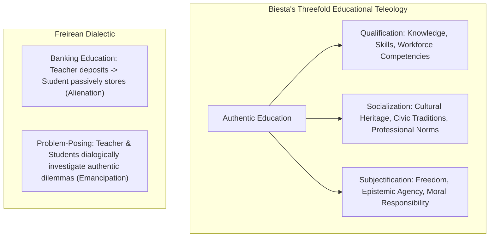

# Epistemic Ethics, Critical Pedagogy, and the Moral Architecture of Learning

> **The Epistemic Mandate**:  
> Education is never neutral. It either functions as an instrument used to facilitate integration into the logic of the present system and bring about conformity, or it becomes the "practice of freedom"—the means by which human beings deal critically and creatively with reality and discover how to participate in the transformation of their world (Freire, 1970).

---

## 0. Learning Contract & Target Competencies

By engaging with this philosophical foundation, you will develop the ability to:
1. **Analyze** any curriculum or AI tutoring system through **Gert Biesta's Threefold Teleology of Education**: Qualification (skills), Socialization (culture/norms), and Subjectification (emancipated agency).
2. **Diagnose and dismantle** the two forms of **Epistemic Injustice** (Miranda Fricker): *Testimonial Injustice* (discounting student voice due to prejudice) and *Hermeneutical Injustice* (lacking the collective conceptual tools to articulate one's lived experience).
3. **Contrast** the authoritarian **"Banking Concept of Education"** with Freirean **Problem-Posing Pedagogy** in authentic instructional design.
4. **Cultivate** systemic **Epistemic Humility** in human educators and AI agents, preventing authoritarian paternalism and algorithmic epistemic debt.

---

## 1. The Intuitive Dilemma: The "Docile Straight-A Student" Paradox

Consider this authentic educational crisis in a high-ranking preparatory academy:
> *Daniel is the valedictorian of his senior class. He has a 4.0 GPA, perfect standardized test scores, and 12 AP course credits. When presented with a textbook problem with a known solution key, his procedural execution is flawless.  
> In his senior philosophy and social justice seminar, the instructor asks:  
> "Consider our school's zero-tolerance disciplinary code. Who wrote these rules, whose interests do they protect, and what evidence justifies their enforcement?"  
> Daniel is paralyzed and deeply distressed:  
> "Why are you asking me that? Is that on the test? Just tell me what the school board's official position is so I can write it down and get my A."*

The instructor realizes: The school has produced a student with supreme **Qualification**, deep **Socialization**, but near-zero **Subjectification**—an intellectual automaton incapable of independent critical agency.

### The Prediction Challenge
*Before reading Section 2, commit to one of the following interpretations:*
- **Interpretation A**: Daniel is simply a pragmatic, high-achieving student; critical questioning should be reserved for graduate school.
- **Interpretation B**: The instructional environment has operated exclusively under the "Banking Concept of Education," treating Daniel as an empty vessel to be filled with pre-approved knowledge, thereby severing his critical consciousness (*conscientização*).
- **Interpretation C**: Daniel's inability to think critically reflects a genetic deficit in abstract philosophical reasoning.

---

## 2. The Core Philosophical Frameworks



### 2.1. Gert Biesta's Threefold Educational Teleology
Dutch educational philosopher Gert Biesta (2010, 2015) warns that modern schooling is obsessed with "learnification"—reducing education to measurable qualification metrics (PISA scores, exam percentages). Authentic pedagogy must balance three interconnected domains:
1. **Qualification**: Equipping learners with domain-specific knowledge, procedural algorithms, and technical proficiencies. (Necessary, but insufficient).
2. **Socialization**: Initiating learners into existing cultural, professional, and disciplinary communities and their shared practices.
3. **Subjectification (The Ultimate Aim)**: Fostering the learner's emergence as an autonomous, responsible, and critical subject who can choose *not* to conform—who can question existing paradigms with epistemic rigor.

### 2.2. Miranda Fricker: Epistemic Injustice in the Classroom
Epistemic injustice occurs when a person is wronged specifically in their capacity as a knower:
* **Testimonial Injustice**: An educator assigns a deflated level of credibility to a student's question or observation based on demographic, age, or socioeconomic bias (*"You're only in 7th grade; what could you possibly know about city budget ethics?"*).
* **Hermeneutical Injustice**: A student experiences a social or cognitive reality (e.g., neurodivergent sensory overload, minority linguistic alienation) but the classroom lacks the conceptual vocabulary to name and validate that experience, forcing the student to accept labels of "laziness" or "defiance."

### 2.3. Paulo Freire: The Banking Model vs. Problem-Posing Education
* **The Banking Concept**:
  - The teacher teaches and the students are taught.
  - The teacher knows everything and the students know nothing.
  - The teacher acts and the students have the illusion of acting through the action of the teacher.
* **Problem-Posing Education**:
  - The teacher-of-the-students and the students-of-the-teacher cease to exist; a new term emerges: **teacher-student with students-teachers**.
  - People teach each other, mediated by the world, through authentic generative themes.

---

## 3. Worked Clinical Example: Transforming a Banking Unit into a Problem-Posing Inquiry

### Scenario: High School Civics Unit on Water Resource Management
* **Banking Model Execution**:
  - Teacher lectures for 5 days on the municipal water filtration process.
  - Students memorize the 5 steps: Coagulation, Flocculation, Sedimentation, Filtration, Disinfection.
  - Multiple-choice quiz on Friday.
* **Problem-Posing Transformative Redesign**:

```text
[Phase 1: Generative Dilemma]
Teacher presents local municipal water testing records from two adjacent ZIP codes: 
ZIP Code A (Affluent): 0.2 ppb lead.
ZIP Code B (Low-Income): 14.8 ppb lead (near federal violation threshold).
Prompt: "Here are the raw water samples from our own county. What is happening here, and why does geography determine toxicity?"

[Phase 2: Disciplinary Qualification]
Students must learn the technical chemistry of pipe corrosion, pH balance, and orthophosphate protective barriers (Rigorous Qualification).

[Phase 3: Dialogic Critical Investigation]
Students interview municipal water engineers and community advocates. Why was orthophosphate dosing skipped during the infrastructure transition? What budgetary trade-offs were made? (Socialization).

[Phase 4: Epistemic Agency & Subjectification]
Students co-author a public policy brief with chemical data and present it at the city council hearing, proposing evidence-based infrastructure remediation.
```

### Expert Think-Aloud:
> *"Notice that I did not abandon technical rigor. The students still mastered stoichiometry, acid-base equilibrium, and filtration chemistry. But instead of storing these as inert 'bank deposits,' the chemistry became an epistemic tool for community survival and justice. That is the synthesis of Qualification and Subjectification."*

---

## 4. Non-Example / Pathological Case: "Performative Criticality" Without Rigor

1. **Teacher Action**: A university instructor announces: *"There are no facts, only narratives! We don't need to read the difficult 40-page economics paper; let's just sit in a circle and share how we feel about capitalism."*
2. **Philosophical Diagnosis**:
   * This is not critical pedagogy; this is **epistemic nihilism**.
   * Freire explicitly insisted that authentic liberation requires rigorous mastery of reality, not intellectual sloth.
   * Depriving marginalized students of rigorous qualification (e.g. statistics, formal logic, academic writing) leaves them unarmed against institutional power. True critical pedagogy demands *higher* intellectual rigor, not lower.

---

## 5. Misconception Diagnostics & Refutation Table

| Misconception | Classroom Symptom | Epistemic Reality |
| :--- | :--- | :--- |
| **"Science and mathematics are purely objective; ethics has no place here."** | STEM courses taught without context, historical sourcing, or ethical implication. | Every algorithm, bridge, and pharmaceutical has societal consequences. Separating technical skill from ethical responsibility produces dangerous technocrats. |
| **"Critical pedagogy means brainwashing students with a specific political ideology."** | Instructors forcing students to adopt predetermined ideological slogans. | Freirean pedagogy is anti-indoctrination. Its purpose is to teach students to analyze power, examine evidence, and think autonomously—including critiquing the teacher. |
| **"AI tutors are neutral knowledge engines."** | Blindly accepting AI summaries as ground truth. | AI models encode the epistemic biases, cultural assumptions, and economic incentives of their training corpora. AI pedagogy must cultivate *critical epistemic scrutiny* of AI outputs. |

---

## 6. Formative Hinge Question & Distractor Analysis

> **Scenario**: An AI education platform is deployed to 50,000 students. The algorithm automatically detects when a student takes longer than 45 seconds on an open-ended essay prompt and immediately pops up an AI-generated paragraph: *"Here is an outline to help you finish quickly."* Under Biesta's framework, what is the primary ethical failure of this design?

* **Option A**: The AI's grammar is occasionally imperfect and introduces typographical errors.
* **Option B**: The system prioritizes immediate speed of task completion (Qualification metric) at the catastrophic expense of student struggling, identity formation, and intellectual voice (**Subjectification**), producing epistemic atrophy and learned dependence.
* **Option C**: The system should be completely free of charge to be ethically sound.
* **Option D**: The pop-up interferes with the student's sensory learning style.

### Diagnostic Distractor Analysis:
* **Option A**: Focuses on trivial surface mechanics while ignoring the profound ethical destruction of student agency.
* **Option B (CORRECT)**: Diagnoses the core ethical danger of algorithmic tutoring: premature cognitive offloading that amputates the student's capacity for independent voice, struggle, and epistemic subjectification.
* **Option C**: Addresses financial access while ignoring the pedagogical toxicity of the interaction itself.
* **Option D**: Invokes a discredited neuromyth (VAK) to analyze a philosophical and ethical dilemma.

---

## 7. Actionable Classroom Protocol: The Epistemic Injustice Audit

```yaml
protocol: CLASSROOM-EPISTEMIC-JUSTICE-CHECK
audit_dimensions:
  1_testimonial_audit:
    action: "Record a 30-minute whole-class discussion."
    metric: "Compare wait-time and uptake of ideas across gender, race, and quiet vs. vocal students."
    standard: "Zero dismissal of atypical or counter-intuitive student observations without explicit evidence."
  2_hermeneutical_expansion:
    action: "Explicitly introduce meta-cognitive and affective vocabulary."
    terms: ["Cognitive Overload", "Stereotype Threat", "Epistemic Friction", "Attributional Bias"]
    goal: "Ensure students have the language to describe their intellectual struggles without self-pathologizing."
  3_power_analysis_checkpoint:
    action: "Once per unit, ask: 'Who generated this theorem/text, under what historical conditions, and what alternative perspectives were excluded?'"
  4_ai_criticality_filter:
    action: "When using AI tools, require students to identify: (a) One hallucination or bias, (b) One perspective omitted by the AI."
```

---

## 8. Philosophical Canon & Evidence Base

| Thinker / Framework | Landmark Work | Core Pedagogical Thesis |
| :--- | :--- | :--- |
| **Paulo Freire (1970)** | *Pedagogy of the Oppressed* | Rejection of the banking concept; education as the practice of freedom through dialogic, problem-posing conscientization. |
| **Miranda Fricker (2007)** | *Epistemic Injustice: Power and the Ethics of Knowing* | Systematic formulation of Testimonial and Hermeneutical Injustice, defining epistemic virtue and harm. |
| **Gert Biesta (2010, 2015)** | *Good Education in an Age of Measurement* | The vital necessity of balancing Qualification, Socialization, and Subjectification against the tyranny of metric reductionism. |
| **John Dewey (1916)** | *Democracy and Education* | Education as continuous reconstruction of experience; school as an embryonic democratic society fostering shared inquiry. |
