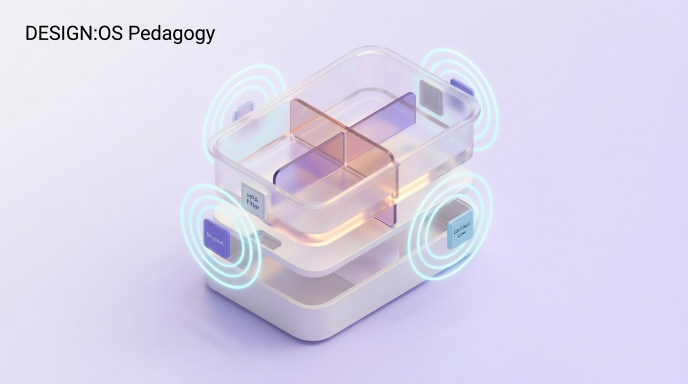

# S0: Thai Giáo Dựa Trên Bằng Chứng Thần Kinh Học

## 1. Trọng Tâm Khoa Học: Epigenetics & Môi Trường Tử Cung
* Trong giai đoạn thai kỳ, tốc độ sinh tế bào thần kinh (Neurogenesis) đạt 250.000 tế bào/phút.
* Sự biểu hiện gen (Epigenetic programming) chịu tác động trực tiếp từ trạng thái sinh hóa của người mẹ.

## 2. Các Trụ Cột Can Thiệp Sư Phạm Cho Người Chăm Sóc (Caregiver Interventions)
1. **Quản Lý Căng Thẳng (Cortisol & Trục HPA)**:
   * Cortisol liều cao kéo dài qua hàng rào nhau thai làm biến đổi cấu trúc hạch hạnh nhân (Amygdala) và hồi hải mã (Hippocampus) của thai nhi.
   * Can thiệp: Thiền chánh niệm, môi trường gia đình an yên, bài tập thở và chia sẻ gánh nặng tâm lý.
2. **Kích Thích Giác Quan Có Kiểm Soát**:
   * Tuần 24+: Ốc tai hoàn thiện. Thai nhi nghe được tiếng tim đập, tiếng máu chảy và giọng nói người mẹ.
   * Thực hành chuẩn: Cha mẹ trò chuyện nhẹ nhàng, hát ru đều đặn. Giọng nói quen thuộc này sẽ là tín hiệu an thần (soothing signal) giúp trẻ sơ sinh tự bình tĩnh sau khi chào đời.
3. **Dinh Dưỡng Kiến Tạo Màng Tế Bào Thần Kinh**:
   * Acid Folic (ngừa dị tật ống thần kinh), Choline & DHA (cấu tạo màng myelin và synap), Sắt & I-ốt (chuyển hóa năng lượng não bộ).

## 3. Phán Quyết Về Các Ngụy Khoa Học Thai Giáo
* ❌ **Ép nghe nhạc Mozart để thông minh**: Không có nghiên cứu kiểm chứng nào xác nhận. Ép đeo tai nghe sát bụng mẹ với âm lượng lớn còn có nguy cơ tổn thương thính giác thai nhi.
* ❌ **Thẻ flashcard toán/chữ cho thai nhi**: Hoàn toàn vô nghĩa về mặt sinh học thần kinh.
