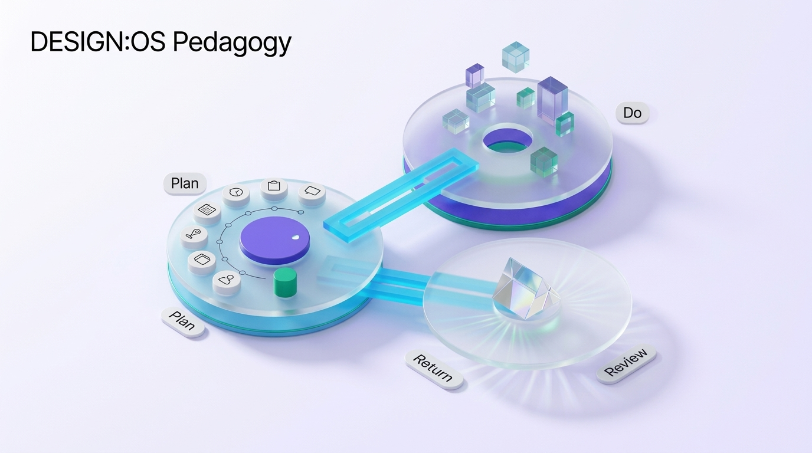

# S1: Early Childhood Education Grounded in Developmental Science

## 1. Neurological Mechanisms: Peak Synaptogenesis
Ages 0–6 exhibit the highest rate of neuroplasticity in the human lifespan. Children acquire schemas through sensory-motor interaction and secure emotional attachment (John Bowlby).

## 2. Core Methodological Architecture
1. **Serve-and-Return Interactions (Harvard Center on the Developing Child)**:
   * When an infant vocalizes, points, or gestures, the adult responds contingently with eye contact, vocal mirroring, and linguistic labeling.
   * This reciprocal biological feedback loop builds fundamental neural circuits for language and executive function.
2. **Guided Play (Hirsh-Pasek et al.)**:
   * Situated between unguided free play and didactic direct instruction.
   * Educators arrange rich, open-ended environments and ask scaffolded questions (*"What do you think happens if we place the wide block on top?"*) rather than commanding task completion.
3. **Plan - Do - Review Cycle (HighScope Model)**:
   * Children articulate a plan (which learning area to explore, what materials to use) $\rightarrow$ Execute the plan $\rightarrow$ Reflect upon and narrate the outcome.
   * Establishes executive functioning and intrinsic agency from age 3 onward.

## 3. Best Practices & Clinical Cautions
* **Reggio Emilia Philosophy**: The physical environment acts as the "third teacher," honoring the hundred languages of children (drawing, sculpting, dramatic play, rhythmic motion).
* **Pedagogical Warning**: Rigid, seated worksheet drills and premature rote flashcards are strictly contraindicated; they induce toxic achievement stress and erode intrinsic curiosity.
