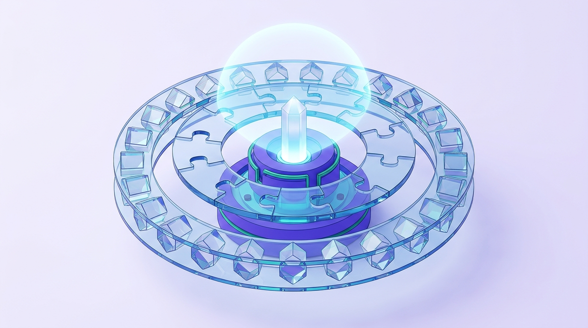

# S3: Secondary Pedagogy — Abstract Reasoning & Disciplinary Inquiry

## 1. Developmental Cognitive Milestones
Maturation of Formal Operational logic (Piaget) accompanied by extensive prefrontal cortex restructuring. Adolescents seek identity affirmation (Erikson), interrogate epistemological validity, and are highly sensitive to peer socio-cognitive cues.

## 2. Core High-Impact Methodologies
1. **Scaffolded Project-Based Learning (Scaffolded PBL)**:
   * Avoid unconstrained open exploration. Provide structured intermediate milestones, clear evaluative rubrics, and calibrated peer feedback protocols.
2. **Desirable Difficulties (Robert & Elizabeth Bjork)**:
   * *Spaced Practice*: Distributing review intervals to demand effortful retrieval.
   * *Interleaved Practice*: Mixing distinct problem types within a single practice session rather than block practicing one formula repeatedly.
   * *Retrieval Practice*: Active free recall and low-stakes diagnostic quizzing replacing passive rereading.
3. **Visible Thinking Routines (Harvard Project Zero)**:
   * **See - Think - Wonder**: Sparking empirical observation and scientific curiosity.
   * **Claim - Support - Question**: Structuring evidence-based argumentation and boundary interrogation.
   * **Circle of Viewpoints**: Analyzing historical or socio-scientific dilemmas across divergent stakeholder lenses.

## 3. Disciplinary Literacy
Teaching students not merely static facts, but the disciplinary habits of mind:
* How does a chemist interrogate the periodic table?
* How does a historian evaluate primary source provenance and corroborate testimony?
