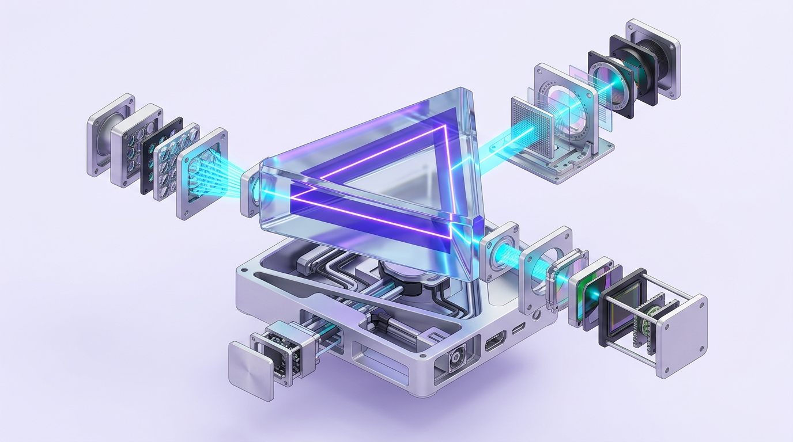

# S4: Higher Education Pedagogy — From Passive Reception to Deep Epistemic Construction

## 1. Constructive Alignment (John Biggs)
High-impact undergraduate courses require absolute triangular alignment across three vertices:
1. **Intended Learning Outcomes (ILOs)**: Formulated with higher-order cognitive verbs (Analyze, Critique, Design, Optimize - SOLO/Bloom Taxonomy).
2. **Teaching & Learning Activities (TLAs)**: Students actively perform the target verbs in class (rather than passively hearing the professor perform them).
3. **Assessment Tasks**: Authentic performance rubrics directly measuring the ILO cognitive verbs under authentic constraints.

## 2. Productive Failure Architecture (Manu Kapur)
* **Two-Phase Design**:
  1. *Phase 1: Exploration & Generation*: Students grapple with a complex, novel problem without prior formula exposure. They generate diverse representations and encounter impasses, sensitizing their cognitive schemas to knowledge gaps.
  2. *Phase 2: Consolidation & Instruction*: The instructor systematically compares student attempts, diagnoses failure modes, and introduces the canonical formal structure.
* **Empirical Outcome**: Yields a 200–300% increase in conceptual understanding and adaptive transfer over traditional direct lecture-first instruction.

## 3. Interactive Peer Instruction (Eric Mazur / Harvard)
* Replacing passive monologues with ConcepTest cycles:
  * 1-minute individual reflection $\rightarrow$ Silent voting via clicker/poll $\rightarrow$ 2-minute peer debate with a disagreeing neighbor $\rightarrow$ Revote $\rightarrow$ Targeted micro-lecture.
