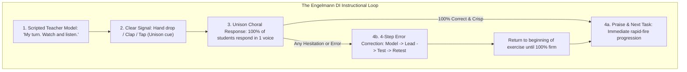

# Direct Instruction (DI): Engelmann's Faultless Communication, Choral Responding, and the Follow Through Engine


> **The Engelmann Axiom**:  
> If the student hasn't learned, the teacher hasn't taught. There are no defective learners; there are only defective presentations of knowledge. When instruction is faultless, 100% of children learn.

---

## 0. Learning Contract & Target Competencies

By engaging with this instructional method, you will develop the ability to:
1. **Differentiate** between general "direct instruction" (lowercase: explicit lecturing) and **Engelmann's Direct Instruction** (Capitalized DI: scripted, signal-driven, mastery-gated behavioral technology).
2. **Execute** the 4 core mechanics of DI: **Faultless Communication**, **Clear Hand Signals for Unison Responding**, **Immediate 4-Step Error Correction**, and the **80%–100% Firming Criterion**.
3. **Analyze** the empirical findings of **Project Follow Through** ($N=79,000$), understanding why DI outperformed all 8 competing progressive models on basic skills, cognitive problem solving, *and* affective self-esteem.
4. **Transform** passive teacher monologues into high-density, 12-responses-per-minute active engagement routines.

---

## 1. The Instructional Dilemma: The Ambiguous Teacher Explanation

Consider an authentic primary classroom interaction:
> *A 1st-grade teacher holds up a picture of an eagle and asks:  
> "Class, look at this. Is this a bird?"  
> Students: "Yes!"  
> Teacher: "Good! Why is it a bird?"  
> Student A: "Because it flies!"  
> Teacher: "Great!"  
> The next day, the teacher shows a picture of an ostrich.  
> Student A: "That's not a bird. It doesn't fly."  
> Teacher: "No, an ostrich is a bird!"  
> Student A is completely confused and shuts down.*

Why did the instruction fail? Because the teacher's positive reinforcement of *"Because it flies!"* created a **faulty concept rule**. The presentation contained ambiguity: the teacher conflated a non-defining property (flight) with the defining biological criterion (feathers, beak, oviparity).

### The Prediction Challenge
*Before reading Section 2, commit to one of the following instructional designs:*
- **Design A**: Let Student A explore a bird sanctuary and inductively discover what makes an ostrich a bird through play.
- **Design B**: Execute Engelmann's **Juxtaposition Principle**: Present positive and negative examples that differ by only one critical attribute (*"This has feathers, so it is a bird. This bat flies, but has fur, so it is NOT a bird"*).
- **Design C**: Wait until 3rd grade when the child's prefrontal cortex developmentally matures to handle biological taxonomy.

---

## 2. The Underlying Architectural Mechanics



### 2.1. The Principle of Faultless Communication
Siegfried Engelmann and Douglas Carnine (1982) proved that concepts must be taught through **minimal pair juxtaposition**:
* To teach a concept, you must present examples that vary in non-essential attributes (color, size, orientation) while holding the essential attribute constant.
* You must present non-examples that match the examples in as many non-essential features as possible, differing *only* in the essential defining criterion.
* Example: To teach "horizontal," show a horizontal line, pencil, and box. Then show a tilted pencil. If you only show horizontal lines, the child will learn that "horizontal means a thin black line."

### 2.2. Choral Responding with a Tactile Signal
* In traditional classrooms, the teacher asks a question, one vocal student raises their hand, is called on, and answers. 29 other students mentally disengage. The response rate is $\approx 1$ response per student every 20 minutes.
* In DI classrooms, **100% of students respond simultaneously in unison** on the teacher's auditory/visual signal (e.g., a crisp finger tap or hand drop).
* **The Signal Mechanism**:
  1. *Think Pause*: Teacher asks question, holds hand up. (Students think).
  2. *Auditory Drop*: Hand drops sharply. (All students answer simultaneously).
  3. The teacher's ear is trained to listen for unified harmony. If one student hesitates, mumbles, or lags by 200 milliseconds, the teacher immediately intervenes.

### 2.3. The 4-Step Error Correction Protocol
When an error occurs, the teacher never lectures, scolds, or asks *"Why did you say that?"*:
1. **Model**: Teacher gives the correct answer immediately (*"My turn: It's a mammal."*).
2. **Lead**: Teacher says it with the group (*"Together: What is it? A mammal."*).
3. **Test**: Students say it independently on signal (*"Your turn: What is it?"* $\rightarrow$ *"A mammal!"*).
4. **Retest (Delayed Verification)**: Teacher backs up 2–3 items in the script and re-tests the failed item in context.

---

## 3. Worked Clinical Example: Teaching the Sound "/m/" (Beginning Reading)

```text
[Teacher holds up letter card 'm'. Points to letter.]
Teacher: "My turn to say the sound."
[Teacher points to mouth.]
Teacher: "/mmmmmm/."
[Teacher points to letter.]
Teacher: "Your turn. When I touch under the letter, say the sound. Keep saying it as long as I touch under it."
[Think pause: 1 second. Teacher drops finger firmly under the letter.]
Students (in unison): "/mmmmmm/."
[Teacher holds finger for 2 seconds, then lifts off cleanly.]
Students (stop instantly): silence.
Teacher: "Outstanding! Again. Get ready."
[Teacher drops finger.]
Students: "/mmmmmm/."
[Teacher lifts finger.]
Teacher: "You are so fast! Now let's see if I can trick you."
[Teacher points to previously mastered 's'. Drops finger.]
Students: "/ssssss/."
[Teacher returns to 'm'. Drops finger.]
Students: "/mmmmmm/."
```

### Expert Think-Aloud:
> *"Notice that I did not say 'Can anyone tell me what sound this letter makes?' That invites wild guessing and wastes working memory. I explicitly modeled the exact sound, gave a unambiguous physical signal for unison responding, and verified that 100% of the children spoke simultaneously. I instantly knew whether all 25 children had mastered the phoneme-grapheme correspondence within 3 seconds."*

---

## 4. Non-Example / Pathological Case: The "Cold Call Guessing" Disaster

1. **Teacher Action**: The teacher points to a complex physics diagram and asks: *"Who can guess what happens to the voltage across Resistor 2?"*
2. **Pathological Sequence**:
   - Student K guesses: *"It goes up?"*
   - Teacher: *"Hmm, not quite. Anyone else?"*
   - Student L guesses: *"It stays the same?"*
   - Teacher: *"Getting warmer! Anyone else?"*
3. **Cognitive Analysis**:
   * This is not teaching; this is **"Guess What's in the Teacher's Head."**
   * Students hear 3 wrong answers before hearing the correct principle, causing retrograde interference in memory.
   * Direct Instruction forbids guessing: *Model the concept clearly, lead the students, then test for crisp unison mastery.*

---

## 5. Misconception Diagnostics & Refutation Table

| Misconception | Origin / Bias | Scientific Reality from Project Follow Through |
| :--- | :--- | :--- |
| **"Scripted instruction turns teachers into robots."** | Romantic ideology of spontaneous teaching. | Expert actors and concert pianists use scripts and sheet music to achieve virtuosity. Scripts free teacher working memory from lesson planning on the fly, allowing 100% of attention to focus on student pacing, signals, and error detection. |
| **"Drill and practice destroys self-esteem and creativity."** | Progressive assumption that structure harms joy. | In Project Follow Through, **Direct Instruction ranked #1 in Self-Esteem / Affective scores**, far beating open-classroom and self-directed models. *Nothing builds self-esteem faster than realizing you can actually read and compute.* |
| **"DI is only for low-performing or special-education students."** | Elitist tracking bias. | The principles of faultless communication and cognitive load optimization apply to all human brains, from kindergarten phonics to medical surgical residency. |

---

## 6. Formative Hinge Question & Distractor Analysis

> **Scenario**: During a DI math session on fraction division, the teacher presents: $\frac{3}{4} \div \frac{2}{5}$. Upon dropping the signal, 3 out of 20 students shout *"Multiply by $\frac{2}{5}$!"* while the rest say *"Multiply by $\frac{5}{2}$!"* What is the immediate, non-negotiable teacher move?

* **Option A**: Congratulate the majority who got it right, write the correct answer on the board, and proceed to the next problem.
* **Option B**: Single out the 3 students who made the error, send them to the back table with an aide, and continue with the remaining 17 students.
* **Option C**: Immediately execute the 4-step correction protocol with the entire class: Model (*"When dividing fractions, we multiply by the reciprocal of the second fraction: $\frac{5}{2}$"*), Lead, Test the entire class, back up two problems, and re-test.
* **Option D**: Ask the 3 students to explain why they thought $\frac{2}{5}$ was correct so the class can debate the issue.

### Diagnostic Distractor Analysis:
* **Option A**: Violates the **Mastery Criterion (80%–100% firm)**. Leaving 15% of students with an active misconception guarantees compound failure in subsequent lessons.
* **Option B**: Publicly stigmatizes struggling students and fractures group momentum; DI keeps the entire cohort unified through rapid choral firming.
* **Option C (CORRECT)**: Flawlessly executes DI error protocol: immediate, neutral, universal correction without emotional judgment, followed by firming re-test.
* **Option D**: Invites unguided debate on a factual procedural rule, confusing working memory and entrenching the erroneous algorithm.

---

## 7. Actionable Classroom Protocol: The DI Rapid-Fire Standard

```yaml
protocol: ENGELMANN-DI-EXECUTION
metrics:
  pacing_target: "10 to 14 active responses per minute."
  mastery_threshold: "100% correct unison responses before advancing."
steps:
  1_focus_signal:
    cue: "'Eyes on me / Looking at the board.'"
    criteria: "100% visual orientation."
  2_scripted_model:
    cue: "'My turn.' -> Deliver rule with zero redundant words."
  3_unison_cue:
    cue: "'Get ready.' -> 1-second pause -> Crisp physical signal."
  4_choral_check:
    listen: "One unified voice. Zero split-second echoes."
  5_rapid_error_correction:
    trigger: "Any split response, hesitation, or incorrect answer."
    sequence: "Model -> Lead -> Test -> Retest."
```

---

## 8. Empirical Evidence & Project Follow Through Benchmark

| Metric / Dimension | Direct Instruction (DI) | Cognitive / Constructivist Models | Whole Language / Open Classroom Models |
| :--- | :--- | :--- | :--- |
| **Basic Skills (Reading, Math, Language)** | **+0.75 SD (Rank 1)** | -0.10 to +0.20 SD | -0.30 to -0.60 SD |
| **Cognitive Problem Solving** | **+0.45 SD (Rank 1)** | -0.05 to +0.15 SD | -0.25 SD |
| **Affective / Self-Esteem** | **+0.35 SD (Rank 1)** | +0.05 SD | -0.10 SD |
| **Long-Term High School Graduation** | **Significant $+28\%$ Increase** | No significant difference | Negative or null correlation |

### Landmark Study Citations:
* **Stebbins et al. (1977)**: *Education as Experimentation: A Planned Variation Model (Vols. IV A-D)*. The official US Department of Education report on Project Follow Through ($N=79,000$, \$1 billion investment over 9 years).
* **Adams & Engelmann (1996)**: Meta-analysis of 34 studies: DI generated statistically significant higher student achievement on 87% of all comparisons.
* **Stockard et al. (2018)**: 50-year meta-analysis (*Review of Educational Research*): Confirmed DI produces large, persistent positive effects across reading, mathematics, language, and spelling that do not fade over time ($g = 0.50 - 0.60$).
