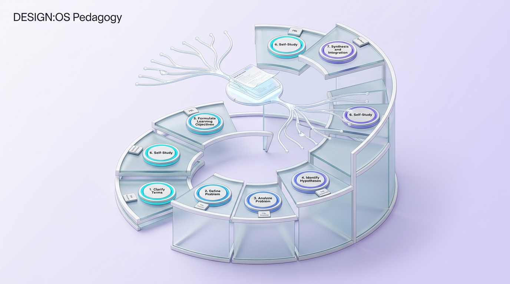
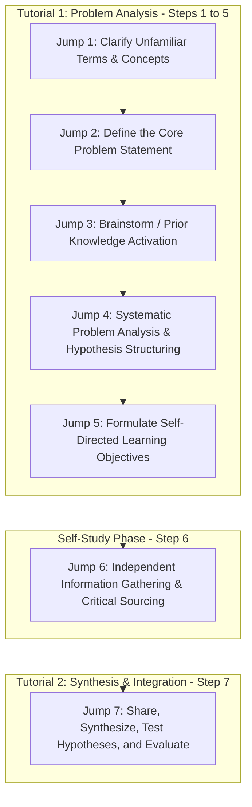

# Problem-Based Learning (PBL): The Maastricht 7-Jump Protocol, Clinical Case Diagnostics, and Scaffolding Dynamics



> **The Barrows Medical Axiom**:  
> Medicine is not a collection of anatomical facts; it is the clinical art of decision-making under uncertainty. When you present an authentic patient before the lecture, facts cease to be trivia and become life-saving diagnostic imperatives.

---

## 0. Learning Contract & Target Competencies

By engaging with this instructional method, you will develop the ability to:
1. **Facilitate** the classical **Maastricht 7-Jump Protocol** in professional, medical, engineering, or higher-education seminars.
2. **Author** authentic, high-fidelity **ill-structured clinical/engineering cases** that trigger prior knowledge activation and systematic hypothesis generation without early closure.
3. **Navigate** the **Expertise Reversal Boundary** (Sweller vs. Barrows): Knowing when learners possess sufficient foundational schema to benefit from PBL vs. when PBL induces catastrophic cognitive overload.
4. **Scaffold** Step 5 (Formulating Learning Objectives) so students self-diagnose genuine epistemic knowledge gaps rather than copying textbook table-of-contents headings.

---

## 1. The Instructional Dilemma: The Rote Diagnostician

Consider this authentic dilemma at a medical school:
> *Students spend their first two years memorizing thousands of drug mechanisms, microbiology classifications, and anatomical paths for multiple-choice exams, scoring in the 90th percentile.  
> In Year 3, they step onto the hospital ward. A 54-year-old patient presents with shortness of breath, swollen ankles, and mild abdominal discomfort.  
> The attending physician asks the student: "What do you do first?"  
> The student freezes: "In the textbook, the chapter was titled 'Congestive Heart Failure,' so I knew what it was. But the patient doesn't come with a chapter title."*

The traditional lecture-first curriculum produced **inert knowledge**: information stored in disconnected semantic bins, entirely inaccessible in an authentic, messy clinical environment.

### The Prediction Challenge
*Before reading Section 2, commit to one of the following instructional designs:*
- **Design A**: Add 100 more hours of pharmacology and pathology lectures to ensure all possible diseases are memorized before entering clinics.
- **Design B**: Throw students into hospital emergency rooms on Day 1 with zero preparation or scaffolding.
- **Design C**: Structure learning around iterative, ill-structured clinical problem units using the **7-Jump Process**, where basic sciences are learned in direct service of patient case problem-solving.

---

## 2. The Maastricht 7-Jump Architecture



### 2.1. Detailed Breakdown of the 7 Jumps
Developed at Maastricht University (Schmidt, 1983; van Berkel & Schmidt, 2000), this protocol prevents premature guessing and forces rigorous epistemic inquiry:

1. **Jump 1: Clarify Terms**: The group reads the case text. Any ambiguous word or clinical term is clarified so everyone shares an identical baseline vocabulary.
2. **Jump 2: Define the Problem**: Agree on the exact phenomena to be explained. What is the fundamental puzzle?
3. **Jump 3: Brainstorm (Prior Knowledge Activation)**: Free activation of existing mental models. What mechanisms could possibly cause these symptoms? Zero evaluation or critique permitted.
4. **Jump 4: Systematic Analysis & Hypotheses**: The group clusters and structures the brainstormed ideas into a causal concept map, identifying conflicting explanations.
5. **Jump 5: Formulate Learning Objectives (The Critical Pivot)**: The group identifies the exact boundaries of their current ignorance (*"We know this is an arrhythmia, but we do not understand the cardiac action potential ion channels. That is Learning Objective 1"*).
6. **Jump 6: Independent Self-Study**: Students disperse for 2–4 days. They consult primary research, physiological texts, and clinical trials to resolve the agreed learning objectives.
7. **Jump 7: Synthesis and Integration**: The group reconvenes. Each member presents their findings, reconciling the patient's symptoms with the newly acquired physiological mechanisms.

---

## 3. Worked Clinical Example: The 48-Year-Old Miner with Exhaustion

### Tutorial 1 Execution:
* **The Case Vignette**: *"Mark, 48, a coal miner for 20 years, reports progressive shortness of breath and a persistent dry cough. Spirometry reveals an $FEV_1/FVC$ ratio of $82\%$, but Total Lung Capacity ($TLC$) is reduced to $65\%$ of predicted. Chest X-ray shows diffuse nodular opacities in upper lung zones."*
* **Student Dialogue**:
  - *Student A (Chair)*: *"Let's do Jump 1. Any unfamiliar terms?"*
  - *Student B*: *"What does an $FEV_1/FVC$ ratio of $82\%$ indicate compared to normal?"*
  - *Student C*: *"Normal is around 75–80%. If it's 82%, airflow isn't obstructed. It must be restrictive!"*
  - *Jump 2*: Problem defined as: *Progressive restrictive lung pathology in an occupational setting.*
  - *Jump 3 & 4*: Students hypothesize coal worker's pneumoconiosis, silicosis, and idiopathic pulmonary fibrosis. They map alveolar macrophage activation $\rightarrow$ cytokine release $\rightarrow$ fibroblast collagen deposition.
  - *Jump 5 Learning Objectives*:
    1. Molecular mechanism of alveolar macrophage activation by crystalline silica vs. coal dust.
    2. Pathophysiology of restrictive lung disease: why is $FEV_1/FVC$ preserved while $TLC$ drops?
    3. Occupational health standards and radiographic staging.

### Expert Think-Aloud:
> *"Notice that the tutor said almost nothing. The tutor acted strictly as an epistemic facilitator, ensuring students did not skip Jump 4 to rush into diagnostic conclusions. When students hit a wall in explaining why $TLC$ decreased, the tutor simply asked: 'What physical property determines lung volume compliance?' That question led directly to Learning Objective 2."*

---

## 4. Non-Example / Pathological Case: "PBL Without Scaffolding" (The Chaos Seminar)

1. **Failure Mode**: An instructor gives an ill-structured case to first-year undergraduates who have never taken biology. The instructor provides no 7-jump protocol, no reference guides, and disappears.
2. **Cognitive Analysis (Sweller, Kirschner, & Clark, 2006)**:
   * Novice students have **zero domain-specific schemas** in long-term memory.
   * Attempting to solve complex clinical problems forces novices to rely on **means-ends analysis** in working memory.
   * Working memory is instantly overloaded; students spend 4 hours Googling random Wikipedia articles, learning irrelevant trivia and cementing grave medical misconceptions.
   * **The Expert-Reversal Boundary**: *PBL is highly effective for intermediate and advanced learners ($S4\text{ to }S6$) who possess foundational schemas. For complete novices, Direct Instruction and Worked Examples are biologically mandatory.*

---

## 5. Misconception Diagnostics & Refutation Table

| Misconception | Classroom Phenomenon | Pedagogical Reality |
| :--- | :--- | :--- |
| **"In PBL, the tutor doesn't need to know the subject matter."** | Assigning non-expert facilitators who cannot detect misconceptions. | Research (Schmidt et al., 1993) shows that while process facilitation is vital, **tutors with deep content expertise generate significantly higher student learning gains** because they ask targeted Socratic questions when students make subtle scientific errors. |
| **"PBL replaces all lectures."** | Complete elimination of explanatory lectures. | Modern Maastricht models employ **"Resource Lectures"**: 30-minute high-impact lectures scheduled *between* Jump 5 and Jump 7, answering specific questions students identified during problem analysis. |
| **"PBL students learn fewer facts."** | Fear that students will fail licensing exams. | While PBL students sometimes score slightly lower on immediate multiple-choice memorization tests, they **significantly outperform lecture students on clinical reasoning, diagnostic accuracy, and long-term delayed retention** ($d = 0.54$; Strobel & van Barneveld, 2009). |

---

## 6. Formative Hinge Question & Distractor Analysis

> **Scenario**: During Jump 3 (Brainstorming) of a medical PBL session on acute chest pain, a student immediately shouts: *"The patient has a massive acute ST-elevation myocardial infarction! Let's prescribe aspirin, heparin, and order a coronary angiogram immediately!"* What is the tutor's correct procedural intervention?

* **Option A**: Congratulate the student on their brilliant medical intuition and proceed directly to Jump 7 treatment options.
* **Option B**: Tell the student they are wrong and demand that they sit in silence for the rest of the session.
* **Option C**: Intercept the premature closure: *"That is one strong hypothesis. Let's record 'Myocardial Infarction' on the board under Hypotheses. Now, before we treat, what other organ systems in the thoracic cavity could produce acute chest pain? Let's map all possibilities."*
* **Option D**: Give a 30-minute mini-lecture on ECG interpretation.

### Diagnostic Distractor Analysis:
* **Option A**: Succumbs to **Premature Closure Bias**; short-circuits differential diagnosis and robs the group of systematic inquiry.
* **Option B**: Punitive reaction that destroys psychological safety and group epistemic participation.
* **Option C (CORRECT)**: Flawlessly maintains the 7-Jump fidelity: validates the idea as a hypothesis while forcing broad differential categorization across organ systems (pulmonary, gastrointestinal, musculoskeletal).
* **Option D**: Abandons the student-centered inquiry cycle and turns the tutorial back into a transmissive lecture.

---

## 7. Actionable Facilitator Protocol: The 7-Jump Script

```yaml
protocol: MAASTRICHT-7-JUMP-FACILITATOR
roles:
  chair: "Student who manages discussion and time."
  scribe: "Student who records ideas and maps on whiteboard."
  tutor: "Faculty member who monitors epistemic rigor and provides micro-scaffolds."
rules:
  no_early_closure: "Prohibit choosing a final diagnosis before Jump 4 is complete."
  unanimous_learning_objectives: "Every student must agree that Jump 5 objectives represent their shared knowledge gaps."
  evidence_sourcing: "In Jump 7, every clinical claim must be substantiated by peer-reviewed evidence."
```

---

## 8. Empirical Evidence & Meta-Analyses

| Study / Citation | Context / Sample | Effect Size ($d$ / $g$) | Core Finding |
| :--- | :--- | :--- | :--- |
| **Albanese & Mitchell (1993)** | Meta-Analysis of 20 years of medical PBL | Grade B | PBL students demonstrated superior clinical performance, diagnostic skills, and study enjoyment compared to traditional curriculum students. |
| **Strobel & van Barneveld (2009)** | Meta-Synthesis of Meta-Analyses (*Interdisciplinary Journal of PBL*) | $d = 0.54\text{ (retention & clinical skills)}$ | PBL is significantly more effective than traditional instruction for long-term retention, skill development, and satisfaction of students and faculty. |
| **Schmidt, Rotgans, & Yew (2011)** | Review in *Medical Education* | Grade A | Synthesizes the cognitive architecture: PBL's power stems from activating prior knowledge, contextual elaboration during group discussion, and individual epistemic curiosity. |
