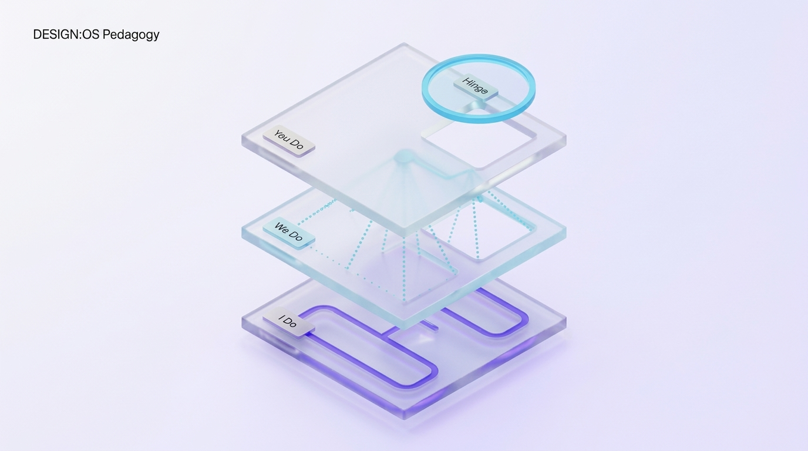

# Barak Rosenshine’s 10 Principles of Instruction

Synthesized from three convergent lines of research: (1) Cognitive science laboratory experiments, (2) Direct observational studies of master teachers, and (3) Classroom cognitive intervention trials.

| Principle # | Instructional Principle | Concrete Classroom Action |
| :--- | :--- | :--- |
| **1** | **Daily Review** | Dedicate 5–8 minutes at lesson onset to activate prior knowledge via low-stakes quizzes or fast-retrieval flashcards. |
| **2** | **Small Steps** | Present new material in small increments; provide immediate student practice after each modular step. |
| **3** | **Ask Questions** | Direct questions to the entire class, avoiding calling only on the first raised hand; probe conceptual mental models. |
| **4** | **Provide Models & Worked Examples** | Deliver clear step-by-step worked examples; externalize expert problem-solving thoughts through vocal Think-Alouds. |
| **5** | **Guide Student Practice** | Oversee guided practice rigorously; allocate substantially more time to guided practice than to didactic lecture. |
| **6** | **Check for Understanding** | Pause frequently: demand student summaries, identify deliberate planted errors, poll via mini-whiteboards. |
| **7** | **High Success Rate** | Attain a verified 80%+ success threshold during guided practice prior to releasing students to unassisted work. |
| **8** | **Provide Scaffolds** | Introduce temporary cue sheets, checklists, and structured prompts; gradually fade scaffolds as competence consolidates. |
| **9** | **Independent Practice** | Require extensive independent problem-solving to automate procedural skills into fluent schemas. |
| **10**| **Weekly & Monthly Review** | Structure spaced cumulative review sessions to consolidate neural representations into permanent long-term memory. |

---

## Navigation Graph
* **Underlying Theory**: [[Cognitive Load Theory]]
* **Paired Assessment Methods**: [[Formative Hinge Questions]] & [[Learner Diagnostics Protocol]]
* **Linked Empirical Evidence**:
  * [[Evidence — Barbieri et al. 2023 Worked Examples]] ($g = 0.48$)
  * [[Evidence — Wisniewski et al. 2020 Feedback]] ($d = 0.48$)
