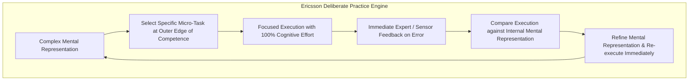

# Clinical Reasoning, Studio Critique, and Deliberate Practice: The Pedagogy of Expert Performance

> **The Expert Performance Axiom**:  
> Experience alone does not produce expertise. Doing the same thing for 20 years often yields 20 years of entrenched mediocrity. Expertise is forged exclusively through **Deliberate Practice**: targeted effort at the outer boundary of current capability, guided by an expert coach who provides immediate, actionable feedback and demands mental model refinement (Ericsson, 2006).

---

## 0. Learning Contract & Target Competencies

By engaging with this professional pedagogy foundation, you will develop the ability to:
1. **Differentiate** between **Mindless Repetition** (naive practice), **Work Experience** (habitual execution), and **Deliberate Practice** (Ericsson's gold standard).
2. **Structure** authentic **Clinical Simulation** and **Studio Critique** sessions that force learners to externalize and critique their tacit mental representations.
3. **Deploy** Donald Schön's twin reflective modes: **Reflection-in-Action** (in-flight adaptation during performance) versus **Reflection-on-Action** (post-hoc diagnostic debriefing).
4. **Design** high-fidelity simulation protocols with **Mastery Learning Criterion** (McGaghie, 2014) for high-stakes professional fields (medicine, architecture, aviation, software engineering).

---

## 1. The Intuitive Dilemma: The 10-Year Surgeon Fallacy

Consider this authentic dilemma in surgical residency:
> *Dr. Vance has performed over 1,200 laparoscopic cholecystectomies over 12 years in private practice. When assessed on a standardized virtual surgical simulator, his complication rate and instrument economy score are identical to a 3rd-year resident.  
> Meanwhile, Dr. Chen, a 4th-year resident who spent 60 hours in a simulation laboratory performing deliberate practice with video debriefing, demonstrates 40% fewer tissue tears and superior bimanual instrument economy.*

How can 12 years of real-world surgery yield less clinical proficiency than 60 hours of structured simulation?

### The Prediction Challenge
*Before reading Section 2, commit to one of the following diagnostic hypotheses:*
- **Hypothesis A**: Dr. Chen is naturally more dexterous and possesses superior innate spatial genetics.
- **Hypothesis B**: In everyday clinical practice, professionals operate in **autonomous performance mode**, executing automated routines without deliberate error feedback or micro-refinement. The simulation lab created **Deliberate Practice**, isolating specific micro-skills and providing immediate corrective feedback.
- **Hypothesis C**: Simulators do not measure real surgical competence; Dr. Vance's experience makes him superior in ways tests cannot measure.

---

## 2. The Cognitive Architecture of Deliberate Practice



### 2.1. The 4 Essential Pillars of Deliberate Practice (K. Anders Ericsson)
1. **A Well-Defined, Specific Goal**: Not *"practice surgery"* or *"practice piano,"* but *"reduce suture tension variability across the left lower quadrant incision by 15%."*
2. **High-Intensity Concentration**: Deliberate practice requires complete cognitive immersion; human cognitive capacity limits true deliberate practice to **3 to 4 hours per day maximum**.
3. **Immediate, Informative Feedback**: An expert mentor or high-fidelity simulation provides instant, granular feedback on performance errors.
4. **Mental Representation Building**: The ultimate product of deliberate practice is not muscular memory, but **rich, predictive mental representations** in long-term memory that allow experts to anticipate patterns, detect anomalies, and self-correct in real time.

### 2.2. Donald Schön: The Reflective Practitioner
In professional studio disciplines (architecture, urban planning, software design, clinical medicine), problems do not present as well-structured puzzles with single answers. They are "swampy lowlands" of conflicting values and uncertainty:
* **Reflection-in-Action**: The practitioner's ability to "think on their feet"—noticing an unexpected occurrence, reshaping what they are doing while doing it, and conducting an on-the-spot experiment.
* **The Studio Critique ("The Crit")**: The master practitioner does not simply lecture; they engage in a **reflective dialogue with the student's work**, pointing out unintended consequences and modeling expert design thinking.

---

## 3. Worked Clinical Example: Simulation-Based Mastery in Central Venous Catheter Insertion

### Context: Northwestern University Medical Simulation Protocol (McGaghie & Barsuk)
* **Novice Traditional Training**: "See one, do one, teach one" on real patients in the ICU.
* **Deliberate Practice Mastery Model**:

```text
[Phase 1: Baseline Simulation Check]
Resident inserts needle into ultrasound vascular phantom. Time, needle passes, and arterial punctures recorded.

[Phase 2: Deliberate Micro-Skill Isolation]
Resident does not perform the entire 20-minute procedure. Instead, the coach isolates Step 4: "Ultrasound probe stabilization while advancing the needle."
- Trial 1: Resident probe slips 3 mm. Coach pauses immediately: "Stop. Look at your pinky anchor on the patient's clavicle. Lock that knuckle."
- Trial 2: Resident locks pinky. Needle trajectory stays perfectly in plane.
- Repeat 15 times until needle alignment is automated and flawless.

[Phase 3: Complication Simulation]
Simulator introduces sudden carotid arterial puncture (blood turns bright red and pulsatile). Resident must identify error within 1.5 seconds, immediately abort advancement, and apply firm digital pressure for 5 minutes.

[Phase 4: Mastery Exam Gate]
Resident must score 100% on the 24-item checklist on the simulator before touching a human patient.
```

### Results in Practice:
When Northwestern University deployed this protocol, **catheter-related bloodstream infections in the hospital ICU dropped from 4.2 per 1,000 catheter days to 0.4—an 85% reduction, saving dozens of lives and \$1.5 million in annual complications (Barsuk et al., 2009).**

---

## 4. Non-Example / Pathological Case: The "10,000-Hour Rule" Misinterpretation

1. **Popular Myth**: Malcolm Gladwell's claim that *"10,000 hours of doing anything makes you an expert."*
2. **The Clinical Reality**:
   * A driver who drives 10,000 hours does not become a Formula 1 racecar driver; they become an average driver who can text while driving.
   * Doing a task repeatedly within one's comfort zone automates performance, leading to **arrested development**, not expert mastery.
   * Deliberate practice requires **continual discomfort**: constantly identifying weaknesses, designing exercises to target those flaws, and practicing with intense feedback.

---

## 5. Misconception Diagnostics & Refutation Table

| Misconception | Practice Manifestation | Pedagogical Reality |
| :--- | :--- | :--- |
| **"Expertise is mostly an innate talent or natural gift."** | Resigning struggling professionals: *"She doesn't have the artistic eye."* | Ericsson's 40 years of empirical research demonstrated that with the exception of height and body size in certain sports, **innate talent plays a negligible role in ultimate expert performance compared to quantity and quality of deliberate practice**. |
| **"Practice should be fun and relaxing."** | Gamified apps with zero cognitive friction. | Deliberate practice is metabolically taxing and cognitively strenuous. If practice feels effortless, no new mental representations are being constructed. |
| **"Feedback is most effective at the end of the semester."** | Term-end evaluations and final exam grades. | Feedback delayed by weeks has near-zero impact on procedural refinement. **Immediate, in-flight corrective feedback** during execution is the engine of skill acquisition. |

---

## 6. Formative Hinge Question & Distractor Analysis

> **Scenario**: An architectural design studio professor wants to accelerate 3rd-year students' ability to handle conflicting zoning, structural, and aesthetic requirements. Which instructional design embodies Deliberate Practice?

* **Option A**: Tell students to spend 200 hours in the library sketching whatever buildings inspire them without any deadlines or feedback.
* **Option B**: Present a highly constrained urban site with severe wind-shear and historic preservation restrictions; students produce 3 distinct structural massing concepts in 3 hours; the professor conducts rapid 5-minute desk critiques targeting structural load paths, followed by students immediately revising their weakest concept for the next morning.
* **Option C**: Have students watch the professor design a skyscraper on AutoCAD for 40 hours.
* **Option D**: Give students an open-book multiple-choice exam on local building codes.

### Diagnostic Distractor Analysis:
* **Option A**: Mindless unguided practice; lacks specific goals, constraints, and expert feedback loops.
* **Option B (CORRECT)**: Flawlessly exemplifies Deliberate Practice: constrained problem at the edge of capability, rapid iteration, immediate expert critique targeting mental representations, and immediate re-execution ($d = 0.85$).
* **Option C**: Pure passive observation without enactive mastery or error generation.
* **Option D**: Assesses declarative legal recall while testing zero architectural synthesis or clinical spatial reasoning.

---

## 7. Actionable Professional Protocol: The Simulation Mastery Blueprint

```yaml
protocol: SIMULATION-BASED-MASTERY-LEARNING
steps:
  1_task_deconstruction:
    action: "Deconstruct complex professional performance into discrete, observable behavioral checklist items."
  2_diagnostic_pretest:
    action: "Assess learner on standardized simulated scenario to identify specific procedural and cognitive gaps."
  3_targeted_deliberate_practice:
    focus: "Isolate the single lowest-scoring sub-component."
    rules:
      - "High repetitions (10-20 trials per hour)."
      - "Immediate coaching feedback within 5 seconds of error."
      - "Coach think-aloud exposing tacit mental model."
  4_mastery_gate:
    standard: "Learner must achieve 100% on the objective checklist twice consecutively before returning to full scenario."
  5_delayed_retention_audit:
    timing: "30 days post-training"
    action: "Unannounced simulated stress scenario to verify durable schema consolidation."
```

---

## 8. Empirical Evidence & Clinical Benchmarks

| Study / Citation | Domain / Sample | Effect Size ($d$ / $g$) | Core Finding |
| :--- | :--- | :--- | :--- |
| **Ericsson, Krampe, & Tesch-Römer (1993)** | Violinists and Pianists (Berlin Music Academy) | Landmark | Accumulated hours of deliberate practice (not innate talent) was the primary variable separating international soloists from music teachers. |
| **McGaghie, Issenberg, Cohen, Barsuk, & Wayne (2014)** | Meta-Analysis of Simulation-Based Medical Education (*Med Educ*) | $d = 0.71 - 1.20$ | Simulation-based deliberate practice with mastery learning produced superior procedural skills, diagnostic accuracy, and patient clinical outcomes compared to traditional clinical training. |
| **Schön (1983, 1987)** | *The Reflective Practitioner* | Canon | Established the epistemology of professional artistry: how professionals solve unique, uncertain problems through reflection-in-action. |
