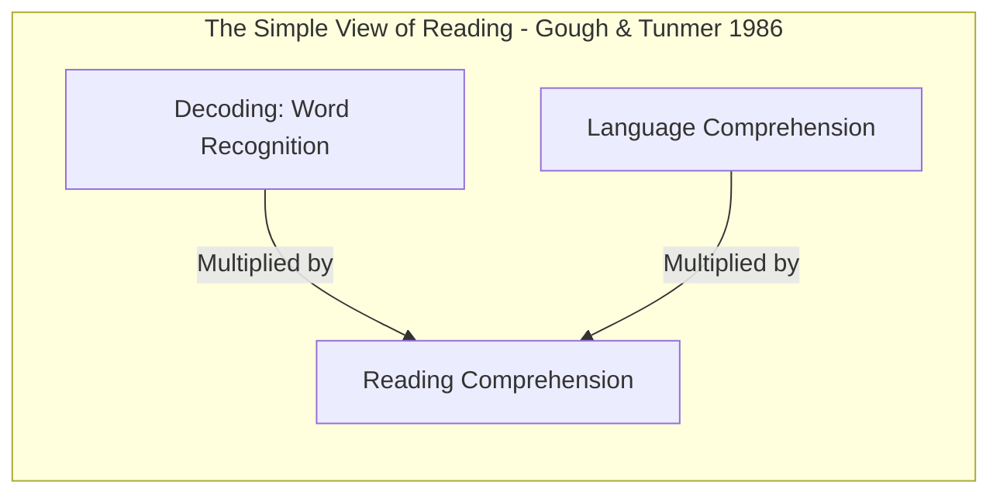
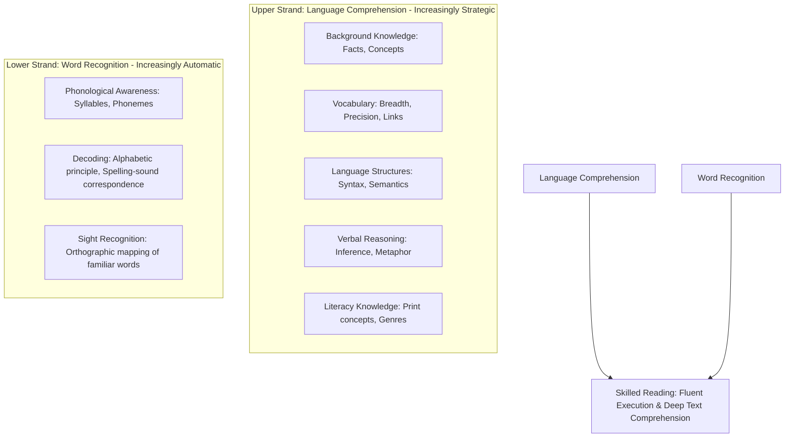

# The Science of Reading: Scarborough's Reading Rope, Orthographic Mapping, and the Simple View of Reading


> **The Neurological Reading Law**:  
> The human brain was never evolved to read. Spoken language is biological and innate; reading is a cultural invention requiring the physical re-wiring of the left occipitotemporal visual word form area ("the brain's letterbox") through systematic phonics and orthographic mapping (Dehaene, 2009).

---

## 0. Learning Contract & Target Competencies

By engaging with this disciplinary literacy foundation, you will develop the ability to:
1. **Apply** the **Simple View of Reading** ($\text{RC} = \text{D} \times \text{LC}$) to diagnose reading failure as a decoding deficit, a language comprehension deficit, or a hyper-deficit (Dyslexia vs. Specific Reading Comprehension Deficit).
2. **Deconstruct** and train the 8 braided strands of **Scarborough's Reading Rope** (Word Recognition $\rightarrow$ Automaticity; Language Comprehension $\rightarrow$ Strategic Processing).
3. **Dissect and eliminate** the discredited **"Three-Cueing System" (MSV: Meaning, Structure, Visual)**, explaining why prompting children to "guess words from pictures" trains the compensatory strategies of poor readers.
4. **Implement** Linnea Ehri's **Orthographic Mapping Protocol** to permanently anchor sight words into long-term lexical memory within 1–4 exposures.

---

## 1. The Intuitive Dilemma: The "Three-Cueing" Trap

Consider this prevalent primary classroom interaction:
> *A 1st-grader, Leo, is reading a leveled reader: "The pony galloped through the..."  
> The next word is 'meadow'. Leo hesitates on the letter 'm'.  
> The teacher immediately prompts:  
> "Look at the picture, Leo! What is the pony running through? Look at the first letter 'm'. What word makes sense in the picture?"  
> Leo looks at the illustration of green grass and cows and guesses: "Mud!"  
> Teacher: "Does mud make sense? Look at the green field!"  
> Leo: "Mountain?"  
> Teacher: "Look at the picture again! It's a field or m-m-meadow!"  
> Leo repeats: "Meadow!" and continues.*

The teacher believes she is teaching reading through "contextual meaning." In reality, she is training Leo to look *away* from the letters, enforcing the exact visual-guessing habit that characterizes severely dyslexic readers.

### The Prediction Challenge
*Before reading Section 2, commit to one of the following diagnostic assessments:*
- **Assessment A**: The teacher is correct: good readers use context, pictures, and syntax to guess unfamiliar words.
- **Assessment B**: The teacher is committing an egregious instructional error. Skilled readers fixate on almost every single letter of a word in 200 milliseconds; they use phonological decoding, not contextual guessing, to read words.
- **Assessment C**: Leo simply needs an audiobook because he is an auditory learner.

---

## 2. The Architectural Framework: Simple View & Scarborough's Rope



$$\text{Reading Comprehension (RC)} = \text{Decoding (D)} \times \text{Language Comprehension (LC)}$$

*Note: This is a **multiplicative formula**, not an additive one!*
* If a child has $100\%$ Language Comprehension ($LC = 1.0$) but cannot decode print ($D = 0.0$), Reading Comprehension is **zero**:
  $$1.0 \times 0.0 = 0.0$$
* If a hyperlexic child can decode flawlessly ($D = 1.0$) but understands zero spoken English ($LC = 0.0$), Reading Comprehension is **zero**:
  $$0.0 \times 1.0 = 0.0$$

---

### 2.1. Scarborough's Reading Rope (2001)



1. **The Lower Strands (Word Recognition)**:
   * **Phonological Awareness**: The ability to isolate, blend, segment, and manipulate spoken speech sounds (phonemes) without letters.
   * **Decoding**: Applying the **alphabetic code**—mapping 26 letters to 44 phonemes and their grapheme representations.
   * **Sight Recognition**: Words recognized instantly (<200 ms) not by memorizing their visual silhouette, but because their spelling, pronunciation, and meaning have been bonded together in memory via **Orthographic Mapping**.

2. **The Upper Strands (Language Comprehension)**:
   * **Background Knowledge**: The schema network that gives meaning to the words.
   * **Syntax & Morphology**: Understanding sentence architecture, prefixes, suffixes, and Latin/Greek roots.
   * **Inference**: Connecting what is explicitly in the text with what is unstated.

---

## 3. Worked Clinical Example: Linnea Ehri's Orthographic Mapping Protocol

How does an irregular word like **"SAID"** become a permanent sight word in 2 minutes?

```text
[Step 1: Phoneme Segmentation (Auditory Channel)]
Teacher: "Say the word: 'said'."
Student: "Said."
Teacher: "How many sounds do you hear in 'said'? Let's tap them out: /s/ ... /e/ ... /d/."
Student (taps 3 fingers): "Three sounds."

[Step 2: Grapheme-Phoneme Mapping (Visual-Phonological Bridge)]
Teacher draws 3 sound boxes on a small whiteboard.
Teacher: "What is the first sound?"
Student: "/s/."
Teacher: "What letter spells /s/?" -> Student writes 's' in Box 1.
Teacher: "What is the last sound?"
Student: "/d/."
Teacher: "What letter spells /d/?" -> Student writes 'd' in Box 3.

[Step 3: The 'Heart Part' (Targeting the Irregular Feature)]
Teacher: "Now look at the middle sound: /e/. Usually, /e/ is spelled with the letter 'e'. But in the word 'said', it is spelled with the letters 'a-i'. We call this the 'heart part' because we have to remember it by heart!"
[Teacher draws a tiny red heart above 'ai' in Box 2.]

[Step 4: Orthographic Bonding]
Student spells aloud: "s - a - i - d, said."
Student writes the whole word 2 times from memory.
```

### Expert Think-Aloud:
> *"I did NOT tell the child: 'Look at the word said like a picture on a flashcard.' The human visual cortex does not memorize words as whole shapes. By isolating the 3 phonemes and explicitly mapping them to the letters—celebrating the unexpected 'ai' spelling—the letters are permanently mapped into the student's phonological lexicon (Ehri, 2005)."*

---

## 4. Non-Example / Pathological Case: Leveled Fountas & Pinnell "Running Records"

1. **Classroom Action**: A teacher gives a child a "Level D" book with predictable sentences:
   - *"I see a brown bear."* (Picture of brown bear).
   - *"I see a red bird."* (Picture of red bird).
   - *"I see a yellow duck."* (Picture of yellow duck).
2. **Cognitive Breakdown**:
   * The child is not reading; the child is **memorizing the sentence frame and naming the picture**.
   * When the picture is covered, the child cannot decode "yellow" or "bear."
   * In 3rd grade, when pictures disappear from textbooks, these children experience the catastrophic **"Grade 3 Reading Slump"** because they never developed the phonemic decoding circuitry.

---

## 5. Misconception Diagnostics & Refutation Table

| Misconception | Origin / Practice | Scientific Reality (Cognitive Neuroscience) |
| :--- | :--- | :--- |
| **"English is too irregular to teach through phonics."** | Whole Language advocates. | Research shows that **84% of English words are completely regular** according to phoneme-grapheme rules. The remaining 16% have only 1 irregular letter (like 'said' or 'was'), which can be mapped via heart-word protocols. |
| **"Explicit phonics kills the joy of reading."** | Romantic belief that reading develops naturally like talking. | Literacy is unnatural. **Nothing destroys the joy of reading faster than illiteracy.** Systematic phonics equips children with the autonomy to read anything they desire ($d = 0.60$; NRP, 2000). |
| **"Dyslexia is a visual problem where letters jump around."** | Commercial colored-overlay sellers. | Overwhelming neuroimaging confirms that **Dyslexia is a phonological processing deficit**, not a visual perception problem. Dyslexic brains struggle to parse the discrete phonemic sounds of language. |

---

## 6. Formative Hinge Question & Distractor Analysis

> **Scenario**: A 2nd-grade student can read aloud with rapid, expressive fluency ($D = 1.0$) but scores 35% on comprehension questions when asked to explain what happened in a historical narrative text. Applying the Simple View of Reading, what is the primary diagnosis?

* **Option A**: The student has dyslexia and needs 100 more hours of basic letter-sound phonics drills.
* **Option B**: The student is a kinesthetic learner who needs to act out the historical battles physically.
* **Option C**: The student has a **Language Comprehension Deficit (Specific Reading Comprehension Deficit)**: Decoding is intact, but background knowledge, domain vocabulary, and syntactic parsing are inadequate to build a mental situation model.
* **Option D**: The student should be given simpler books with more colorful pictures so they can guess the plot.

### Diagnostic Distractor Analysis:
* **Option A**: Diagnoses the wrong strand; drilling decoding when $D$ is already automated yields zero comprehension growth.
* **Option B**: Invokes a discredited neuromyth (VAK) instead of scientific assessment.
* **Option C (CORRECT)**: Flawlessly applies the Simple View ($\text{RC} = \text{D} \times \text{LC}$). The remediation must target background knowledge, tier-2/3 vocabulary, and syntactic comprehension, not phonics.
* **Option D**: Reverts to three-cueing crutches that further handicap reading comprehension.

---

## 7. Actionable Classroom Protocol: Phonics & Vocabulary Tiering

```yaml
protocol: SCIENCE-OF-READING-DAILY-CORE
daily_allocation: 90m
block_1_word_recognition:
  duration: 40m
  components:
    phonemic_warmup: "5m oral phoneme segmentation/blending (no print)."
    explicit_phonics: "15m introducing 1 new sound-spelling correspondence with Engelmann minimal pairs."
    decodable_text_reading: "20m students reading texts containing ONLY previously taught grapheme-phoneme patterns."
    rule: "Zero three-cueing prompts. If a student stalls, say: 'Sound it out letter by letter.'"
block_2_language_comprehension:
  duration: 50m
  components:
    rich_read_aloud: "20m teacher reading advanced literature 2 grade levels above student decoding ability."
    background_knowledge: "15m explicit instruction in history, geography, or science concepts."
    tier_2_vocabulary: "15m deep word exploration: morphology (prefix/root/suffix) and conceptual usage."
```

---

## 8. Empirical Evidence & Meta-Analytic Benchmarks

| Landmark Investigation | Scope / Sample | Effect Size ($d$ / $g$) | Core Empirical Finding |
| :--- | :--- | :--- | :--- |
| **National Reading Panel (2000)** | Meta-Analysis of 400+ experimental studies | $d = 0.58 - 0.74$ | Systematic, synthetic phonics significantly outperformed non-phonics/whole language on reading accuracy, fluency, and spelling for all socio-economic groups. |
| **Gough & Tunmer (1986)** | Empirical Validation of Simple View of Reading | $R^2 = 0.75 - 0.85$ | Decoding and Linguistic Comprehension account for virtually the entirety of variance in reading comprehension across elementary cohorts. |
| **Ehri et al. (2001, 2005)** | Systematic Studies on Orthographic Mapping | Grade A | Phonemic awareness and grapheme-phoneme knowledge are the twin cognitive prerequisites for sight-word bonding in the brain's visual word form area. |
| **Castles, Rastle, & Nation (2018)** | *Ending the Reading Wars* (*PSPI*) | Definitive Review | Comprehensive synthesis demonstrating that whole-language and cueing methods actively harm children; explicit systematic phonics is a biological imperative. |
