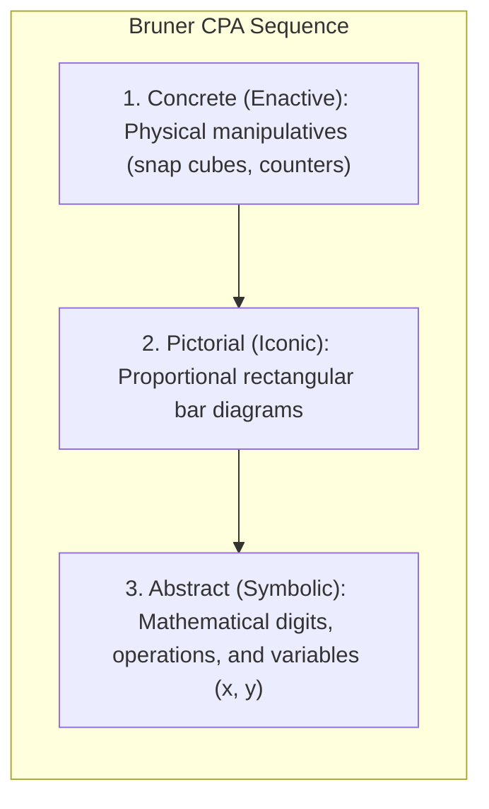

# Singapore Math Bar Modeling: Concrete-Pictorial-Abstract (CPA) Progression and Visual Algebraic Scaffolding


> **The Mathematical Heuristic Axiom**:  
> A child who struggles with word problems is not failing at arithmetic; they are failing to construct a mental representation of the relationships between quantities. The bar model transforms invisible semantic prose into visible, proportional spatial architecture.

---

## 0. Learning Contract & Target Competencies

By engaging with this mathematical pedagogy foundation, you will develop the ability to:
1. **Execute** Jerome Bruner's **Concrete $\rightarrow$ Pictorial $\rightarrow$ Abstract (CPA)** sequence for any elementary or middle-school mathematical concept.
2. **Construct and teach** the two foundational bar model architectures: **Part-Whole Models** (addition/subtraction, fractions) and **Comparison Models** (multiplicative ratios, algebraic unknown comparisons).
3. **Bridge** arithmetic bar models directly into formal symbolic linear algebra ($ax + b = c$), preventing the common 7th-grade "algebra shock."
4. **Reduce** working memory cognitive load during multi-step word problems by externalizing proportional relationships onto a spatial canvas.

---

## 1. The Instructional Dilemma: The Word Problem Phobia

Consider this authentic 5th-grade math dilemma:
> *A 5th-grade class is presented with the following contest problem:  
> "Liam and Sophia have \$180 altogether. Liam gives Sophia \$20. Sophia now has 3 times as much money as Liam. How much money did Liam have at first?"  
> 85% of the students freeze. Some try random arithmetic: $180 - 20 = 160$, $160 \times 3 = 480$.  
> When the teacher attempts to solve it using 8th-grade algebra:*
> $$S + L = 180$$
> $$(S + 20) = 3(L - 20)$$
> *The 10-year-olds stare blankly. The symbolic abstractions ($S$, $L$, parentheses, distributive property) exceed their working memory capacity.*

### The Prediction Challenge
*Before reading Section 2, commit to one of the following instructional moves:*
- **Move A**: Tell students to memorize "clue words" (e.g., "altogether means add", "times means multiply").
- **Move B**: Use the Singapore **Comparison Bar Model** to draw the final state (Sophia has 3 equal rectangular units, Liam has 1 equal unit; total 4 units = \$180), then work backward to find the initial state.
- **Move C**: Avoid word problems until students are 14 years old and have completed formal pre-algebra.

---

## 2. The Cognitive Architecture: Bruner's CPA & The Bar Model Heuristic



### 2.1. Why the Bar Model Works: Dual Coding & Working Memory Offloading
* **The Semantic-to-Spatial Translation**: Word problems require reading comprehension, syntactic parsing, and quantitative reasoning simultaneously. In traditional approaches, all three compete for the same 4 chunks of working memory.
* **Externalizing the Unknown**: Drawing a rectangular bar:
  1. Offloads the verbal relationships into the visuospatial sketchpad.
  2. Converts abstract relations ("Sophia has 3 times as much") into concrete spatial units ($1 \text{ unit vs. } 3 \text{ units}$).
  3. Reveals the invariant quantity (the total money, \$180, never changed during the transfer!).

---

## 3. Worked Clinical Example: Solving the Liam & Sophia Dilemma Visually

```text
[Step 1: Identify the Invariant]
Teacher: "When Liam gives Sophia $20, did any money leave the room?"
Students: "No, the total is still $180!"

[Step 2: Draw the Final State (Comparison Model)]
Teacher: "Sophia now has 3 times as much as Liam. Let's draw Liam's money as 1 unit."
[Teacher draws 1 rectangular bar labeled 'Liam'.]
Teacher: "How many identical units does Sophia have?"
Students: "Three units!"
[Teacher draws 3 identical rectangular bars labeled 'Sophia'.]

[Liam:   ] [--- 1 Unit ---]
[Sophia: ] [--- 1 Unit ---] [--- 1 Unit ---] [--- 1 Unit ---]

[Step 3: Map the Total]
Teacher: "How many equal units do we see in total?"
Students: "4 units!"
Teacher: "What is the total value of these 4 units?"
Students: "$180!"

[Step 4: Compute the Unit Value]
1 Unit = $180 / 4 = $45.
Therefore, Liam's final money = $45.

[Step 5: Work Backward to Find the Initial State]
Teacher: "Liam has $45 NOW. But remember: he GAVE away $20 to Sophia. How much did he have AT FIRST?"
Students: "$45 + $20 = $65!"
```

### Expert Think-Aloud:
> *"Notice how the bar model bypassed the complex simultaneous system of linear equations with two variables. By visualizing the ratio as 4 equal units, 10-year-old children instantly saw that $180 \div 4 = 45$. The algebraic reasoning was 100% rigorous, but the cognitive load was distributed onto a simple spatial diagram (Ng & Lee, 2009)."*

---

## 4. Non-Example / Pathological Case: The "Keyword" Strategy Trap

1. **Teacher Action**: The teacher posts a "Math Keywords Chart" on the wall:
   - *"More / Altogether" $\rightarrow$ Add*
   - *"Less / Difference" $\rightarrow$ Subtract*
   - *"Share / Each" $\rightarrow$ Divide*
2. **Cognitive Breakdown**:
   * Problem: *"Carlos has 15 marbles. He has 5 more marbles than David. How many marbles does David have?"*
   * A student trained on keywords sees the word **"MORE"** and immediately calculates: $15 + 5 = 20$.
   * The keyword strategy bypasses authentic mental modeling of the relationship. It teaches blind syntactic pattern-matching, which fails on 70% of real-world and standardized assessment word problems.

---

## 5. Misconception Diagnostics & Refutation Table

| Misconception | Classroom Phenomenon | Pedagogical Reality |
| :--- | :--- | :--- |
| **"Bar modeling is a childish crutch that slows students down."** | Middle school teachers telling students to "stop drawing boxes and use real algebra." | Bar modeling is the foundational cognitive bridge to algebra. Studies (Leinwand, 2014) show that students trained in bar models transition to formal algebra ($x, y$) with significantly higher conceptual understanding because they already visualize variables as unknown quantities. |
| **"Bars must be drawn to exact millimeter measurements."** | Students spend 10 minutes with rulers drawing perfect lines. | Bars need only be *roughly proportional* to illustrate relationships (e.g. half vs. double). The goal is conceptual scaffolding, not architectural drafting. |
| **"Bar models can only solve simple addition."** | Restricting bar models to 1st-grade arithmetic. | Bar models gracefully scale to fractions, percentages, ratios, rate/speed/time, and simultaneous linear equations. |

---

## 6. Formative Hinge Question & Distractor Analysis

> **Scenario**: A 4th-grade student is solving: *"A jacket costs 3 times as much as a shirt. Together, they cost \$120. How much does the jacket cost?"* The student draws 1 bar for the shirt, 3 bars for the jacket, calculates $120 \div 3 = 40$, and concludes the jacket costs \$40. What is the precise diagnostic error?

* **Option A**: The student cannot perform basic multi-digit division ($120 \div 3$).
* **Option B**: The student suffers from dyscalculia and cannot process monetary values.
* **Option C**: The student constructed the comparison model correctly (1 unit vs. 3 units), but divided the total (\$120) by the number of jacket units (3) instead of the **total units in the system ($1 + 3 = 4\text{ units}$)**.
* **Option D**: The student should have guessed and checked random numbers until finding two that add to \$120.

### Diagnostic Distractor Analysis:
* **Option A**: The division arithmetic ($120 \div 3 = 40$) was executed correctly; the conceptual mapping of the whole was flawed.
* **Option B**: Pathologizes a common, easily remediable conceptual mis-mapping.
* **Option C (CORRECT)**: Pinpoints the exact misconception: conflating a sub-component quantity with the total sum ($120 \div 4 = 30 \rightarrow \text{jacket} = 30 \times 3 = \$90$). Remediate by bracketing all 4 units with the total label before dividing.
* **Option D**: Suggests an inefficient trial-and-error strategy that abandons mathematical modeling.

---

## 7. Actionable Classroom Protocol: The CPA Bar Model Progression

```yaml
protocol: CPA-BAR-MODEL-SEQUENCE
stages:
  concrete_phase:
    duration: 1-2 lessons
    tool: "Unifix / Snap Cubes."
    move: "Physical interlocking blocks: 'Snap 3 green cubes for the jacket, 1 yellow cube for the shirt. Total = 4 cubes.'"
  pictorial_phase:
    duration: 3-5 lessons
    tool: "Graph paper or whiteboard."
    move: "Draw rectangular strips. Always label: (1) Unit brackets, (2) Known values, (3) The question mark '?' for the target unknown."
  abstract_phase:
    duration: Ongoing
    tool: "Standard algebraic notation."
    move: "Replace the 1 unit bar with 'x'. The 3 unit bars become '3x'. The whole equation emerges naturally: x + 3x = 120."
```

---

## 8. Empirical Evidence & International Benchmarks

| Metric / Study | Scope / Methodology | Empirical Finding |
| :--- | :--- | :--- |
| **TIMSS (1995–2023)** | Trends in International Mathematics and Science Study (IEA) | Singapore elementary and secondary students have ranked **#1 in the world** in virtually every cycle since the nationwide implementation of the CPA bar model curriculum (Kho, 1987). |
| **Ng & Lee (2009)** | *Journal for Research in Mathematics Education* ($N=573$) | $d = 0.62$ | The model method enables primary students to successfully solve algebraic word problems that typically require algebraic equations in secondary education. |
| **Leinwand (2014)** | Comparative Mathematics Analysis (*Stirring the Head, Heart and Soul*) | Grade A | Visual bar modeling drastically reduces math anxiety and eliminates achievement gaps between low- and high-SES primary cohorts. |
