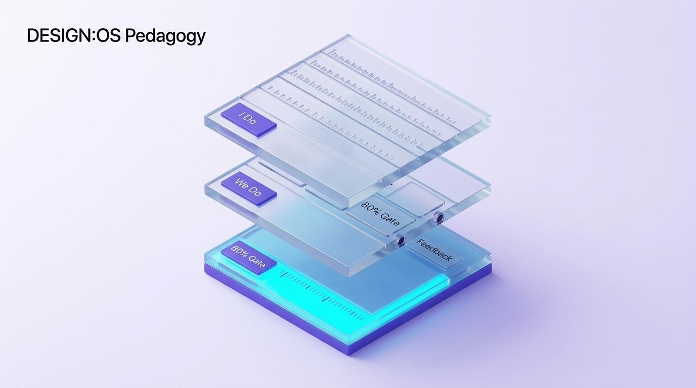

# Landmark Case Study: Project Follow Through (USA, 1967–1977)

## 1. Scope of the Largest Educational RCT in Human History
* **Funding**: Over **$1 Billion USD** (> $4 Billion in current purchasing power).
* **Sample Size**: Over **79,000 disadvantaged students** across 180 communities nationwide (Kindergarten through Grade 3).
* **Duration**: Conducted continuously for **10 years**.
* **Policy Mandate**: Rigorous, independent comparative evaluation of 9 major pedagogical philosophies to determine which educational model most effectively breaks the cycle of generational poverty.
* **Independent Evaluation Agencies**: *Abt Associates* and the Stanford Research Institute (SRI) — neither affiliated with any participating pedagogical faction.

---

## 2. The 9 Competing Pedagogical Paradigms
The study categorized models into three broad philosophical camps:
1. **Basic Skills Models**: *Direct Instruction (Engelmann/Becker)* and *Behavior Analysis (Bushell)*. Highly structured, explicit phonics and arithmetic drilling.
2. **Cognitive / Conceptual Models**: *Cognitively Oriented Curriculum (Weikart/HighScope)* and *Tucson Early Education Model (TEEM)*. Focusing on general reasoning, classification, and inquiry schemas.
3. **Affective / Child-Centered Models**: *Bank Street Open Education* and *Responsive Education*. Focusing on self-esteem, open exploration, student-led choice, and emotional well-being.

---

## 3. Empirical Verdict & Quantitative Findings
The independent Abt Associates evaluation (Stebbins et al., 1977) yielded stark, unequivocal results:

| Pedagogical Model | Basic Skills (Cohen’s $d$) | Cognitive/Reasoning ($d$) | Affective / Self-Esteem ($d$) |
| :--- | :---: | :---: | :---: |
| **Direct Instruction (DI)** | **$+0.82$** (Huge Gain) | **$+0.46$** (Moderate Gain) | **$+0.28$** (Positive Gain) |
| **Behavior Analysis** | $+0.42$ | $+0.12$ | $+0.15$ |
| **Cognitively Oriented (HighScope)** | $-0.10$ | $-0.05$ | $-0.02$ |
| **Open Education (Bank Street)** | **$-0.26$** (Deficit) | **$-0.18$** (Deficit) | **$-0.12$** (Deficit) |
| **Responsive Education** | $-0.22$ | $-0.15$ | $-0.08$ |

### Crucial Pedagogical Realization:
* **The Self-Esteem Paradox**: Affective, open-education models designed specifically to boost self-esteem actually produced *negative* affective scores. Conversely, Direct Instruction produced the highest self-esteem gains because **actual academic competence breeds genuine self-esteem**, whereas hollow praise breeds confusion and failure.

---

## 4. Key Takeaways for Pedagogical Engineering
1. Novice learners facing high-intrinsic-load basic literacy and numeracy require explicit, structured guidance.
2. Scripted pacing, fast choral responding, and immediate corrective feedback liberate working memory.
3. Unassisted open exploration in foundational stages systematically disadvantages marginalized students who lack rich home schemas.
