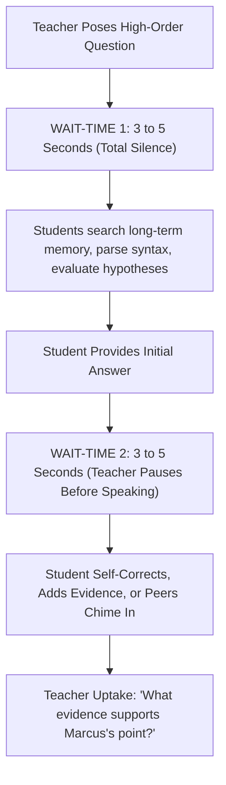

# The Wait-Time Questioning Protocol: Rowe's Twin Pauses, Cognitive Latency, and Dylan Wiliam Formative Calibration


> **The Cognitive Latency Axiom**:  
> In traditional classrooms, teachers wait an average of **0.9 seconds** before calling on a student or answering their own question. A 0.9-second pause tests only the speed of reflex memory; expanding wait-time to **3 to 5 seconds** transforms the classroom into a theatre of deep conceptual reflection.

---

## 0. Learning Contract & Target Competencies

By engaging with this clinical intervention, you will develop the ability to:
1. **Differentiate and execute** Mary Budd Rowe's two distinct temporal pauses: **Wait-Time 1** (pause after asking a question) and **Wait-Time 2** (pause after a student responds).
2. **Explain** the cognitive and behavioral transformations that occur when wait-time exceeds 3 seconds: 400% increase in utterance length, elimination of "I don't know" answers, and surge in speculative causal reasoning.
3. **Replace** destructive questioning habits (calling on the first raised hand, answering one's own question, immediate evaluative praising *"Good!"*) with neutral formative inquiry.
4. **Deploy** tactile physical and digital timers to calibrate classroom pacing and AI tutor response latency.

---

## 1. The Intuitive Dilemma: The Rapid-Fire Interrogation Trap

Consider this authentic classroom recording:
> *Teacher: "Why did the French revolution turn into the Reign of Terror?"  
> [0.8 seconds pass. No hands are up.]  
> Teacher: "Anyone? Think about the Jacobins! Was Robespierre peaceful?"  
> [0.6 seconds pass. Student M raises hand.]  
> Teacher: "Yes, Marcus!"  
> Marcus: "He had a guillotine."  
> Teacher: "Good! Exactly! He executed the King and anyone who opposed him! Now turn to page 45."*

What just occurred?
* The teacher asked an enormous, complex historiographical question, but allowed **less than 1 second** for cognitive processing.
* Because deep synthesis requires 3–5 seconds of associative memory search, the teacher panicked at the silence and lowered the question to a trivial binary hint (*"Was Robespierre peaceful?"*).
* Marcus gave a 4-word fragment (*"He had a guillotine"*). The teacher immediately validated it and answered the rest of the question herself.
* Only 1 student out of 30 was cognitively engaged; the rest learned that if they stay silent for 1 second, the teacher will provide the answer.

### The Prediction Challenge
*Before reading Section 2, commit to one of the following diagnostic decisions:*
- **Decision A**: The students were unprepared; the teacher should assign more homework reading.
- **Decision B**: The teacher committed **Cognitive Latency Truncation**. Holding a disciplined 4-second silence after the initial question would have allowed 80% of students to construct nuanced causal explanations.
- **Decision C**: High-school history should only be taught through multiple-choice clickers to avoid uncomfortable classroom silence.

---

## 2. The Twin-Pause Chronometer Architecture



### 2.1. Mary Budd Rowe's Two Distinct Wait-Times
1. **Wait-Time 1 (Post-Question Pause)**: The duration of silence between the teacher concluding a question and a student speaking.
   * *Baseline in uncoached classrooms*: **$0.9\text{ seconds}$**.
   * *Target threshold*: **$3.0\text{ to }5.0\text{ seconds}$**.
2. **Wait-Time 2 (Post-Response Pause)**: The duration of silence after a student stops speaking before the teacher evaluates, elaborates, or redirects.
   * *Baseline in uncoached classrooms*: **$0.7\text{ seconds}$**.
   * *Target threshold*: **$3.0\text{ to }4.0\text{ seconds}$**.
   * *The Critical Impact of Wait-Time 2*: When the teacher does not immediately say *"Good!"* or jump in, the student continues speaking, expanding their answer, qualifying their reasoning, or self-correcting errors without teacher intervention!

---

## 3. The 8 Observable Transformations of Rowe's 3-Second Threshold

When wait-times consistently exceed 3 seconds across elementary, secondary, and tertiary classrooms, research demonstrates 8 invariant behavioral shifts (Rowe, 1972, 1986; Tobin, 1987):

| Behavioral Dimension | Baseline ($< 1\text{ second}$) | Calibrated ($3 - 5\text{ seconds}$) | Quantitative Shift |
| :--- | :--- | :--- | :--- |
| **1. Length of Student Responses** | 3 to 7 word fragments | 25 to 50 word complete arguments | **$+300\%\text{ to }+700\%$** |
| **2. Unsolicited Inferences & Speculation** | Near zero | Frequent hypothetical statements (*"If X, then Y..."*) | **$+300\%$ Increase** |
| **3. Evidence-Backed Claims** | Rarely supported | Spontaneous citations of text or experimental data | **$+250\%$ Increase** |
| **4. "I Don't Know" or Silence Failures** | $25\% - 35\%$ of cold calls | Decreases to under $5\%$ | **$-80\%$ Reduction** |
| **5. Student-to-Student Dialogue** | $100\%$ mediated by teacher | Students spontaneously respond to peers' ideas | **Dramatic Surge** |
| **6. Academic Disparity Gaps** | Vocal top 10% dominate | Low-SES, ESL, and introverted students participate equally | **Equity Convergence** |
| **7. Teacher Question Quality** | Rapid factual recalls | Fewer, higher-order evaluative questions | **$+50\%$ Higher Bloom's** |
| **8. Disciplinary Disruption** | High fidgeting during lectures | Focused cognitive engagement | **Marked Decline** |

---

## 4. Worked Clinical Example: The KMOFAP Classroom Script

### Dialogue: 9th-Grade Physics (Newton's Third Law)
* **Goal**: Dispel the misconception that a Mack truck exerts more force on a Honda Civic than the Civic exerts on the truck during a collision.

```text
[00:00] Teacher: "A heavy Mack truck travelling at 60 mph collides head-on with a stationary compact car. Which vehicle experiences a greater magnitude of force during the collision?"
[Teacher crosses arms, looks at back wall. Enforces WAIT-TIME 1.]
[00:01 - Total silence. Students look startled.]
[00:02 - Students look at notebooks; furrowed brows.]
[00:04 - Several hands go up slowly. Teacher does not point yet.]
[00:05] Teacher: "Elena, what is your reasoning?"
Elena: "At first I wanted to say the truck, because it's bigger and going fast..."
[Elena stops talking at 00:08. Uncoached teacher would jump in. Instead, teacher smiles, nods, and remains SILENT. Enforces WAIT-TIME 2.]
[00:09 - 00:11: Three full seconds of post-student silence.]
Elena (resuming spontaneously): "...but Newton's Third Law says forces come in matched pairs. The car pushes back on the truck with the exact same Newtons of force. The car gets crushed more only because its mass is smaller, so its acceleration is huge ($a = F/m$)."
Teacher: "Hold on Elena's deduction, class. Who can summarize the distinction Elena just made between force and acceleration?"
```

### Expert Think-Aloud:
> *"Notice what happened between 00:08 and 00:11. If I had said 'Good job, Elena!' at 00:08, she would have stopped at 'I wanted to say the truck.' By holding my tongue for 3 full seconds of Wait-Time 2, Elena had the psychological space to resolve the cognitive dissonance herself and formulate the definitive physical proof."*

---

## 5. Non-Example / Pathological Case: The "Praise-Interruption" Reflex

1. **Teacher Action**:
   - Student: *"I think the protagonist left because he felt guilty."*
   - Teacher (within 0.3 seconds): *"Brilliant! Absolutely! Guilty! Great insight, Tom!"*
2. **Cognitive Breakdown**:
   * The teacher's instantaneous praise **terminates thinking in the entire room**.
   * Other students who were about to offer an alternative textual interpretation (e.g. *"Actually, he left to protect his sister"*) immediately retract their hands because the teacher has officially closed the debate by declaring Tom "brilliant."
   * Wait-Time 2 was zero. The teacher replaced inquiry with evaluation.

---

## 6. Formative Hinge Question & Distractor Analysis

> **Scenario**: A middle-school science teacher asks: *"How does increasing the temperature of a gas affect the pressure inside a rigid container?"* Two seconds of silence pass, and no student raises a hand. What is the teacher's most pedagogically rigorous move?

* **Option A**: Immediately shout: *"Think about molecules moving faster!"* to prevent the students from feeling embarrassed.
* **Option B**: Maintain silent, open body language for another 2 to 3 seconds (reaching the full 4–5 second wait-time window), then cold-call a student with low processing speed.
* **Option C**: Call on the student who got 100% on the last exam to save the momentum of the lesson.
* **Option D**: Answer the question directly and write the formula $PV = nRT$ on the board.

### Diagnostic Distractor Analysis:
* **Option A**: Violates Wait-Time 1; provides a premature cognitive scaffold that short-circuits independent associative retrieval.
* **Option B (CORRECT)**: Honors the biological latency of working memory retrieval. Maintaining disciplined silence across the 4–5 second window gives students time to construct internal mental models before being asked to speak ($d = 0.54$).
* **Option C**: Resorts to the *Elitist Reflex*; disengages 95% of the class and rewards cognitive speed over deep understanding.
* **Option D**: Abandons inquiry entirely, reverting to passive transmissive lecturing.

---

## 7. Actionable Classroom & AI Tutor Execution Protocol

```yaml
protocol: DUAL-WAIT-TIME-CALIBRATION
physical_classroom:
  wait_time_1:
    duration: 3-5s
    technique: "Ask question -> Physically step back two paces -> Count silently: 'One-thousand-one, one-thousand-two, one-thousand-three, one-thousand-four' -> Cold call."
    rule: "No hands up during the first 3 seconds ('Hands Down Think Time')."
  wait_time_2:
    duration: 3-4s
    technique: "Student finishes speaking -> Maintain eye contact and nod neutrally -> Count silently to 3 before speaking."
    uptake_prompt: "'Tell us more about that' or 'What in the text led you there?'"
ai_tutor_runtime:
  latency_injection:
    rule: "Never respond immediately (<500ms) with full solutions."
    heuristic: "When asking a Socratic question, enforce a pacing pause; prompt user: 'Take 30 seconds to think about this before you type your answer.'"
```

---

## 8. Empirical Evidence & Landmark Citations

| Empirical Source | Methodology / Sample | Effect Size ($d$ / $g$) | Core Empirical Finding |
| :--- | :--- | :--- | :--- |
| **Mary Budd Rowe (1972, 1986)** | Audio-Tape Analysis of 300+ classrooms | Landmark ($d \approx 0.60$) | Discovered the 0.9s baseline; proved that training teachers to hold $>3.0\text{s}$ wait-times produces dramatic, multi-fold improvements in student language, reasoning, and retention. |
| **Kenneth Tobin (1987)** | Comprehensive Review in *Review of Educational Research* | Grade A | Extended wait-time significantly increases student achievement across all grade levels and science disciplines, especially for complex cognitive tasks. |
| **Black & Wiliam (1998, KMOFAP)** | Quasi-Experimental Intervention ($N=24\text{ schools}$) | $d = 0.34 - 0.40$ | The King's-Medway-Oxfordshire Formative Assessment Project proved that wait-time and rich questioning are the foundational levers of formative classroom gains. |
