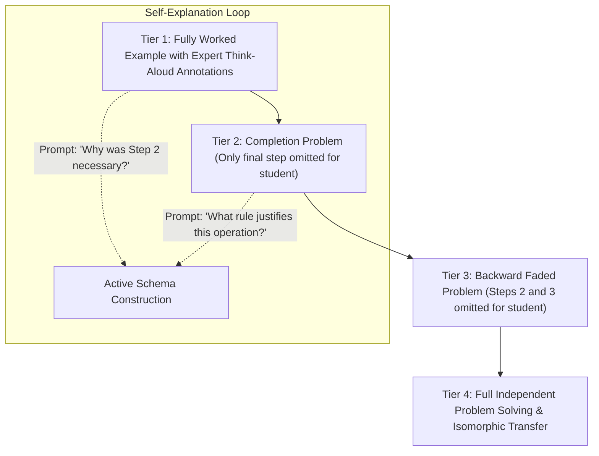

# The Worked-Example Fading Protocol: Cognitive Scaffolding, Completion Problems, and Self-Explanation Prompts

> **The Cognitive Load Scaffolding Axiom**:  
> Asking a novice to solve an unassisted problem from scratch forces them to rely on **means-ends analysis**—an exhaustive, random search through working memory that generates high extraneous load and zero schema acquisition. Studying a step-by-step worked example frees 100% of working memory capacity to encode the underlying structural schema.

---

## 0. Learning Contract & Target Competencies

By engaging with this clinical intervention, you will develop the ability to:
1. **Design** a 4-tier **Backward Fading Sequence** (Fully Worked $\rightarrow$ Final-Step Completion $\rightarrow$ Two-Step Faded $\rightarrow$ Full Independent Transfer).
2. **Embed** structured **Self-Explanation Prompts** (Chi, 1994) that prevent passive skimming and force learners to articulate *why* a mathematical or scientific step was taken.
3. **Navigate** the **Expertise Reversal Effect** (Kalyuga et al., 2003): Knowing exactly when to fade out worked examples to prevent cognitive redundancy for advancing learners.
4. **Transform** frustrating, high-failure problem sets into progressive competence-building sequences.

---

## 1. The Intuitive Dilemma: The Homework Frustration Spiral

Consider this widespread parent-teacher conference scenario:
> *Mr. Davis teaches 7th-grade algebra. In class, he solves 2 problems on the board, then assigns 25 multi-step equations for homework: $3(2x - 4) + 5 = 29$.  
> That evening, 12-year-old Jason sits at the kitchen table. He stares at the sheet for 45 minutes, bursts into tears, and says: "I don't know what to do with the parentheses! I hate math!"  
> His parents try to help, but use a different method. Jason arrives at school frustrated, incomplete, and anxious.*

Mr. Davis thinks: *"Students these days lack grit. If they just practiced more, they would get it."*

### The Prediction Challenge
*Before reading Section 2, commit to one of the following instructional diagnoses:*
- **Diagnosis A**: Jason lacks academic grit and needs stricter homework penalties.
- **Diagnosis B**: Mr. Davis committed the **Worked Example Deficit Error**. Assigning 25 unguided problems to a novice induces cognitive overload. Replacing 15 of those problems with paired **Worked Examples and Completion Tasks** would double learning while cutting homework time in half.
- **Diagnosis C**: Algebra should not be taught until age 16.

---

## 2. The Backward Fading Architecture



### 2.1. Why Backward Fading Outperforms Forward Fading
Alexander Renkl and Robert Atkinson (2002, 2003) demonstrated that **Backward Fading** is empirically superior to Forward Fading:
* In forward fading, the student must execute Step 1, which has the highest ambiguity and strategic uncertainty. If they stumble on Step 1, the entire subsequent problem collapses.
* In **backward fading**, the expert provides the setup and intermediate transitions. The student is responsible only for the final closure step.
* This allows the student to experience **immediate enactive mastery** and closure without getting lost in initial formulation mechanics. In the next problem, the scaffold recedes backward one step further.

---

## 3. Worked Clinical Example: A 4-Tier Faded Algebra Progression

### Tier 1: Fully Worked Example with Self-Explanation Prompt
$$\text{Solve for } x: \quad 4(x + 3) - 7 = 21$$

```text
[Step 1: Distribute the 4 across parentheses]
4 * x + 4 * 3 - 7 = 21
4x + 12 - 7 = 21
[Expert Think-Aloud]: "Before I can isolate x, I must unpack the terms trapped inside parentheses."

[Step 2: Combine constant terms on the left side]
4x + 5 = 21
[Expert Think-Aloud]: "12 minus 7 is 5. Simplifying constants reduces the equation to a standard two-step form."

[Step 3: Subtract 5 from both sides to isolate the variable term]
4x = 16
[Expert Think-Aloud]: "Inverse operation of +5 is -5."

[Step 4: Divide both sides by 4]
x = 4
[Expert Think-Aloud]: "4x means 4 multiplied by x; dividing by 4 isolates 1x."

>>> MANDATORY SELF-EXPLANATION PROMPT <<<
"Why was it essential to combine 12 - 7 in Step 2 before trying to divide by 4?"
[Student writes 1-sentence justification before turning page.]
```

### Tier 2: Completion Problem (Step 4 Omitted)
$$\text{Solve for } x: \quad 5(x + 2) - 8 = 22$$
* *Step 1 (Provided)*: $5x + 10 - 8 = 22$
* *Step 2 (Provided)*: $5x + 2 = 22$
* *Step 3 (Provided)*: $5x = 20$
* *Step 4 (STUDENT COMPLETES)*: $\underline{\hspace{4cm}}$

### Tier 3: Backward Faded Problem (Steps 3 & 4 Omitted)
$$\text{Solve for } x: \quad 3(x + 4) - 5 = 19$$
* *Step 1 (Provided)*: $3x + 12 - 5 = 19$
* *Step 2 (Provided)*: $3x + 7 = 19$
* *Step 3 (STUDENT COMPLETES)*: $\underline{\hspace{4cm}}$
* *Step 4 (STUDENT COMPLETES)*: $\underline{\hspace{4cm}}$

### Tier 4: Independent Problem
$$\text{Solve for } x: \quad 2(x + 5) - 3 = 23$$
* *Full independent execution by student.*

---

## 4. Non-Example / Pathological Case: "Example Without Think-Aloud"

1. **Teacher Action**: The teacher prints 5 worked problems on a worksheet, but includes only the bare algebraic steps without annotations, commentary, or self-explanation prompts.
2. **Cognitive Analysis**:
   * Novice students **skim the lines passively**, experiencing the illusion of understanding (*"Looks simple"*).
   * They do not attend to the *subgoals* or underlying strategic decisions.
   * Without **Self-Explanation Prompts** (e.g. *"Why did the minus sign become plus?"*), worked examples degenerate into passive decorative text ($d$ drops from $0.65$ to $0.10$).

---

## 5. Misconception Diagnostics & Refutation Table

| Misconception | Classroom Phenomenon | Cognitive Science Reality |
| :--- | :--- | :--- |
| **"Giving students worked examples is cheating; they should struggle."** | Refusing to show complete solutions before homework. | The **Worked Example Effect** (Sweller, 1988) is one of the most robust findings in cognitive psychology ($d = 0.60 - 0.90$). Novices cannot struggle productively on procedural tasks because they lack the requisite schemas. |
| **"Worked examples should be given for every problem all year long."** | Providing full solutions to advanced students. | **Expertise Reversal Effect** (Kalyuga et al., 2003): Once a student acquires domain schemas, worked examples become redundant extraneous load that slows down processing. Fading must be aggressive as competence rises. |
| **"Students will read the explanation if it's there."** | Students skipping paragraphs of text to get to problem 1. | Self-explanation must be **structurally enforced**: the student cannot unlock the next problem without answering the diagnostic prompt. |

---

## 6. Formative Hinge Question & Distractor Analysis

> **Scenario**: An instructor is teaching 9th-grade chemistry stoichiometry (converting grams of reactant to grams of product via moles). Which homework design aligns with the Worked-Example Fading protocol?

* **Option A**: 20 identical stoichiometry problems with no worked solutions, requiring students to look up the steps online.
* **Option B**: 5 paired sets: Each set consists of a fully annotated worked example with a self-explanation prompt, immediately followed by an isomorphic completion problem where the final mole-to-gram conversion step is left blank for the student.
* **Option C**: A 2-hour video tutorial of the teacher solving 15 problems while students passively watch without writing.
* **Option D**: Giving students the complete answer key with all 20 problems fully worked out and telling them to memorize the answers.

### Diagnostic Distractor Analysis:
* **Option A**: Overloads working memory with unstructured search ($d = -0.20$); induces panic and homework copying.
* **Option B (CORRECT)**: Flawlessly applies the worked-example/completion-problem pair ($d = 0.70$), maximizing schema construction while ensuring active accountability.
* **Option C**: Passive video watching without active generation fails to induce synaptic reconsolidation.
* **Option D**: Encourages rote memorization without procedural execution or conceptual schema transfer.

---

## 7. Actionable Classroom Protocol: The Example-Problem Pair

```yaml
protocol: WORKED-EXAMPLE-FADING-ENGINE
unit_structure:
  ratio: "1 Worked Example : 1 Completion Problem : 1 Independent Problem"
  fading_direction: "Backward (last step first, then middle steps)"
scaffolding_rules:
  1_annotated_subgoals: "Every worked example must visually label subgoals (e.g., 'Subgoal 1: Find moles of A')."
  2_mandatory_self_explanation: "Insert a prompt every 2 steps: 'What would happen if we skipped this operation?'"
  3_firming_check: "If student makes an error on a completion problem, immediately redirect to the paired worked example to identify the divergence point."
```

---

## 8. Empirical Evidence & Meta-Analytic Benchmarks

| Investigation / Author | Domain / Sample | Effect Size ($d$ / $g$) | Core Empirical Finding |
| :--- | :--- | :--- | :--- |
| **Sweller & Cooper (1985)** | High School Mathematics | $d = 0.82$ | Students studying worked examples solved subsequent test problems in half the time and with significantly fewer errors than students who solved problems during learning. |
| **Renkl, Atkinson, & Maier (2002)** | Cognitive Architecture Research | $d = 0.65$ | Backward fading from worked examples to completion problems significantly outperformed forward fading and traditional problem-solving on far-transfer tasks. |
| **Barbieri et al. (2023)** | Large-Scale Middle School Algebra RCT ($N=1,400$) | $g = 0.42 - 0.58$ | Integrating worked examples with error analysis into standard algebra curricula significantly boosted procedural flexibility and state assessment scores, especially for struggling learners. |
