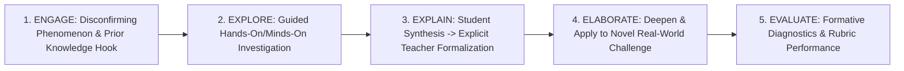

# The BSCS 5E Instructional Model: Engage, Explore, Explain, Elaborate, and Evaluate

> **The Inquiry Architecture Axiom**:  
> Scientific literacy cannot be acquired through passive memorization of pre-packaged facts, nor through chaotic, unguided play. The 5E model provides a disciplined cyclic scaffold where inquiry precedes vocabulary, and direct explanation anchors shared exploration.

---

## 0. Learning Contract & Target Competencies

By engaging with this instructional pattern, you will develop the ability to:
1. **Sequence and execute** a multi-day or single-period unit through the 5 distinct phases of the **BSCS 5E Model**: Engage, Explore, Explain, Elaborate, and Evaluate.
2. **Prevent** the fatal instructional collapse of "Explaining during the Explore phase," maintaining student inquiry ownership.
3. **Design** disconfirming **Engage phenomena** that expose pre-existing naive misconceptions and trigger authentic prediction commitments.
4. **Align** 5E lessons with the Next Generation Science Standards (NGSS 3D learning: Science & Engineering Practices, Disciplinary Core Ideas, Crosscutting Concepts).

---

## 1. The 5E Architectural Progression



### Phase-by-Phase Pedagogical Specification

| Phase | Duration | What the Students Do | What the Teacher Does (Teacher Moves) | Fatal Anti-Pattern to Avoid |
| :--- | :--- | :--- | :--- | :--- |
| **1. Engage** | 5–10m | Observe anomalous event, record intuitive prediction, reveal prior assumptions. | Demonstrates a puzzling phenomenon; asks: *"What do you notice and what do you wonder?"* | Lecturing on the answer; defining terms before the hook. |
| **2. Explore** | 15–25m | Manipulate variables, record data, experience cognitive friction in small groups. | Facilitates, observes, asks probing questions (*"What pattern do you see?"*); withholds formal terms. | Interrupting to explain the underlying theory or giving away the answer. |
| **3. Explain** | 15–20m | Share observations in their own words; listen to formal explanation; connect claims to evidence. | Solicits student descriptions first, then introduces formal scientific vocabulary and canonical models. | Presenting an isolated 45-minute PowerPoint disconnected from the Explore data. |
| **4. Elaborate** | 15–30m | Apply the newly acquired concept to a novel, more complex scenario (near/far transfer). | Challenges students with a new contextual boundary; provides minimal fading scaffolds. | Giving identical duplicate problems that require zero conceptual transfer. |
| **5. Evaluate** | Ongoing + 10m | Complete formative hinge question, self-assess rubric, demonstrate observable mastery. | Inspects student diagnostic signal; provides immediate corrective feedback; redirects pacing. | Grading only at the very end of the unit with zero in-flight formative checks. |

---

## 2. Worked Clinical Example: Middle-School Science Unit on Thermal Energy & Density

### Phase 1: Engage (7 minutes)
* **The Phenomenon**: The teacher places two identical-looking clear liquid beakers on the desk. She drops an ice cube into Beaker A (it floats). She drops an identical ice cube into Beaker B (it sinks immediately to the bottom!).
* **Student Activity**: Every student writes in their notebook: (1) One observation, (2) One causal hypothesis to explain why Ice Cube B sank.
* **Teacher Move**: Accepts all hypotheses neutrally: *"Julian thinks Beaker B is alcohol; Maya thinks the ice cube in B has a lead weight inside. Let's explore."*

### Phase 2: Explore (20 minutes)
* **Investigation**: Students in lab pairs receive graduated cylinders, digital balances, and samples of three liquids (Water, Isopropanol, Corn Syrup).
* **Task**: Calculate the mass of exactly $50\text{ mL}$ of each liquid. Graph Mass vs. Volume.
* **Student Discovery**: Isopropanol has significantly less mass for the exact same volume than water. They calculate the mass-to-volume ratio.

### Phase 3: Explain (15 minutes)
* **Step 1 (Student Voice)**: Students share their ratios. *"Isopropanol only weighed 39 grams for 50 mL, but water weighed 50 grams!"*
* **Step 2 (Teacher Formalization)**: Teacher introduces the canonical term:
  $$\text{Density} = \frac{\text{Mass}}{\text{Volume}} \quad (\rho = \frac{m}{V})$$
* **Step 3 (Molecular Dual Coding)**: Teacher projects a simulation showing molecular packing: Water molecules are tightly hydrogen-bonded; isopropanol molecules have bulky hydrocarbon tails that prevent close packing.
* **Step 4 (Resolution of Engage Hook)**: Ice has a density of $0.92\text{ g/cm}^3$. It floats in water ($1.00\text{ g/cm}^3$) because it is less dense, but sinks in isopropanol ($0.78\text{ g/cm}^3$) because it is more dense!

### Phase 4: Elaborate (20 minutes)
* **Novel Transfer Challenge**: *"A giant cargo ship is loaded to maximum capacity in the freshwater Amazon River. When it enters the saltwater Atlantic Ocean, will the ship sit higher in the water, lower, or sink? Justify using your molecular density model."*
* **Students apply schema**: Saltwater contains dissolved $Na^+$ and $Cl^-$ ions packed into the interstitial water spaces, increasing its density ($1.03\text{ g/cm}^3$). The ship experiences greater buoyant force and floats higher.

### Phase 5: Evaluate (8 minutes)
* **Hinge Question**: 1 diagnostic multiple-choice question testing the difference between mass, volume, and density.

---

## 3. Non-Example / Pathological Case: The "Reverse 5E"

1. **Teacher Action**:
   - Day 1: Teacher lectures on the definition of density, writes the formula, and makes students copy 4 vocabulary definitions.
   - Day 2: Teacher hands out a "cookbook lab" with 12 numbered steps telling students exactly which liquid to pour and what numbers to write down.
2. **Cognitive Analysis**:
   * The students experience zero wonder, zero prediction error, and zero inquiry agency.
   * The lab becomes a mindless procedural following of instructions, disconnected from conceptual reasoning.

---

## 4. Actionable Turn-Key Lesson Template

```yaml
lesson_plan_template: 5E-INQUIRY-BLOCK
metadata:
  unit_topic: "String"
  grade_level: "S2/S3/S4"
  ngss_standard: "Disciplinary Core Idea + Practice"
phase_execution:
  1_engage:
    disconfirming_hook: "Demonstration or dataset that defies naive intuition."
    student_commitment: "Written prediction + 1-sentence justification."
  2_explore:
    hands_on_setup: "Structured manipulation of independent/dependent variables."
    data_recording: "Shared table or digital visual graph."
    tutor_prompt: "'What pattern is emerging across your trials?'"
  3_explain:
    student_articulation: "Learners explain observations using non-technical language."
    canonical_formalization: "Teacher provides scientific term, mathematical formula, and molecular/dual-coded representation."
  4_elaborate:
    transfer_task: "Real-world engineering, ecological, or physical problem in a new context."
  5_evaluate:
    formative_instrument: "Hinge question with distractor diagnosis + self-assessment rubric."
```

---

## 5. Empirical Evidence & Meta-Analytic Support

| Investigation | Scope / Sample | Effect Size ($d$ / $g$) | Core Finding |
| :--- | :--- | :--- | :--- |
| **Bybee et al. (2006)** | 20-Year Synthesis of BSCS 5E Model | Grade B | Students taught with 5E demonstrated significantly higher mastery of science concepts, reasoning ability, and scientific attitudes than traditional lecture/textbook instruction. |
| **Wilson et al. (2010)** | Cluster Randomized Controlled Trial ($N=58\text{ classes}$) | $d = 0.40 - 0.50$ | 5E inquiry instruction produced significantly greater science learning gains and closed achievement gaps for students with special needs and English language learners. |
