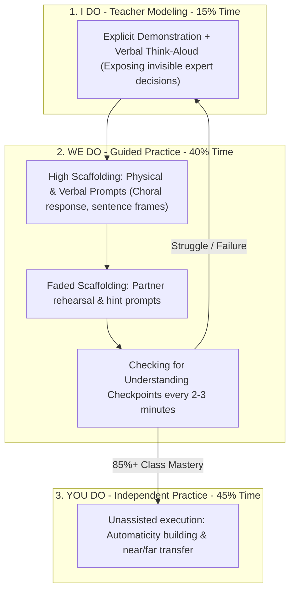

# Explicit Instruction Architecture: The "I Do, We Do, You Do" Gradual Release Protocol

> **The Archer & Hughes Axiom**:  
> Good instruction is not an accident; it is systematic, relentless, and clear. Optimize time on task, teach essential skills directly, break complex tasks into manageable sub-skills, model explicitly with think-alouds, and provide immediate feedback until 100% of students achieve automaticity.

---

## 0. Learning Contract & Target Competencies

By engaging with this lesson pattern, you will develop the ability to:
1. **Structure and execute** a high-density lesson through the 3 phases of the **Gradual Release of Responsibility**: *I Do* (Teacher Modeling), *We Do* (Guided Practice), and *You Do* (Independent Practice).
2. **Embed** a **Checking for Understanding (CFU)** routine every 2 to 3 minutes, ensuring zero passive bystander behavior.
3. **Calibrate** the *We Do* phase, knowing when to provide physical/verbal prompts and when to fade them to prevent learned helplessness.
4. **Achieve** an 85% to 90% success rate during guided practice before releasing students to independent work.

---

## 1. The 3-Tier Gradual Release Architecture



### Phase-by-Phase Execution Standards

| Phase | Instructional Focus | Teacher Script & Moves | Student Cognitive Action |
| :--- | :--- | :--- | :--- |
| **I DO** | Explicit Modeling | *"Watch me. Listen to my thoughts. Notice why I choose Step 1."* | Full visual and auditory attention; zero writing; encoding the expert schema. |
| **WE DO** | Guided Co-Construction | *"Let's do the next one together. Prompt me: What do we do first? On my signal, tell me."* | Active verbal/written generation with instant corrective safety net; testing emerging hypotheses. |
| **YOU DO** | Independent Automaticity | *"Now prove it to yourself. 3 problems on your own, silent focus. Raise hand if you hit a wall."* | Retrieval from long-term memory; consolidating synaptic connections; far-transfer application. |

---

## 2. Worked Clinical Transcript: Teaching Long Division with Remainders

```text
================================================================================
PHASE 1: I DO (Teacher Modeling)
================================================================================
Teacher: "Eyes on the board. Pens down. My turn. The problem is 75 divided by 4.
I ask myself: 'How many 4s are in 7 tens?' 
Watch my thinking: 4 times 1 is 4; 4 times 2 is 8. 8 is too big!
So there is only 1 group of 4 tens. 
I write the 1 above the tens place.
Now I multiply: 1 ten times 4 is 4 tens. I write 4 below the 7.
Now I subtract to find the leftovers: 7 tens minus 4 tens is 3 tens.
3 tens is smaller than 4, so my estimate was correct.
Now I bring down the 5 ones: 35 ones."

================================================================================
PHASE 2: WE DO (Guided Practice with High CFU)
================================================================================
Teacher: "Whiteboards in hand. Next problem: 94 divided by 3.
Step 1: Look at the 9 tens. What question do we ask ourselves? Whisper it to your partner."
[10-second peer whisper.]
Teacher: "Together, on my signal: What question?"
Class (unison): "How many 3s are in 9 tens?"
Teacher: "Show me on your fingers: how many 3s in 9?"
[Teacher scans 28 whiteboards/hands in 2 seconds: all show 3 fingers.]
Teacher: "Write the 3 above the tens. Now multiply and hold your board to your chin."
[Boards show 3 * 3 = 9; subtracted = 0. Teacher nods.]
Teacher: "What is our next move? Choral response, get ready..."
Class: "Bring down the 4!"

================================================================================
PHASE 3: YOU DO (Independent Practice)
================================================================================
Teacher: "Whiteboards down, open your independent practice notebooks.
Problems 1, 2, and 3 are identical to what we just practiced.
You have 6 minutes. Begin."
[Teacher circulates immediately to 4 students identified as hesitant during Phase 2.]
```

---

## 3. Non-Example / Pathological Case: The "Abbreviated We Do" Crash

1. **Teacher Action**:
   - The teacher demonstrates 1 problem on the board (*I Do* for 5 minutes).
   - The teacher asks: *"Does everyone understand?"* (Two students nod).
   - The teacher immediately says: *"Great! Do problems 1 to 20 for homework!"* (*Skipping We Do*).
2. **Cognitive Analysis**:
   * **The "We Do" phase was completely omitted.**
   * Novice students have had zero opportunity to attempt the algorithm under expert supervision.
   * Result: 60% of students make an error on Step 2 of Problem 1, practice that error 19 more times, and arrive tomorrow with an entrenched false schema.
   * **Rule**: *Never transition to "You Do" until 85%+ of students demonstrate flawless execution during "We Do."*

---

## 4. Actionable Turn-Key Lesson Protocol

```yaml
protocol: EXPLICIT-INSTRUCTION-DELIVERY
pacing_ratio: "I Do (15%) : We Do (40%) : You Do (45%)"
checks_for_understanding:
  frequency: "Every 2 to 3 minutes"
  instruments:
    - "Simultaneous Choral Responding (Auditory unison on signal)"
    - "Chin-Level Individual Whiteboards (Immediate visual 100% scan)"
    - "Finger Voting / Action Cues (Kinesthetic confirmation)"
guidelines_for_we_do:
  scaffold_level_1: "Teacher leads thinking, students provide answers."
  scaffold_level_2: "Students lead thinking with partner, teacher monitors."
  scaffold_level_3: "Students complete 1 problem silently, verify with peer before teacher release."
```

---

## 5. Empirical Evidence Base

| Study / Citation | Methodology / Scope | Effect Size ($d$ / $g$) | Primary Finding |
| :--- | :--- | :--- | :--- |
| **Archer & Hughes (2011)** | Comprehensive Synthesis (*Explicit Instruction*) | Grade A | Explicit instruction with structured I-We-You phasing consistently yields the highest academic growth rates for elementary, middle, and struggling secondary students. |
| **Rosenshine (2012)** | Principles of Instruction (*American Educator*) | Grade A | High-performing teachers spend substantially more time in guided practice (*We Do*), ask 3x more questions, and check for understanding before independent release. |
| **Pearson & Gallagher (1983)** | Gradual Release of Responsibility Model | Foundational | Established the theoretical framework demonstrating that transfer of cognitive responsibility from teacher to student requires an intermediate guided co-construction phase. |
