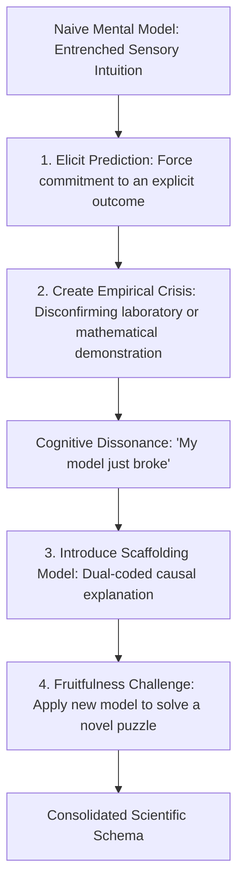

# The Master Catalog of Landmark Student Misconceptions: Diagnostic Cues, Probes, and Disconfirming Interventions

> **The Conceptual Change Axiom**:  
> A misconception is not an empty absence of knowledge; it is an active, deeply coherent, intuitive theory of the world built from years of sensory experience. You cannot erase a misconception by lecturing over it; you must create a disconfirming crisis that renders the naive model untenable, followed by scaffolding a superior replacement schema (Posner et al., 1982; Vosniadou, 2002).

---

## 0. Master Diagnostic Matrix: 12 Landmark Misconceptions

| Domain | # | Landmark Misconception | Intuitive Naive Model | Diagnostic Hinge Probe | Disconfirming Cognitive Crisis |
| :--- | :--- | :--- | :--- | :--- | :--- |
| **Physics** | 1 | **Aristotelian Impetus** | *"Motion requires continuous force. If an object is moving, a force is pushing it forward."* | *"A puck slides on frictionless ice. What forward force keeps it moving?"* | Free-body diagram showing gravity and normal force cancel, zero horizontal force, yet puck maintains constant velocity ($F_{net} = 0 \Rightarrow a = 0$). |
| **Physics** | 2 | **Gravitational Mass Fallacy** | *"Heavier objects fall faster than lighter objects in a vacuum."* | *"A 10kg bowling ball and a 1kg book are dropped in a vacuum chamber. Which hits first?"* | Apollo 15 hammer-and-feather vacuum drop video; showing $a = F/m = (mg)/m = g$, mass cancels. |
| **Biology** | 3 | **Lamarckian Adaptation** | *"Organisms evolve traits because they 'need' them to survive, passing acquired traits to offspring."* | *"Why do arctic hares have white fur? (A) They needed to hide so their fur changed; (B) Random mutation produced white fur, conferring differential survival."* | Case of dark Peppered Moths during the Industrial Revolution: individual moths did not change color; population allele frequency shifted through selective predation. |
| **Chemistry** | 4 | **Combustion Mass Destruction** | *"When wood burns, matter is destroyed; the ashes weigh less, so mass vanished."* | *"A 100g log burns inside a sealed airtight glass bell jar. What does the scale read after burning?"* | Mass remains exactly 100g. Trapping escaping $CO_2$ and $H_2O$ vapor proves Conservation of Mass ($\sum m_{reactants} = \sum m_{products}$). |
| **Mathematics** | 5 | **Equal Sign as Operator** | *"The '=' sign means 'compute the answer now' rather than 'two expressions have equal value'."* | *"Fill in the blank: $8 + 4 = \underline{\hspace{1cm}} + 5$."* (Naive answer: 12 or 17). | Physical two-pan balance scale: place 8g + 4g on left pan; showing that adding 12g on right pan creates balance imbalance ($12 + 5 = 17 \neq 12$). Target is 7. |
| **Mathematics** | 6 | **Multiplication Makes Bigger** | *"Multiplication always increases a number; division always decreases it."* | *"Is $12 \times 0.5$ greater than, equal to, or less than 12?"* | Singapore bar model: 12 divided into half a unit yields 6; area model showing fractional dimensions reduce area. |
| **Earth Science** | 7 | **Seasonal Distance Fallacy** | *"Summer is hotter because the Earth is physically closer to the Sun in its orbit."* | *"When it is July and scorching in New York, why is it freezing winter in Sydney, Australia?"* | Distance model disconfirmed: Earth is actually closest to the Sun (*perihelion*) in January! Demonstration of axial tilt and angle of solar incidence ($23.5^\circ$). |
| **History** | 8 | **Historical Presentism** | *"People in medieval Europe were ignorant or barbaric because they didn't hold modern 21st-century human rights values."* | *"Evaluate a 17th-century Puritan witchcraft trial using only 17th-century theological and legal texts."* | Primary source contextualization: reading court transcripts reveals strict adherence to prevailing biblical jurisprudence and demonological science of the era. |
| **Economics** | 9 | **Lump of Labor Fallacy** | *"There is a fixed amount of work in an economy, so immigrants or automation necessarily steal jobs from existing workers."* | *"If 100 immigrants move into a city, does total employment decrease, stay flat, or expand?"* | Immigrants are not only workers (supply); they are consumers who buy food, housing, and services, shifting aggregate demand curve rightward and creating new labor demand. |
| **Genetics** | 10 | **Dominant = Common** | *"Dominant alleles are always more frequent, stronger, or healthier in a population than recessive alleles."* | *"Huntington's disease is caused by a dominant allele. Why doesn't 50%+ of the population have it?"* | Allele frequency is governed by natural selection and genetic drift, not dominance (Hardy-Weinberg equilibrium). Polydactyly (extra fingers) is dominant but rare ($1 \text{ in } 1,000$). |
| **Mathematics** | 11 | **Fraction Numerator/Denominator Separation** | *"In $\frac{3}{8}$, 3 is an independent integer and 8 is an independent integer; therefore $\frac{3}{8} + \frac{2}{5} = \frac{5}{13}$."* | *"Is $\frac{1}{2} + \frac{1}{2}$ equal to $\frac{2}{4}$?"* | If $\frac{1}{2} + \frac{1}{2} = \frac{2}{4}$, then half a pizza plus half a pizza equals two-fourths of a pizza (which is half a pizza!). Physical fraction tiles induce instant visual crisis. |
| **Cognition** | 12 | **Multitasking Illusion** | *"I can study effectively while texting and listening to podcasts because my brain can multitask."* | *"Perform a Stroop color-naming task while counting backward by 7s aloud."* | Reaction time doubles, error rate jumps by 400%. Demonstrates the prefrontal central executive bottleneck: the brain cannot process two cognitively demanding semantic streams simultaneously. |

---

## 1. The 4-Step Conceptual Change Intervention Protocol

Posner, Strike, Hewson, & Gertzog (1982) demonstrated that conceptual change requires 4 conditions:
1. **Dissatisfaction with Current Conception**: The learner must be confronted with an authentic anomalous observation that their existing schema cannot explain.
2. **Intelligibility of New Conception**: The replacement model must make sense and be easily parsed via dual coding.
3. **Plausibility of New Conception**: The replacement model must solve the anomaly and reconcile with prior verified experiences.
4. **Fruitfulness**: The replacement model must open up new predictive capacity and solve novel transfer problems.



---

## 2. Worked Clinical Vignette: Remediating the Equal Sign ($=$) Misconception

```text
[Teacher presents: 7 + 5 = ___ + 4]
Student writes: 12.
Teacher: "Read the equation aloud, substituting your number 12."
Student: "7 plus 5 equals 12 plus 4."
Teacher: "What is 7 plus 5?"
Student: "12."
Teacher: "What is 12 plus 4?"
Student: "16."
Teacher: "Does 12 equal 16?"
Student (startled): "No... wait. Why did I do that?"
Teacher: "Because your brain treated '=' like a cash register button that says 'total now!' 
In mathematics, the '=' sign is not a button; it is a balance beam. 
Whatever weight is on the left pan MUST equal the weight on the right pan. 
If the left side is 12, what number plus 4 will balance the right side to 12?"
Student: "8!"
Teacher: "Let's test: 7 + 5 = 12. 8 + 4 = 12. Does 12 = 12?"
Student (smiling): "Yes, it balances!"
```

---

## 3. Empirical Citations & Canon

* **Posner, Strike, Hewson, & Gertzog (1982)**: *Accommodation of a Scientific Conception: Toward a Theory of Conceptual Change* (*Science Education*). Landmark foundational paper.
* **Vosniadou (2002)**: *Mental Models of the Earth: A Study of Conceptual Change in Childhood* (*Cognitive Psychology*). Proved children construct coherent "synthetic models" (e.g. flat hollow Earth) to reconcile adult testimony with sensory gravity.
* **Hestenes, Wells, & Swackhamer (1992)**: *Force Concept Inventory (FCI)* (*The Physics Teacher*). Demonstrated that traditional physics lectures leave 80% of Newtonian misconceptions intact.
* **Wineburg (2001)**: *Historical Thinking and Other Unnatural Acts*. Established that historical thinking requires overcoming instinctive presentism through sourcing, contextualization, and corroboration.
