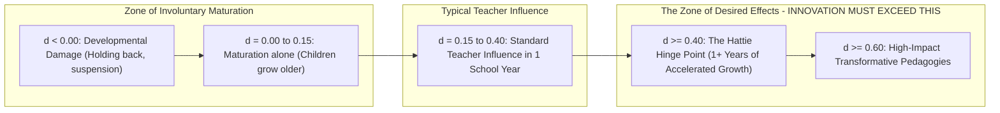

# Meta-Analytic Effect Size Synthesis: The Empirical Hierarchy of Educational Interventions

> **The Empirical Evidence Axiom**:  
> Almost everything in education "works" to some minimal degree—95% of educational interventions produce a positive effect size ($d > 0.00$) simply because students are growing older and receiving attention. The pedagogical imperative is not asking *"Does it work?"* but asking: **"Does it produce significantly more growth than the 0.40 hinge-point of a standard school year?"** (Hattie, 2009).

---

## 0. The Hattie Hinge Point ($d = 0.40$) Baseline

John Hattie's synthesis of over 2,100 meta-analyses covering 300+ million students establishes the **Hinge Point of Educational Effectiveness**:

$$\text{Cohen's } d = \frac{\mu_{\text{intervention}} - \mu_{\text{control}}}{\sigma_{\text{pooled}}}$$

* **$d = 0.20$**: Small effect (approx. 3 months of additional progress).
* **$d = 0.40$**: Medium effect (the baseline average growth across one typical academic year).
* **$d = 0.60$**: Large effect (accelerates student learning by 6–9 months beyond baseline).
* **$d \ge 0.80$**: Transformative / Super-Impact (doubles the standard rate of learning).

---

## 1. The Master Empirical Hierarchy Table

Synthesizing findings from **Hattie (2023)**, **Dunlosky et al. (2013)**, the **Education Endowment Foundation (EEF)**, and the **What Works Clearinghouse (WWC)**:

| Rank | Pedagogical Construct / Intervention | Cohen's $d$ / Hedges' $g$ | EEF Months Progress | Primary Literature Base |
| :---: | :--- | :---: | :---: | :--- |
| **1** | **Feedback & Micro-Teaching Reflection** | **$d = 0.88$** | $+7\text{ months}$ | Hattie (2009), Wisniewski et al. (2020) |
| **2** | **Scaffolding & Worked-Example Fading** | **$d = 0.82$** | $+6\text{ months}$ | Sweller (1988), Barbieri et al. (2023) |
| **3** | **Spaced Retrieval Practice** | **$g = 0.74$** | $+6\text{ months}$ | Roediger & Karpicke (2006), Agarwal (2021) |
| **4** | **Peer Instruction & Socratic ConcepTests** | **$g = 0.74$** | $+6\text{ months}$ | Mazur (1997), Crouch & Mazur (2001) |
| **5** | **Metacognitive Strategies & Self-Regulation** | **$d = 0.69$** | $+7\text{ months}$ | EEF (2024), Zimmerman (2002) |
| **6** | **Interleaved Mathematics Practice** | **$d = 0.65$** | $+5\text{ months}$ | Rohrer & Taylor (2007), Dunlosky (2013) |
| **7** | **Direct Instruction (Engelmann DI)** | **$d = 0.59$** | $+5\text{ months}$ | Stebbins (1977), Stockard et al. (2018) |
| **8** | **Productive Failure (Kapur)** | **$d = 0.58$** | $+5\text{ months}$ | Kapur (2012), Sinha & Kapur (2021) |
| **9** | **Dual Coding & Multimodal Representation** | **$d = 0.57$** | $+5\text{ months}$ | Mayer (2009, 2021), Paivio (1986) |
| **10** | **Formative Assessment & Hinge Questions** | **$d = 0.48$** | $+5\text{ months}$ | Black & Wiliam (1998), KMOFAP |
| **--** | **--- THE HATTIE HINGE POINT ($d = 0.40$) ---** | **$0.40$** | $+4\text{ months}$ | Baseline standard annual growth |
| **11** | **Individualized 1-on-1 Coaching** | **$d = 0.49$** | $+4\text{ months}$ | Kraft, Blazar, & Hogan (2018) |
| **12** | **Cooperative / Small-Group Learning** | **$d = 0.40$** | $+4\text{ months}$ | Johnson & Johnson (2009) |
| **13** | **Problem-Based Learning (PBL)** | **$d = 0.38$** | $+3\text{ months}$ | Strobel & van Barneveld (2009) |
| **14** | **Homework (Secondary 9–12)** | **$d = 0.35$** | $+3\text{ months}$ | Cooper (2006) |
| **15** | **Growth Mindset Alone (General Population)** | **$d = 0.08$** | $+1\text{ month}$ | Sisk et al. (2018 meta-analysis) |
| **16** | **Homework (Elementary K–5)** | **$d = 0.10$** | $0\text{ months}$ | Cooper (2006), EEF (2024) |
| **17** | **Matching Instruction to Learning Styles (VAK)** | **$d = 0.02$** | $0\text{ months}$ | Pashler et al. (2008), Rogowsky (2020) |
| **18** | **Ability Grouping / Tracking** | **$d = 0.12$** | $0\text{ months}$ | Hattie (2023), EEF (2024) |
| **19** | **Pure Discovery Learning (Unguided)** | **$d = -0.15$** | $-1\text{ month}$ | Alfieri et al. (2011), Kirschner (2006) |
| **20** | **Grade Retention (Holding a student back a year)**| **$d = -0.32$**| $-3\text{ months}$ | Jimerson (2001), Hattie (2023) |

---

## 2. Critical Caveats & Epistemic Boundaries

1. **The Fallacy of Effect Size Stacking**: An educator cannot simply take 5 interventions with $d = 0.60$ and expect $d = 3.00$. Working memory, instructional time, and cognitive energy are bounded resources. Interventions must be integrated into a coherent cognitive architecture.
2. **Context and Prior Knowledge (The Expertise Reversal Filter)**: An intervention that yields $d = 0.82$ for novices (Worked Examples) can produce $d = -0.20$ for experts (redundancy effect).
3. **Assessment Alignment (Far Transfer vs. Surface Recall)**: High effect sizes on multiple-choice recall tests often evaporate when students are evaluated on novel, ill-structured transfer tasks. Pedagogical design must measure deep conceptual schema formation.
