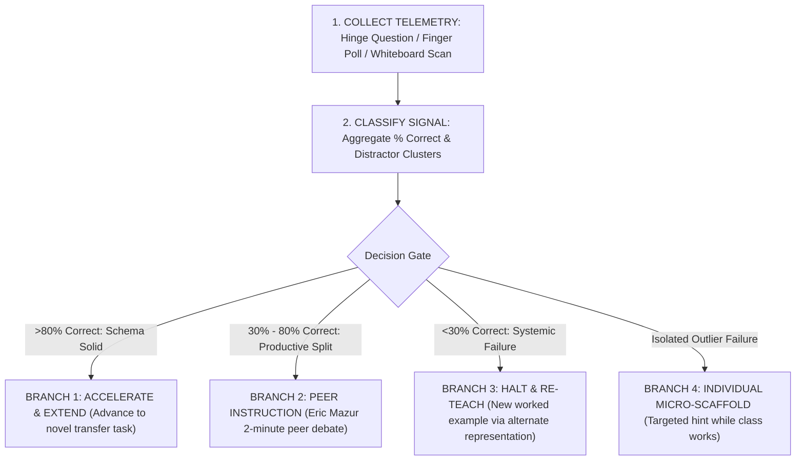

# Real-Time Formative Adaptation Protocol (CAP-04): Telemetry, In-Flight Decision Gates, and Remediation Routing

> **The CAP-04 Adaptation Axiom**:  
> Assessment is formative only if the diagnostic information is actually used to adapt instruction in real time. If a teacher administers a diagnostic quiz, records the scores in a gradebook, and moves on to the next chapter regardless of the results, the assessment was purely summative, irrespective of what it was called.

---

## 0. Capability Contract (CAP-04)

An educator or AI agent exercising **CAP-04** operates a continuous 4-phase cybernetic feedback loop:



---

## 1. The 4-Way In-Flight Decision Matrix

When a formative checkpoint (such as a [[formative-hinge-questions|Hinge Question]]) is deployed, the facilitator routes the lesson along 1 of 4 pre-planned architectural branches:

### Branch 1: High Mastery ($> 80\%$ Correct)
* **Diagnosis**: The class has successfully constructed the target schema.
* **Immediate Move**: Do not waste instructional time re-explaining to the choir. Immediately advance to independent practice or introduce a boundary-condition challenge problem (Elaborate).

### Branch 2: The Peer Instruction Sweet Spot ($30\% - 80\%$ Correct)
* **Diagnosis**: The concept is partially consolidated; misconception diversity exists in the room.
* **Immediate Move (The Mazur Maneuver)**:
  1. Do *not* reveal the correct answer.
  2. Tell students: *"Find a neighbor who chose a different letter than you. You have 2 minutes to convince them using physical evidence or logic."*
  3. Re-poll after 2 minutes. Peer debate shifts accuracy from $\approx 50\%$ to $>80\%$ ($g = 0.74$) because students who just mastered the concept possess the exact pedagogical language needed to bridge their peers' zone of proximal development.

### Branch 3: Systemic Breakdown ($< 30\%$ Correct)
* **Diagnosis**: The initial instructional presentation was flawed, ambiguous, or overloaded working memory.
* **Immediate Move**:
  1. **Halt the lesson immediately**. Do not proceed to independent homework.
  2. Do *not* simply repeat the exact same explanation louder.
  3. Pivot to a completely different sensory representation (e.g. switch from symbolic algebra to a Singapore Bar Model or a physical balance scale).
  4. Walk through a fresh, fully annotated [[worked-example-fading-protocol|Worked Example]] with explicit think-aloud.

### Branch 4: Isolated Outlier Struggle ($1 - 3$ Students in a Room of 30)
* **Diagnosis**: The group is ready, but specific learners have idiosyncratic prerequisite deficits.
* **Immediate Move**: Release the 27 mastering students to independent partner challenges. Immediately pull the 3 struggling learners to a small side table for 3 minutes of concrete worked-example fading.

---

## 2. Telemetry Collection Instruments

| Instrument | Latency to Actionable Data | Cognitive Burden on Teacher | Diagnostic Precision |
| :--- | :--- | :--- | :--- |
| **All-Pupil Whiteboard Scan** | $< 3\text{ seconds}$ | Low (Visual pattern recognition) | High (Full mathematical steps visible) |
| **Finger Voting (1-4 on chest)** | $< 2\text{ seconds}$ | Very Low | High (Instant percentage estimation) |
| **Exit Ticket (End of Period)** | 15–30 minutes (post-class) | Moderate | Very High (Durable written artifacts) |
| **AI Tutor Latency Telemetry** | $< 100\text{ milliseconds}$ | Automated | Algorithmic (Tokens/sec + semantic drift) |

---

## 3. Machine-Auditable Decision Algorithm for AI Tutors

```yaml
algorithm: REALTIME-ADAPTIVE-FORK
inputs:
  student_response: "String"
  time_to_respond: "Integer (seconds)"
  target_concept: "CONCEPT-ID"
evaluation:
  is_correct: "Boolean"
  identified_misconception: "MISCONCEPTION-ID or NULL"
action_dispatch:
  case_1_clean_mastery:
    condition: "is_correct == true AND time_to_respond < 45s"
    action: "DISPATCH_NEXT_DIFFICULTY_TIER"
  case_2_correct_with_hesitation:
    condition: "is_correct == true AND time_to_respond > 90s"
    action: "DISPATCH_CONFIDENCE_PROBE ('You got it! What key clue gave you confidence?')"
  case_3_known_misconception:
    condition: "is_correct == false AND identified_misconception != NULL"
    action: "DISPATCH_DISCONFIRMING_ANOMALY (misconception_db[identified_misconception].anomaly_prompt)"
  case_4_catastrophic_error:
    condition: "is_correct == false AND identified_misconception == NULL"
    action: "DISPATCH_WORKED_EXAMPLE_FALLBACK (Step-by-step model with self-explanation)"
```

---

## 4. Empirical Evidence Base

* **Black & Wiliam (1998)**: *Assessment and Classroom Learning*. Landmark meta-analysis across 250+ studies: Formative assessment adaptations produce effect sizes of **$d = 0.40\text{ to }0.70$**, among the largest ever recorded for educational interventions.
* **Wisniewski, Zierer, & Hattie (2020)**: Meta-analysis of 435 studies on feedback: Feedback that informs the learner about *how to proceed* and adapts task difficulty yields $d = 0.73$.
