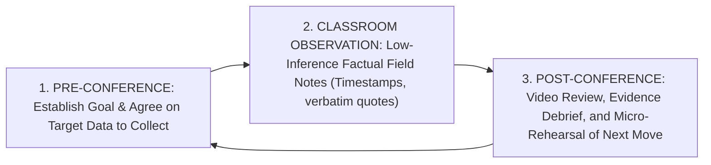

# Instructional Coaching & Observation Protocol (CAP-05): Partnership Principles, Low-Inference Field Notes, and Micro-Rehearsal

> **The CAP-05 Coaching Axiom**:  
> Traditional teacher evaluation (an administrator holding a clipboard checking 40 generic rubric boxes once a year) has **zero impact on student learning** ($d = 0.00$). Instructional coaching that pairs non-evaluative partnership dialogue with objective video evidence and deliberate micro-rehearsal yields massive, permanent gains in pedagogical fidelity ($d = 0.49$).

---

## 0. Capability Contract (CAP-05)

A Master Professor or Coach executing **CAP-05** operates a rigorous 3-stage coaching cycle:



---

## 1. The Jim Knight Partnership Principles

Coaching fails whenever it feels like surveillance or compliance auditing. CAP-05 enforces 7 foundational partnership principles (Knight, 2007, 2018):
1. **Equality**: Coach and teacher are equal partners with different, complementary perspectives.
2. **Choice**: The teacher chooses the instructional goal and selects the intervention from a menu of evidence-based options.
3. **Voice**: The teacher speaks at least 60% of the time during debriefing conferences.
4. **Dialogue**: Conversation is a collaborative exploration of reality, not top-down directives.
5. **Reflection**: The coach asks reflective questions that prompt the teacher to inspect student artifacts and video evidence.
6. **Praxis**: Ideas must be translated into immediate classroom practice.
7. **Reciprocity**: The coach expects to learn from the teacher.

---

## 2. Low-Inference Field Notes vs. High-Inference Judgment

A core competency of CAP-05 is writing **strictly factual, low-inference records**:

| High-Inference Judgment (BANNED) | Low-Inference Factual Data (MANDATORY) |
| :--- | :--- |
| *"Teacher had poor classroom management."* | *"At 10:14, 8 out of 28 students were looking away from the board while instructions were being given; 3 were tapping pencils."* |
| *"Great questioning technique!"* | *"Teacher asked 4 evaluative questions; average Wait-Time 1 was 1.1 seconds; 4 of 4 questions were answered by the same student in Row 1."* |
| *"Students were confused by the worksheet."* | *"During minutes 22–27, 6 students raised hands asking: 'What do we write in Box 3?'"* |

---

## 3. The 4-Step Post-Observation Debriefing Protocol

```text
[Step 1: Reality Confirmation]
Coach: "Looking at the video clip from minute 12 to 16, what do you notice about student engagement during the transition?"
Teacher: "I see that when I turned to write on the whiteboard, half the room started talking because they didn't have a clear task."

[Step 2: Compare to Target Standard]
Coach: "Our agreed goal was 100% on-task engagement during transitions. How does this clip compare to that target?"
Teacher: "We lost about 4 minutes of learning time."

[Step 3: Co-Design the Adjustment]
Coach: "What explicit routine from our playbook (e.g. 'Pens down, eyes on board before transition') would eliminate that lag?"
Teacher: "Giving the prompt verbally BEFORE they pick up their binders, and using a 30-second digital countdown timer."

[Step 4: Micro-Rehearsal (Deliberate Practice on the Spot)]
Coach: "Let's rehearse it right now. I'll act as the class. Model your entry prompt and transition cue."
[Teacher rehearses script twice with coach feedback until delivery is crisp and confident.]
```

---

## 4. Empirical Evidence & Effect Sizes

| Citation / Study | Methodology / Scope | Effect Size ($d$ / $g$) | Core Finding |
| :--- | :--- | :--- | :--- |
| **Kraft, Blazar, & Hogan (2018)** | Meta-Analysis of 60 teacher coaching RCTs | $d = 0.49\text{ (instruction)}, d = 0.18\text{ (student achievement)}$ | Individualized instructional coaching is the **single most effective form of professional development** for improving teacher practice. |
| **Joyce & Showers (2002)** | Systematic Research on Teacher Training | Transfer: $5\% \rightarrow 95\%$ | Training involving theory, demonstration, and practice resulted in only 5% classroom transfer; adding **in-class coaching and peer feedback increased transfer to 95%**. |
