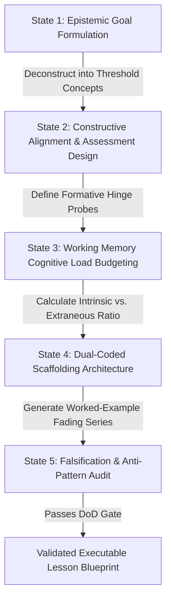

# Instructional System Design Protocol (CAP-02): Constructive Alignment, Cognitive Load Budgeting, and Scaffolding Blueprints

> **The CAP-02 Architectural Axiom**:  
> Instructional design is not the chronological sequencing of activities; it is the algorithmic optimization of cognitive architecture. Every minute of instructional time must be accounted for against a strict Working Memory Load Budget, aligned with observable evidence of understanding.

---

## 0. Capability Contract (CAP-02)

An educator or autonomous pedagogical agent possessing **CAP-02** executes the following verifiable state machine before generating or delivering any instructional unit:



---

## 1. The 5-Step Operational Protocol

### Step 1: Epistemic Goal Formulation & Threshold Concept Identification
* **Action**: Identify the **Threshold Concept** (Meyer & Land, 2003)—the transformative, irreversible conceptual portal without which advanced disciplinary thinking cannot proceed.
* **Filter**: Ban superficial behavioral verbs (*"Students will know / understand"*). Enforce Bloom's Revised Taxonomy verbs (*"Students will diagnose / calculate / contrast / refute"*).

### Step 2: Constructive Alignment & Assessment Specification (UbD Stage 2)
* **Rule (Biggs, 1996)**: *Assessment must be designed before learning activities are chosen.*
* **Deliverable**:
  1. One summative performance task demonstrating authentic transfer.
  2. Exactly two formative **Hinge Questions** with 4-distractor diagnostic mapping placed at critical pivot points ($30\%$ and $60\%$ lesson markers).

### Step 3: Working Memory Cognitive Load Budgeting
* **Working Memory Limit**: Maximum **4 chunks** of concurrent active processing.
* **Audit Rule**:
  * Identify **Intrinsic Load** (irreducible complexity of element interactivity).
  * Eliminate **Extraneous Load** (split attention, decorative graphics, seductive details, unexplained jargon).
  * Allocate **Germane Load** (schema construction via active retrieval and comparison).

### Step 4: Dual-Coded Scaffolding Architecture
* Select the instructional pattern based on learner developmental stage and prior schema strength:
  * *Novice Cohort* $\rightarrow$ [[explicit-instruction-i-we-you|Explicit Instruction I-We-You]] + [[worked-example-fading-protocol|Worked-Example Fading]].
  * *Intermediate Cohort* $\rightarrow$ [[productive-failure-kapur|Productive Failure 2-Phase Cycle]].
  * *Advanced Cohort* $\rightarrow$ [[problem-based-learning-7jumps|Maastricht 7-Jump PBL]] / Socratic Colloquium.

### Step 5: Falsification & Anti-Pattern Audit Gate
Before deployment, test the blueprint against the 4 fatal failure modes:
1. *Does it rely on the "Three-Cueing" or "Learning Styles" myth?* $\rightarrow$ Reject.
2. *Is there an unexplained lecture stretch $>15$ minutes without active retrieval?* $\rightarrow$ Reject.
3. *Does the assessment test superficial recall instead of the threshold concept?* $\rightarrow$ Reject.
4. *Are all visual models textless and 35° isometric compliant with [[pedagogical-authoring-spec]]?* $\rightarrow$ Confirm.

---

## 2. Machine-Readable Schema for AI Curriculum Agents

```yaml
schema_version: "2.0.0"
capability: "CAP-02-DESIGN"
unit_blueprint:
  target_id: "CONCEPT-ID"
  developmental_stage: "S2" # S0-S7
  threshold_concept: "Statement of irreversible conceptual transition"
  cognitive_load_audit:
    intrinsic_chunks: 3
    extraneous_elimination: ["Removed decorative stock images", "Integrated labels into diagram plane"]
    germane_prompts: ["Self-explanation question at Step 3"]
  assessment_architecture:
    hinge_checkpoint_1:
      placement: "Minute 18"
      diagnostic_probe: "Hinge Question YAML"
    transfer_task: "Unseen isomorphic challenge"
  pacing_matrix:
    total_minutes: 50
    i_do_minutes: 10
    we_do_minutes: 20
    you_do_minutes: 20
```

---

## 3. Empirical Evidence & Quality Benchmarks

| Source | Standard | Impact on Design Quality |
| :--- | :--- | :--- |
| **Biggs (1996, 2011)** | Constructive Alignment | Reduces student strategic memorization; aligns deep cognitive processing with evaluation criteria ($d = 0.50$). |
| **Wiggins & McTighe (2005)** | Understanding by Design (UbD) | Eliminates "twin sins" of schooling: activity-oriented design without purpose, and coverage-oriented design without understanding. |
| **Sweller, Ayres, & Kalyuga (2011)** | Cognitive Load Theory in Practice | Explicit design guidelines for split-attention, modality, redundancy, and worked-example effects. |
