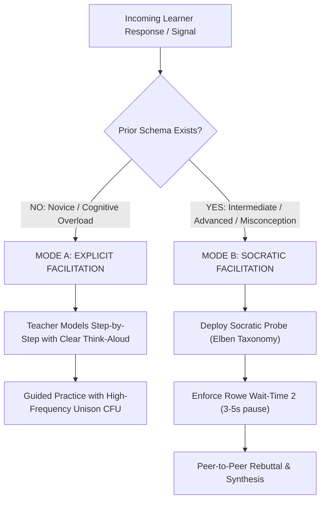

# Facilitation & Delivery Protocol (CAP-03): Socratic Dialectic, Explicit Modeling, and Classroom Flow

> **The CAP-03 Facilitation Axiom**:  
> Teaching is not performing; it is the orchestrating of attention and cognitive friction. The master facilitator knows precisely when to provide authoritative explicit clarity, and when to step back into disciplined Socratic silence, compelling learners to shoulder the cognitive burden of proof.

---

## 0. Capability Contract (CAP-03)

An educator or AI agent executing **CAP-03** operates under a dual-mode facilitation engine:



---

## 1. Mode Switching Criteria: Explicit vs. Socratic

| Classroom Indicator | Correct Facilitation Mode | Why the Wrong Mode Fails |
| :--- | :--- | :--- |
| **Learner lacks baseline vocabulary / algorithmic rules** | **Mode A: Explicit Modeling** | Attempting Socratic questioning on a student who lacks basic facts generates acute anxiety and degenerates into "Guess What's in the Teacher's Head." |
| **Learner has automated rules but commits a conceptual error** | **Mode B: Socratic Dialectic** | Lecturing the correction robs the student of the opportunity to notice the internal contradiction between their premises and conclusions. |
| **Learner displays high confidence in a false intuition** | **Mode B: Counterfactual Socratic Probe** | Direct correction is rejected by cognitive confirmation bias; an anomalous Socratic case forces self-generated doubt. |
| **Time is constrained; multi-step procedure must be executed** | **Mode A: Explicit Choral Cadence** | Socratic meanderings cause time overruns, leaving complex tasks incomplete and unstructured. |

---

## 2. Paul & Elder Socratic Questioning Taxonomy

When operating in Mode B, facilitators deploy probes across 6 structured epistemic levels:

1. **Questions of Clarification**:
   * *"What exactly do you mean by 'force' in this sentence?"*
   * *"Can you rephrase your claim without using the word 'energy'?"*
2. **Questions that Probe Assumptions**:
   * *"What are you taking for granted when you assume the friction is zero?"*
   * *"Why would an investor assume that interest rates will remain static?"*
3. **Questions that Probe Reasons and Evidence**:
   * *"What empirical data in Figure 3 directly supports that diagnosis?"*
   * *"Can you show me the calculation that rules out lung cancer?"*
4. **Questions about Perspectives and Viewpoints**:
   * *"How would a Keynesian economist explain this inflation spike differently from a Monetarist?"*
   * *"How would an opposing defense attorney cross-examine this witness statement?"*
5. **Questions that Probe Implications and Consequences**:
   * *"If we accept your hypothesis that all bacteria are killed, what happens to the patient's gut microbiome on Day 5?"*
   * *"What is the ethical implication of that algorithm if deployed in bail sentencing?"*
6. **Questions about the Question**:
   * *"Is this a question that can be answered mathematically, or is it a question of human values?"*

---

## 3. Actionable Teacher Protocol: The 100% Engagement Delivery Loop

```yaml
protocol: DUAL-FACILITATION-LOOP
mode_a_explicit:
  pacing: "Rapid, crisp, 10-12 responses per minute."
  checks: "Choral responses on hand-drop signal; chin-level whiteboard scans."
  error_rule: "Never ask why an error occurred in Mode A; immediately Model -> Lead -> Test."
mode_b_socratic:
  pacing: "Deliberate, unhurried, 3-5 second wait-times."
  rules:
    - "Withhold evaluation: Never say 'Good' or 'Wrong.' Say: 'Interesting. Who agrees, and who sees a flaw?'"
    - "Bounce the ball: Redirect student responses to peers ('Marcus, rephrase Sarah's argument in your own words')."
    - "Demand textual/data warrant: 'Point your finger to the paragraph that justifies that inference.'"
```

---

## 4. Empirical Benchmarks

* **Lemov (2021)**: *Teach Like a Champion 3.0*. Standardized behavioral techniques (Cold Call, No Opt Out, Right Is Right, Stretch It) yielding $+0.40\text{ to }+0.60$ SD in urban classroom interventions.
* **Paul & Elder (2006)**: *The Art of Socratic Questioning*. Proved that disciplined dialectic questioning develops intellectual humility, autonomy, and critical analytical endurance.
