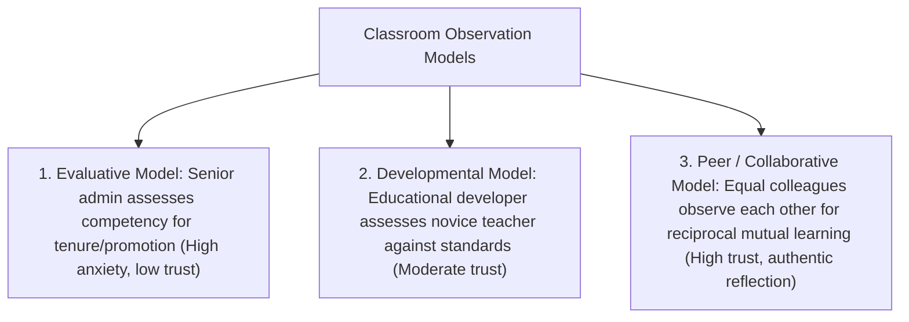
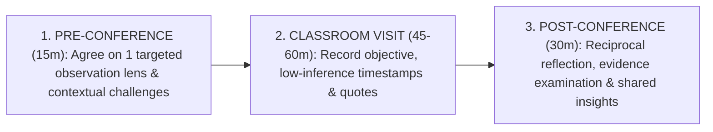

# Peer Observation and Faculty Mentorship: Formative Non-Evaluative Protocols and Reciprocal Professional Growth

> **The Reciprocal Observation Axiom**:  
> When peer observation is used as an evaluation instrument for tenure or performance appraisal, it produces anxiety, defensive teaching, and staged theatrical compliance. When peer observation is strictly formative, non-evaluative, and reciprocal, the observer learns as much about their own teaching as the observed colleague (Gosling, 2002).

---

## 0. Learning Contract & Target Competencies

By engaging with this faculty development foundation, you will develop the ability to:
1. **Differentiate** between the 3 major peer observation models: **Evaluative** (administrative inspection), **Developmental** (expert to novice), and **Peer/Reciprocal** (mutual formative reflection).
2. **Execute** a complete **Peer Observation Triad**: (1) Pre-Observation Briefing, (2) Focused Low-Inference Classroom Visit, and (3) Reflective Debriefing Dialogue.
3. **Calibrate** observation lenses to isolate specific cognitive indicators: student wait-time, cognitive offloading to AI, participation equity, and formative feedback loops.
4. **Establish** a sustainable, department-wide culture of open-door pedagogical transparency.

---

## 1. The Three Models of Classroom Observation (Gosling, 2002)



### The Peer-Review Safeguard Rule:
* **The "Firewall" Principle**: Notes, debriefing records, and discussions from formative peer observations **must never be submitted to tenure, promotion, or administrative review committees**.
* The only document submitted to administration is a one-sentence verification of completion: *"Dr. Smith and Dr. Davis completed their reciprocal peer observation cycle on October 14."*
* This firewall guarantees psychological safety, allowing faculty to invite colleagues into their most challenging classes rather than staging safe, rehearsed lectures.

---

## 2. The 3-Stage Peer Observation Protocol



### Stage 1: The Pre-Observation Briefing (15 minutes)
* The observed instructor sets the focus. They do *not* say: *"Just tell me how I do."*
* They select a specific pedagogical lens:
  - *Lens A*: Student questioning patterns and wait-time duration.
  - *Lens B*: Transition efficiency from lecture to small-group inquiry.
  - *Lens C*: Equity of student voices across the classroom space.
* The observer agrees to record only factual data related to that chosen lens.

### Stage 2: The Focused Classroom Visit (50 minutes)
* The observer sits unobtrusively, acting as a neutral ethnographic researcher.
* They do not participate or grade against a generic rubric.
* They record a chronological running log with exact timestamps and verbatim quotes.

### Stage 3: The Reflective Post-Conference (30 minutes within 48 hours)
* The meeting begins with the observed teacher's self-reflection: *"How did the session feel relative to your goals?"*
* The observer shares the objective field log: *"Here is what the data showed during the 15 minutes of group discussion."*
* The conversation shifts to **reciprocal learning**: *"Watching how you handled the student who challenged the theorem gave me a new idea for my own seminar next Tuesday."*

---

## 3. Actionable Faculty Observation Log Template

```yaml
peer_observation_log:
  observer: "Faculty Name"
  observed: "Faculty Name"
  course: "Course Code & Title"
  agreed_focus_lens: "Checking for Understanding (CFU) frequency & wait-time"
  chronological_records:
    - timestamp: "10:05"
      teacher_action: "Presents Hinge Question on board."
      student_action: "28 students silent, reading slide."
      metric: "Wait-Time 1 = 4.2 seconds."
    - timestamp: "10:06"
      teacher_action: "Calls on Student A (Row 3)."
      student_action: "Student A gives 25-word explanation."
      metric: "Wait-Time 2 = 3.1 seconds before teacher response."
    - timestamp: "10:18"
      teacher_action: "Pivots to worked example based on Student A's distractor diagnosis."
  reflective_synthesis:
    strengths_observed: "Disciplined wait-time permitted complex causal explanation."
    growth_opportunity: "Expand participation beyond left side of the lecture hall."
    observer_takeaway: "Will implement the 4-second silence rule in my own Tuesday seminar."
```

---

## 4. Empirical Evidence Base

* **Gosling (2002)**: *Models of Peer Observation of Teaching*. Established the theoretical framework distinguishing evaluative monitoring from peer collaborative development in UK higher education.
* **Bell (2005)**: *Peer Observation of Teaching in Higher Education*. Demonstrated that faculty participating in reciprocal peer observation report significant improvements in course design, teaching confidence, and departmental collegiality.
* **Cosh (1999)**: *Peer Observation in Higher Education: A Reflective Approach*. Proved that the observer frequently gains greater pedagogical insights from watching a colleague than the person being observed.
