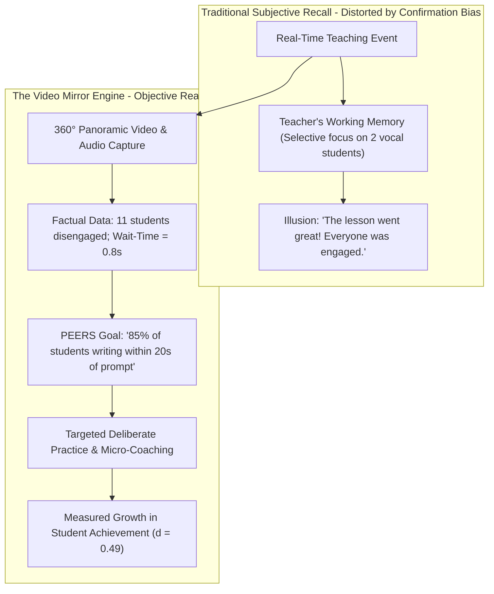
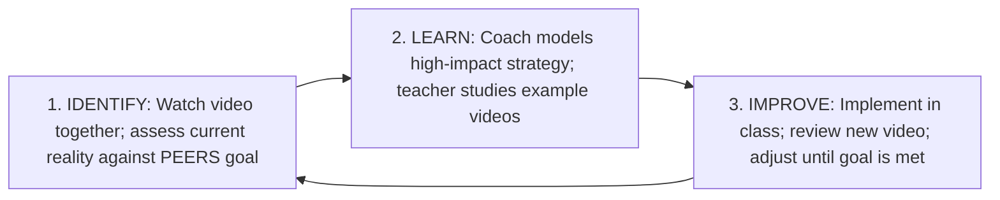

# Video-Assisted Instructional Coaching: The Mirror Effect, Objective Self-Reflection, and Jim Knight's Impact Cycle


> **The Video Mirror Axiom**:  
> Human memory is biologically incapable of capturing an accurate record of one's own teaching. In the heat of the moment, a teacher's working memory is consumed with pacing, content delivery, and immediate noise management. Video provides an unyielding, objective mirror, dissolving illusions and allowing the educator to see their classroom through the eyes of the students for the very first time (Knight, 2014).

---

## 0. Learning Contract & Target Competencies

By engaging with this faculty coaching foundation, you will develop the ability to:
1. **Navigate** the psychological barrier of **Video Self-Confrontation** (moving beyond superficial self-consciousness about appearance/voice into analytical pedagogical inquiry).
2. **Execute** Jim Knight's **Impact Cycle**: *Identify* (current reality via video) $\rightarrow$ *Learn* (evidence-based strategy modeling) $\rightarrow$ *Improve* (iterative adaptation until goal is reached).
3. **Analyze** classroom video through the **Student-Behavior Lens**: Tracking time on task, student talk ratio, wait-time compliance, and misconception frequency.
4. **Formulate** a **PEERS Goal** (Powerful, Easy, Emotionally compelling, Reachable, Student-focused) with measurable criteria for student success.

---

## 1. The Cognitive Psychology of the Video Mirror



### 1.1. Why Teachers Miss 80% of What Happens in Their Classrooms
Elizabeth van Es and Miriam Sherin (2008) demonstrated that novice and experienced teachers suffer from **Inattentional Blindness** during teaching:
* A teacher managing 30 students makes over **1,500 pedagogical decisions per day** (Jackson, 1968).
* Because working memory is saturated, the teacher's attention naturally tracks the students who are either: (a) aggressively compliant and raising hands, or (b) actively disruptive.
* The "quiet middle"—students who quietly disengage, doodle, or stare blankly—become invisible. Video brings the quiet middle into sharp, unignorable focus.

---

## 2. Jim Knight's 3-Phase Impact Cycle



### Phase 1: Identify (Getting a Clear Picture of Reality)
* The teacher watches video of their own lesson using the **"Watching Students First" Checklist**:
  1. *Are students engaged?* (Target: $>90\%$ of students on task).
  2. *What is the ratio of student talk to teacher talk?* (Target: $>50\%$ student talk during discussion).
  3. *What happens to student response length when I pause after asking a question?*

### Phase 2: Learn (Modeling and Micro-Rehearsal)
* The coach does not simply say: *"You should use better wait-time."*
* The coach provides a concrete demonstration:
  - Option A: The teacher watches a 3-minute exemplar video of a master teacher executing the exact routine.
  - Option B: The coach co-teaches or models the routine in the teacher's classroom.
  - Option C: **Micro-rehearsal**: The coach and teacher rehearse the 4-step routine in an empty classroom until delivery is automated.

### Phase 3: Improve (Iterative Refinement)
* The teacher implements the new strategy with video recording.
* In the debrief conference, teacher and coach watch the new tape: Did on-task engagement reach the PEERS goal? If not, what small tweak is needed?

---

## 3. Worked Clinical Dialogue: Moving Past the Vanity Barrier

```text
[Teacher and Coach sit before the coaching monitor.]
Teacher (groaning): "Oh no, look at my hair! And my voice sounds so high-pitched! I hate watching myself."
Coach (smiling, validating): "Every human being hates watching themselves on video for the first 10 minutes. It's completely normal. Let's ignore the sound of our voices and look only at Maya and Jordan in Row 3. Watch what happens when you give the instruction for the group lab at minute 14."
[Video plays. On screen, teacher gives a 4-minute complex verbal explanation of 6 lab steps without writing them on the board. Maya looks at Jordan; both sit frozen with arms crossed.]
Teacher (quietly): "Look at them. They had no idea what to do. I thought they were just being stubborn, but looking at the tape... I overwhelmed them with instructions."
Coach: "What a powerful observation. You just identified the root cause: auditory instruction overload. If you were to do that transition tomorrow, what visual tool would you provide on the board?"
Teacher: "A 3-step checklist with bullet points on the slide, and I will ask Jordan to read Step 1 aloud before they move."
Coach: "Let's rehearse that right now. Open your slides; let's draft those 3 bullet points."
```

---

## 4. Empirical Benchmarks & Effect Sizes

| Source / Citation | Sample / Context | Effect Size ($d$ / $g$) | Core Finding |
| :--- | :--- | :--- | :--- |
| **John Hattie (2009, 2023)** | Visible Learning Synthesis of 1,200+ meta-analyses | $d = 0.88$ | **Micro-Teaching & Video Self-Analysis** is one of the highest-impact professional development interventions ever measured across global educational systems. |
| **Jim Knight (2014)** | *Focus on Teaching: Using Video for High-Impact Instruction* | Grade A | Video coaching removes subjective administrator bias, accelerates teacher self-efficacy, and produces double the instructional change of traditional coaching. |
| **Tripp & Rich (2012)** | Systematic Review (*Teaching and Teacher Education*) | Grade A | Video-assisted reflection enables teachers to move from superficial emotional self-critique to rigorous analysis of student learning and pedagogical reasoning. |
