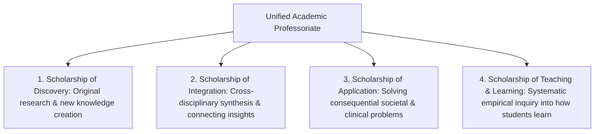
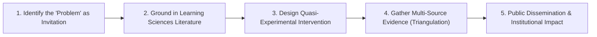

# The Scholarship of Teaching and Learning (SoTL): Boyer's Four Scholarships, Classroom Inquiry, and Empirical Pedagogy

> **The Boyer SoTL Axiom**:  
> For over a century, higher education suffered from an impoverished view of scholarship that equated academic prestige solely with basic discovery research while treating teaching as a routine, unexamined trade. The Scholarship of Teaching and Learning (SoTL) establishes that pedagogical practice—when systematically investigated, peer-reviewed, and made public—is a premier form of intellectual scholarship (Boyer, 1990).

---

## 0. Learning Contract & Target Competencies

By engaging with this faculty development foundation, you will develop the ability to:
1. **Deconstruct** academic faculty responsibilities using **Ernest Boyer's Four Dimensions of Scholarship**: *Discovery*, *Integration*, *Application*, and *Teaching*.
2. **Transform** everyday classroom teaching into a systematic **SoTL Inquiry Project**: formulating research questions, designing quasi-experimental controls, collecting ethical student learning artifacts, and submitting for peer review.
3. **Execute** Peter Felten's **5 Principles of Good Practice in SoTL**: Inquiry into student learning, grounded in context, methodologically sound, conducted in partnership with students, and publicly shared.
4. **Deploy** the **Master Professor SoTL HUD Console** to monitor classroom learning telemetry in real time.

---

## 1. Ernest Boyer's Fourfold Architecture of Scholarship

In his landmark Carnegie Foundation report, *Scholarship Reconsidered: Priorities of the Professoriate* (1990), Ernest Boyer redefined academic excellence:

* **The Historical Pathology**: Prior to Boyer, universities operated under a toxic binary: "publish or perish" (meaning discovery research in specialized journals) while teaching was treated as a private, unexamined chore behind closed classroom doors.
* **Lee Shulman's Pedagogical Imperative (1999)**: For teaching to become scholarship, it must meet three invariant criteria:
  1. It must be made **public**.
  2. It must be subject to **critical peer review and evaluation**.
  3. It must be organized in a form that **other educators can build upon**.

---

## 2. The 5-Step SoTL Research Lifecycle

### Step 1: Reframing Classroom Problems as Research Inquiries
* **Traditional Teacher**: *"Students always fail Question 4 on the midterm; they are so lazy."*
* **SoTL Scholar (Randy Bass, 1999)**: *"Why does Question 4 produce a bimodal failure distribution? What threshold concept or misconception makes this specific problem counter-intuitive? Let me investigate."*

### Step 2: Grounding in Existing Learning Sciences
* A SoTL project does not re-invent the wheel. Before designing an intervention, the scholar reviews the empirical literature: What does [[cognitive-load-theory|Cognitive Load Theory]] say? How does [[dual-coding-theory-multimedia-learning|Dual Coding]] apply here?

### Step 3: Designing the Methodological Intervention
* **Quasi-Experimental Design**: Compare Section A (traditional lecture) with Section B (peer instruction with hinge questions), controlling for incoming GPA and baseline diagnostic pre-tests.

### Step 4: Evidence Triangulation
Gathering evidence from at least 3 distinct epistemic sources:
1. *Quantitative Performance*: Pre/post normalized learning gains ($g$).
2. *Qualitative Artifacts*: Student think-aloud transcripts, video recordings, exam error annotations.
3. *Student Epistemic Experience*: Structured surveys on self-efficacy, cognitive load, and metacognitive awareness.

### Step 5: Public Dissemination
Publishing results in disciplinary education journals (e.g. *Physical Review Physics Education Research*, *Journal of Chemical Education*, *CBE—Life Sciences Education*) or institutional repositories.

---

## 3. Worked Case: Eric Mazur's Transformation from Lecturer to SoTL Pioneer

At Harvard University, physics professor Eric Mazur lectured brilliantly for 7 years, receiving 4.8/5.0 student evaluations. In 1990, he read David Hestenes' *Force Concept Inventory (FCI)*:
* Mazur administered the FCI to his elite Harvard students, assuming they would score 95%.
* **The Crisis**: His students scored poorly on basic conceptual questions (e.g. Newton's Third Law in collisions), despite being able to solve complex calculus-based equations.
* **The SoTL Inquiry**: Mazur transformed his physics classroom into an empirical laboratory. He invented **Peer Instruction (ConcepTest)**:
  - 10-minute mini-lecture.
  - Conceptual multiple-choice question.
  - Individual vote $\rightarrow$ 2-minute peer debate $\rightarrow$ Revote.
* **The Publication**: Mazur documented normalized learning gains doubling ($g = 0.25 \rightarrow 0.74$) across 10 years, publishing his landmark book *Peer Instruction: A User's Manual* (1997) and altering global STEM pedagogy forever.

---

## 4. Empirical Evidence & SoTL Impact

| Author / Citation | Scope / Landmark Contribution | Core Finding |
| :--- | :--- | :--- |
| **Ernest Boyer (1990)** | Carnegie Foundation Report | Established the 4 scholarships, elevating SoTL to legitimate tenure and promotion criteria. |
| **Peter Felten (2013)** | *Principles of Good Practice in SoTL* (*Teaching & Learning Inquiry*) | Defined the 5 quality standards for rigorous SoTL methodology, ethics, and student partnership. |
| **Freeman et al. (2014)** | PNAS Meta-Analysis of 225 STEM studies | Active learning interventions developed through SoTL increase student exam scores by $6\%$ and cut failure rates by $33\%$ ($d = 0.47$). |
