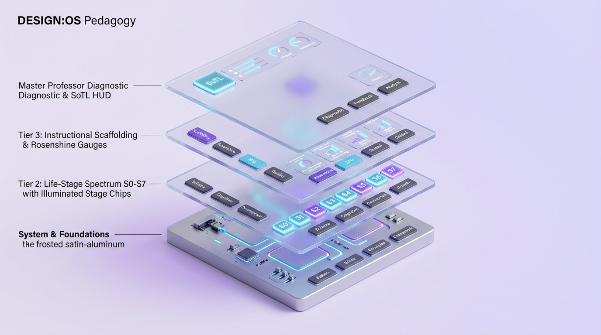

# DESIGN:OS Pedagogy — The Autonomous Pedagogical Operating System

<div align="center">



**A Unified, Evidence-Based Pedagogical Engineering Architecture for Human & Machine Intelligence**  
*From Prenatal Neurodevelopment (S0) to Doctoral Viva (S5), Lifelong Learning (S6), and Master Professor (S7)*

[](README.md)
[](README.vi.md)
[](https://github.com/jangtrinh/design-os-pedagogy)
[](#-5d-hyper-matrix-system-architecture)
[](#-5-landmark-empirical-experiments-in-educational-history)
[](ART-DIRECTION.md)

[English](README.md) • [🇻🇳 Tiếng Việt](README.vi.md) • [System Architecture](#-5d-hyper-matrix-system-architecture) • [Life-Stage Spectrum](#-the-pedagogical-life-stage-spectrum-s0s7) • [Empirical Cases](#-5-landmark-empirical-experiments-in-educational-history) • [Quickstart](#-quickstart)

</div>

---

## 🌌 Executive Summary & Epistemic Policy

> *"Knowledge explains. Evidence constrains. Practice operationalizes. Assessment diagnoses. Reflection adapts. Research advances. Teaching teachers proves mastery."*

`design-os-pedagogy` is an open-source, scalable, evidence-based Pedagogical Operating System. Rather than relying on dogma, intuition, or educational neuromyths (such as learning styles, right/left-brain dichotomy, or the Mozart effect), this system is strictly grounded in **Cognitive Science**, **Developmental Psychology**, and the **Largest Randomized Controlled Trials (RCTs)** in educational history.

It provides a unified conceptual, operational, and clinical architecture designed to be consumed equally by:
1. **Human Educators & Scholars**: Teachers, instructional coaches, curriculum designers, and doctoral supervisors.
2. **Autonomous Pedagogical Agents**: AI tutors, diagnostic assessment engines, and adaptive curriculum builders.

---

## 🏛️ 5D Hyper-Matrix System Architecture

The core knowledge base is structured as an orthogonal 5-dimensional tensor:
$$	ext{Stage} 	imes 	ext{Axis} 	imes 	ext{Capability} 	imes 	ext{Evidence} 	imes 	ext{Context}$$

Every pedagogical entity, lesson plan, and diagnostic rubric is precisely localized at the intersection of these five axes:

<div align="center">


</div>

1. **Stage (S0–S7)**: 8 evolutionary developmental human stages.
2. **Axis (AX-01 to AX-08)**: Disciplinary dimensions (Learning Sciences, Developmental Psych, Instructional Design, Curriculum, Assessment, Inclusion/UDL, EdTech/AI, Ethics).
3. **Capability (C1–C6)**: Operational competencies (Diagnose, Design, Scaffold, Question, Assess, Reflect).
4. **Evidence (Tier 1–Tier 5)**: Strict epistemic grading from Tier 1 (Replicated Meta-analyses, Cohen’s $d \ge 0.40$) down to Tier 5 (Anecdotal claims / Neuromyths marked with refusal gates).
5. **Context**: Deployment environment (Under-resourced K-12, Elite University, 1-on-1 Clinical Tutoring, Autonomous LLM Agent).

---

## 🧭 Dual-Linking Navigation Graph

The repository provides parallel navigation topologies:
* **For Humans**: Visual exploration via Obsidian Flavored Markdown, bidirectional Wikilinks `[[...]]`, and interactive Graph Views.
* **For AI Agents**: Traversal via **Stable YAML Metadata IDs** (`id`, `stage`, `prerequisites`, `leads_to`, `evidence_basis`, `clinical_cases`) ensuring deterministic execution regardless of filesystem renames.

<div align="center">


</div>

### Quick Decision Diagnostic Router

| Observed Learner Symptom | Cognitive Root Cause | Target Construct & Intervention | Empirical Benchmark Case |
| :--- | :--- | :--- | :--- |
| **Paralysis at task onset / Staring blankly** | Working Memory Overload (High intrinsic load) | [`Cognitive Load Theory`](10-foundations/learning-science/cognitive-load-theory.md) & [`Rosenshine 10 Principles`](30-pedagogy/instructional-methods/rosenshine-10-principles.md) | [`Case — Grade 7 Algebra Worked Examples`](50-practice-library/cases/case-grade-7-algebra-worked-examples.md) |
| **Fluency during lecture, zero recall next week** | Failed Synaptic Consolidation / Illusion of Competence | [`Spaced Practice`](60-evidence/sources/evidence-mawson-2025-spacing.md) & [`Retrieval Practice`](60-evidence/sources/evidence-agarwal-2021-retrieval.md) | [`Case — High School Biology Spaced Retrieval`](50-practice-library/cases/case-highschool-biology-retrieval-spacing.md) |
| **Correct formula execution, total failure on word problems** | Procedural mimicry without conceptual schema | [`Learner Diagnostics Protocol`](70-capabilities/diagnose/learner-diagnostics-protocol.md) & [`STEM Pedagogy`](40-disciplines/stem-math-science/stem-disciplinary-pedagogy.md) | [`Case — Fraction Misconception Clinical Case`](50-practice-library/cases/fraction-misconception-clinical-case.md) |
| **Nodding along in class, failing midterm exams** | Illusion of Explanatory Depth | [`Constructive Alignment`](20-stages/s4-tertiary/constructive-alignment-productive-failure.md) & [`Peer Instruction`](50-practice-library/cases/case-eric-mazur-harvard-peer-instruction.md) | [`Case — Eric Mazur Harvard Peer Instruction`](50-practice-library/cases/case-eric-mazur-harvard-peer-instruction.md) |
| **PhD candidate stalling, fearful of thesis defense** | Epistemic identity crisis & Deficient boundary defense | [`Doctoral Supervision Socratic`](20-stages/s5-postgraduate-doctoral/doctoral-supervision-socratic.md) | [`Dissertation Defense Guide`](80-professor-development/doctoral-supervision/dissertation-defense-guide.md) |

---

## 🧬 The Pedagogical Life-Stage Spectrum (S0–S7)

<div align="center">


</div>

### S0: Prenatal & Caregiver Readiness (Prenatal)
* **Core Mechanisms**: Maternal-fetal HPA stress axis modulation, environmental epigenetics, caregiver psychological readiness.
* 📖 Details: [`20-stages/s0-prenatal-caregiver/prenatal-neurodevelopment.md`](20-stages/s0-prenatal-caregiver/prenatal-neurodevelopment.md)

### S1: Early Childhood (Ages 0–6)
* **Core Mechanisms**: Serve-and-return interaction, executive function development, HighScope Plan-Do-Review cycle.
* 📖 Details: [`20-stages/s1-early-childhood/play-and-executive-function.md`](20-stages/s1-early-childhood/play-and-executive-function.md)

### S2: Primary Education & FLN (Ages 6–11)
* **Core Mechanisms**: Foundational Literacy and Numeracy (FLN), Explicit Instruction (`I Do -> We Do -> You Do`), Science of Reading, Concrete-Pictorial-Abstract (CPA) Math.
* 📖 Details: [`20-stages/s2-primary/explicit-instruction-fln.md`](20-stages/s2-primary/explicit-instruction-fln.md)

### S3: Secondary Education (Ages 11–18)
* **Core Mechanisms**: Disciplinary inquiry, Harvard Project Zero Visible Thinking Routines, Desirable Difficulties (Spaced, Interleaved, Retrieval).
* 📖 Details: [`20-stages/s3-secondary/scaffolded-inquiry-visible-thinking.md`](20-stages/s3-secondary/scaffolded-inquiry-visible-thinking.md)

### S4: Higher Education (Tertiary: Ages 18–22)
* **Core Mechanisms**: Cognitive Apprenticeship, Constructive Alignment (Biggs), Productive Failure (Manu Kapur), Peer Instruction (Eric Mazur / Harvard).
* 📖 Details: [`20-stages/s4-tertiary/constructive-alignment-productive-failure.md`](20-stages/s4-tertiary/constructive-alignment-productive-failure.md)

### S5: Postgraduate & Doctoral Research
* **Core Mechanisms**: Independent knowledge creation, Anne Lee’s 5 Supervision Models, Socratic Colloquium, EUA Salzburg II Principles.
* 📖 Details: [`20-stages/s5-postgraduate-doctoral/doctoral-supervision-socratic.md`](20-stages/s5-postgraduate-doctoral/doctoral-supervision-socratic.md)

### S6: Adult & Lifelong Learning
* **Core Mechanisms**: Andragogy (Knowles), Kolb’s 4-Stage Experiential Learning Cycle, Action Learning (Reg Revans).
* 📖 Details: [`20-stages/s6-lifelong-adult/andragogy-experiential-learning.md`](20-stages/s6-lifelong-adult/andragogy-experiential-learning.md)

### S7: Master Pedagogy & Professor Development
* **Core Mechanisms**: Teacher of Teachers, 15-minute clinical classroom diagnosis, Scholarship of Teaching and Learning (SoTL - Boyer), Advance HE PSF 2023.
* 📖 Details: [`20-stages/s7-master-pedagogy/sotl-and-instructional-coaching.md`](20-stages/s7-master-pedagogy/sotl-and-instructional-coaching.md)

---

## 🔬 5 Landmark Empirical Experiments in Educational History

Every pedagogical strategy in this operating system is verified against historic empirical benchmarks:

1. **Project Follow Through (USA, 1967–1977)**:
   * The largest educational RCT in history: \$1B, 79,000 disadvantaged students, 9 pedagogical models compared over 10 years. **Direct Instruction (DI)** outperformed all models across basic skills ($+0.82$), cognitive conceptual skills ($+0.46$), and self-esteem ($+0.28$).
   * 📖 Case Study: [`50-practice-library/cases/case-project-follow-through-direct-instruction.md`](50-practice-library/cases/case-project-follow-through-direct-instruction.md)
2. **Harvard Conceptual Physics Crisis & Peer Instruction (1990–2001)**:
   * Prof. Eric Mazur discovered that traditional lecturing creates an illusion of understanding. Replacing lecturing with 2-minute peer debates on ConcepTests doubled learning gains ($g$ increased from $0.23$ to $0.74$, $N > 3,000$ Harvard undergraduates).
   * 📖 Case Study: [`50-practice-library/cases/case-eric-mazur-harvard-peer-instruction.md`](50-practice-library/cases/case-eric-mazur-harvard-peer-instruction.md)
3. **KMOFAP Formative Assessment Project (UK, 1999–2001)**:
   * Dylan Wiliam & Paul Black trained 24 secondary teachers to extend Wait Time to 3–5 seconds and implement comment-only marking (no grades), achieving a **$+0.34$ SD gain** on national GCSE examinations.
   * 📖 Case Study: [`50-practice-library/cases/case-kmofap-formative-assessment-wiliam.md`](50-practice-library/cases/case-kmofap-formative-assessment-wiliam.md)
4. **Perry Preschool 40-Year Longitudinal RCT (1962–2005)**:
   * 40-year tracking of 123 high-risk children: 2 years of active Plan-Do-Review preschool yielded a 65% vs 45% high school graduation rate, 19% reduction in arrests, and \$7.16–\$12.90 social return per \$1 invested (Nobel laureate James Heckman ROI analysis).
   * 📖 Case Study: [`50-practice-library/cases/case-perry-preschool-highscope-longitudinal.md`](50-practice-library/cases/case-perry-preschool-highscope-longitudinal.md)
5. **McMaster & Maastricht Medical Problem-Based Learning (1969–2006)**:
   * Howard Barrows replaced lecture halls with 7-Jump clinical problem solving, demonstrating superior 5-year diagnostic reasoning retention and clinical performance over traditional didactic medical schools.
   * 📖 Case Study: [`50-practice-library/cases/case-mcmaster-maastricht-pbl-medical.md`](50-practice-library/cases/case-mcmaster-maastricht-pbl-medical.md)

---

## 🎨 Visual System: Luminous Layered Precision

All visual diagrams adhere to a unified, mathematical 3D design system:
* **Strict 35° Isometric Grid**: Hardware-grade exploded architectural layers.
* **100% Pure Textless Design**: Tactile 3D affordances conveying pedagogical mechanics without billboard text overlays.
* **High-Key Studio Daylight**: Clean lilac background (`#F5F4FC` $\rightarrow$ `#FAF9FE`), 90% light-transmission borosilicate glass, 1px pure white specular chamfers, diffused subsurface violet/cyan glow.
* 📖 Visual Specification: [`ART-DIRECTION.md`](ART-DIRECTION.md) | Production Roadmap: [`ASSETS_ROADMAP.md`](ASSETS_ROADMAP.md)

---

## 📂 Repository Layout

```text
design-os-pedagogy/
├── 00-navigation/           # Master MOCs & Diagnostic Router
├── 00-system/               # 5D Ontology, Epistemic Policy, Metadata Schemas
├── 10-foundations/          # Cognitive Science: Load Theory, Executive Functions
├── 20-stages/               # S0–S7 Life-Stage Pedagogical Guides
├── 30-pedagogy/             # Rosenshine, Formative Assessment, UDL 3.0, AI Epistemic Partner
├── 40-disciplines/          # Disciplinary Pedagogy: STEM (NGSS), Reading, History
├── 50-practice-library/     # Landmark Historical Experiments & Clinical Cases
├── 60-evidence/             # Peer-Reviewed Meta-Analyses & Empirical Claims
├── 70-capabilities/         # 4-Step Learner Diagnostics & Scaffolding
├── 80-professor-development/# Master Professor Guide: Viva Voce & SoTL
├── 90-agent-runtime/        # Clinical Benchmark Evals for AI & Instructors
├── assets/                  # 36 High-Key 3D Isometric Visual Illustrations
├── ART-DIRECTION.md         # Visual Style Guide & Meta-Prompt Schema
├── ASSETS_ROADMAP.md        # 36-Piece Asset Production Pipeline
├── MASTER_PEDAGOGY_GUIDE.md # Comprehensive Pedagogical Master Guide (EN)
├── MASTER_PEDAGOGY_GUIDE.vi.md # Bản Tiếng Việt Cẩm Nang Sư Phạm
├── README.md                # Canonical Project Overview (English)
└── README.vi.md             # Bản Dịch Tiếng Việt
```

---

## 🚀 Quickstart

```bash
# 1. Clone the public repository
git clone https://github.com/jangtrinh/design-os-pedagogy.git
cd design-os-pedagogy

# 2. Open the Master Map of Content in Obsidian or Markdown Reader
open "00-navigation/MOC-Master.md"

# 3. Read the Comprehensive Pedagogy Master Guide
open "MASTER_PEDAGOGY_GUIDE.md"
```

---

<div align="center">

*Engineered by **Jang Trinh** & The Open Pedagogical Science Community.*  
*Licensed under MIT — Free to study, adapt, and advance human and artificial learning.*

</div>
