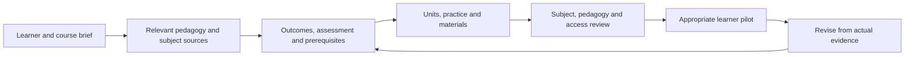

# Knowledge roadmap for course design

Snapshot: 17 September 2026. The goal is to help an AI assistant design a course for a specified learner group and topic using reusable pedagogy, verified subject material and explicit review criteria.

## Current position

The project has a functioning knowledge registry and a narrow, authored fraction rehearsal. It now also has a course-authoring handoff. It does not yet have a general course execution engine, a complete subject curriculum library or demonstrated effectiveness across learner groups.

| Area | Verified inventory or behavior | Practical limit |
| --- | --- | --- |
| Knowledge graph | 94 records; 346 resolved references; no registry errors in the current snapshot | Structural validity does not establish factual or pedagogical quality |
| Review status | 86 unreviewed records, 8 source-checked records, no records marked reviewed | Source-checked includes different record types; it is not eight independently appraised studies |
| Source collection | 10 source records, including five new institutional sources checked in this run | Reading scope varies; most primary studies have not been methodologically appraised |
| Pedagogical content | 11 concepts, 21 practices, 8 stage guides, 5 capability records and 4 faculty guides | These are record classifications, not complete learning progressions |
| Domain guidance | Five discipline guides in four folders: STEM/mathematics, literacy, historical inquiry and professional/clinical practice | These folders do not cover arbitrary subject matter or every curriculum jurisdiction |
| Metadata debt | 62 legacy records and 7 unclassified records | Missing tags and types reduce retrieval precision; migration must preserve uncertainty |
| Typed evidence connection | 17 non-source records have a traceable source path | Connectivity alone does not establish that a source supports every statement in a document |
| Rehearsal | Three authored Vietnamese fraction cases with stored sessions, replay and export | Authored branch feedback does not semantically grade free-text reasoning or demonstrate learner gains |

The baseline before this run was 86 records, 326 references, five source records, 83 unreviewed records, 69 legacy warnings and 70 passing software tests. Eight records were added. Seven existing documents were migrated to explicit v2 metadata and repaired; they remain unreviewed. The smaller legacy count is a structural improvement, not evidence of expert approval.

Full evidence and validation are recorded under [this run's plan](../plans/20260917-knowledge-course-design/plan.md). The generated baseline preserves pre-edit counts, source hashes and test output.

## What can be used now

Start with the [course-design assistant](../90-agent-runtime/prompts/course-design-assistant.md), [CAP-02 protocol](../70-capabilities/design/instructional-system-design-protocol.md), [blueprint template](templates/course-blueprint.yaml) and [acceptance scenarios](../90-agent-runtime/evals/course-design-acceptance.md).

The workflow asks for goals, age, educational setting, subject proficiency, language, access, delivery and time constraints. It then builds a subject-source map, prerequisite sequence and outcome-assessment-practice alignment before writing units. A unit includes examples, checked answers, error analysis, practice, feedback, transfer and an appropriate revisit. The resulting course remains a proposal until the relevant reviews are performed.



This is the intended authoring and review process. The arrows do not imply that every stage is implemented as software.

Keep these distinctions explicit: educational stage versus age; age versus subject proficiency; access support versus answer-producing assistance; authored example versus observed case; source extraction versus appraisal; successful software behavior versus learning effectiveness.

## Work completed in this run

Added source records for CMU course alignment, NAEYC developmental practice, CAST UDL 3.0, UNESCO adult learning and the IES practice-guide summary. Each includes a locator, reading scope, revision/access information and limits. No numerical intervention effects were invented.

Revised the design capability, early-childhood guide, adult-learning guide, UDL guide, backward-design guide and two navigation maps. Removed unsupported effect claims and rigid rules from those audited paths, replaced definitive behavioral diagnoses with follow-up observations, and kept original identifiers. Other legacy documents still need review.

Added a read-only coverage command with tests, a reusable blueprint, an assistant prompt, a bounded research cycle and manual course-design acceptance scenarios. The blueprint is an authoring template, not an executable schema. The acceptance scenarios have been authored, not run as a model benchmark.

## Prioritized next work

| Priority | Work package | Completion evidence |
| --- | --- | --- |
| P0 | Audit remaining high-impact claims and quotations | Each retained quantitative claim has a typed estimate and exact locator; quotations are checked against primary text; unresolved claims are visibly held back from recommendations |
| P0 | Repair metadata without granting false trust | The seven unclassified records receive justified types; legacy migration preserves source scope, uncertainty and provenance; registry and links remain valid |
| P1 | Formalize the course contract | A separate versioned schema and validator reject missing outcomes, orphan assessments, duplicate IDs, prerequisite cycles and inconsistent time budgets; this does not reuse knowledge-record v2 as a course schema |
| P1 | Finish context-sensitive stage and access guidance | Remaining stage guides have appropriate examples, boundaries, diagnostics and source appraisal; multilingual and low-resource pathways are explicit rather than inferred from age |
| P2 | Build complete representative domain packs | Each selected pack has subject sources, prerequisites, misconceptions, checked examples, an aligned assessment and an actual review record |
| P2 | Exercise the authoring workflow across cases | Save actual outputs for the acceptance scenarios; review failures and revise the prompt/template; report not-run scenarios explicitly |
| P3 | Improve retrieval and agent handoff | Retrieval returns relevant context with source scope, review status and prerequisites; evaluation includes untagged content, unknown topics and contradictory sources |
| P3 | Evaluate with subject experts and learners | Record actual reviewer findings, feasible pilot evidence and independent/transfer performance; distinguish a small pilot from a causal effectiveness claim |
| P4 | Maintain knowledge through bounded updates | Runs preserve queries or discovery inputs, reading scope, accepted/rejected sources, changes and validation; source changes and material contradictions trigger review |

### P0: concrete audit targets

The seven unclassified records are the dual-coding foundation and six case files covering biology retrieval, KMOFAP, McMaster/Maastricht PBL, Perry Preschool, Project Follow Through and university physics productive failure. Their names alone are insufficient to decide whether each should be a source, authored case or another record type. Read the body and provenance before migration.

The remaining STEM guide contains unlocated numerical effects and broad causal interpretations of benchmarks. The historical-inquiry guide contains purported primary quotations and numerical performance claims requiring exact-source verification. Those were flagged, not comprehensively repaired in this run. Other stage and method documents may have similar issues; do not extend the reviewed status of one source to the surrounding corpus.

The baseline had no CAP-06 tags. The new research workflow and an institutional source provide starting references; a complete research/advancement capability and its evaluation are still future work.

### P1-P2: course and domain completeness

A practical first comparison set is a primary mathematics course, a secondary inquiry course and an adult beginner course in a new domain. Choose the specific topics with the intended users and available subject reviewers. This set should test different prerequisites, language, materials and assessment modes; it should not become three copies of one syllabus with different reading levels.

For every domain pack, include the exact topic boundary and exclusions, current authoritative subject material, prerequisite graph, common errors with discriminating probes, worked answers, guided/independent tasks, assessment criteria and a transfer task. Record local curriculum and professional requirements when applicable. A method guide about teaching mathematics is not a complete mathematics curriculum; an instructional-design source does not verify a medical or engineering procedure.

For a previously unsupported topic, obtain and check a bounded subject foundation when the course is requested. There is no need to populate every imaginable subject with generic placeholder pages first.

### P3: retrieval before infrastructure expansion

Begin with canonical metadata and source-aware context assembly. Keep legacy warnings, source applicability and unresolved gaps in the context delivered to the agent. Add semantic retrieval only against a measured relevance problem; evaluate it against known answers and missing-topic cases. A larger embedding index would not by itself correct unsupported content.

The user-facing output can be a complete course report with linked evidence and editable materials. The working interaction can remain in an AI assistant with project access. A new web application is not a prerequisite for testing the authoring workflow.

## Measuring progress

Track structural errors separately from content and educational evidence. Useful measures include unresolved references, unclassified/untagged records, verified source locators, claim-appraisal completion, course alignment defects, incorrect keys found, untested access routes, actual scenario outputs reviewed and pilot findings.

Do not report a single “ready for all ages and topics” percentage. Coverage counts overlap, sparse tags can hide existing prose, and a source trail is not a verdict on the claim it accompanies.

From the project root:

```bash
.venv/bin/python -B tools/knowledge_coverage.py
.venv/bin/python -B tools/knowledge_coverage.py --stage S6 --axis AX-04 --capability CAP-02 --json
.venv/bin/python -B tools/knowledge_registry.py --json
.venv/bin/python -B tools/verify_links.py
```

The coverage command only reads the curated corpus. It does not fetch sources, change review labels, start a scheduler or certify a course. Its filters intersect declared metadata, so inspect the returned material and the untagged inventory before making a course-design decision.
